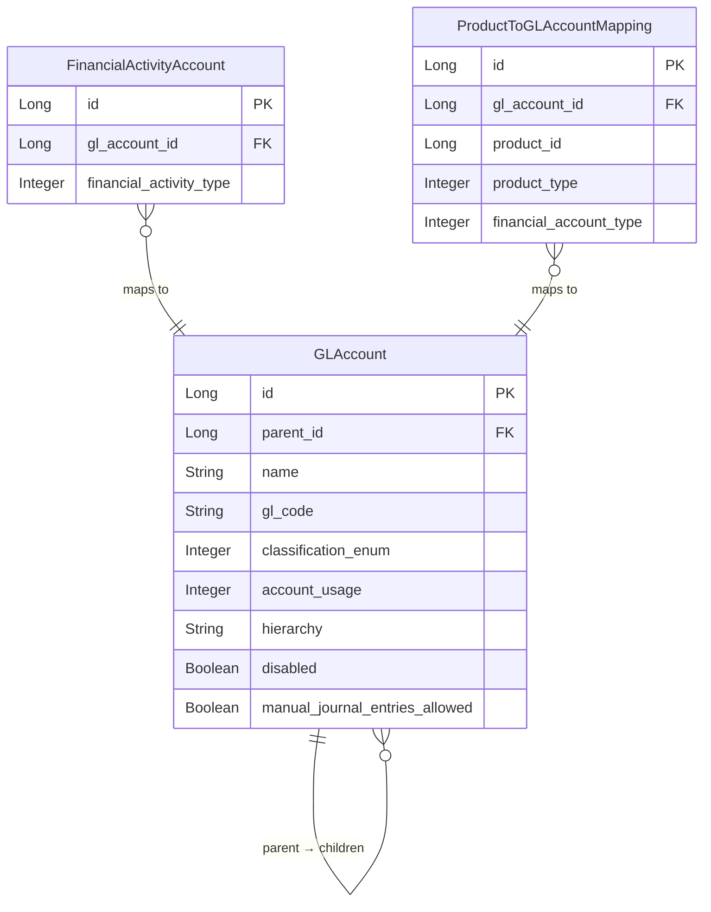

The chart of accounts in Apache Fineract is implemented as a hierarchical tree of `GLAccount` entities persisted to the `acc_gl_account` table. Every journal entry debit and credit references a `GLAccount`. The domain classes live in `org.apache.fineract.accounting.glaccount.domain` inside **fineract-core**, while the REST layer lives in `org.apache.fineract.accounting.glaccount.api` inside **fineract-accounting**.

## GLAccount Entity

```java
// org.apache.fineract.accounting.glaccount.domain.GLAccount (fineract-core)
@Entity
@Table(name = "acc_gl_account",
       uniqueConstraints = { @UniqueConstraint(columnNames = { "gl_code" }, name = "acc_gl_code") })
@Getter @Setter @NoArgsConstructor @Accessors(chain = true)
public class GLAccount extends AbstractPersistableCustom<Long> {

    @ManyToOne(fetch = FetchType.LAZY)
    @JoinColumn(name = "parent_id")
    private GLAccount parent;           // Null for root accounts

    @Column(name = "hierarchy", nullable = true, length = 50)
    private String hierarchy;           // Dot-notation path, e.g. ".1.5.12."

    @OneToMany(fetch = FetchType.LAZY)
    @JoinColumn(name = "parent_id")
    private List<GLAccount> children;

    @Column(name = "name", nullable = false, length = 45)
    private String name;

    @Column(name = "gl_code", nullable = false, length = 100)
    private String glCode;              // Unique code (e.g. "1001", "CASH-101")

    @Column(name = "disabled", nullable = false)
    private boolean disabled;

    @Column(name = "manual_journal_entries_allowed", nullable = false)
    private boolean manualEntriesAllowed = true;

    @Column(name = "classification_enum", nullable = false)
    private Integer type;               // GLAccountType value

    @Column(name = "account_usage", nullable = false)
    private Integer usage;              // GLAccountUsage value

    @Column(name = "description", nullable = true, length = 500)
    private String description;

    @ManyToOne(fetch = FetchType.LAZY)
    @JoinColumn(name = "tag_id")
    private CodeValue tagId;            // Optional categorisation tag
}
```

## Account Types

`GLAccountType` (in `org.apache.fineract.accounting.glaccount.domain`, fineract-core) classifies every account according to standard accounting principles:

| Enum Constant | Value | Normal Balance | Description |
|---|---|---|---|
| `ASSET` | 1 | Debit | Resources owned by the institution (cash, loans receivable, investments) |
| `LIABILITY` | 2 | Credit | Obligations owed by the institution (deposits, borrowings) |
| `EQUITY` | 3 | Credit | Residual interest (share capital, retained earnings) |
| `INCOME` | 4 | Credit | Revenue earned (interest income, fees) |
| `EXPENSE` | 5 | Debit | Costs incurred (interest expense, provisioning) |

```java
// org.apache.fineract.accounting.glaccount.domain.GLAccountType
public enum GLAccountType {
    ASSET(1, "accountType.asset"),
    LIABILITY(2, "accountType.liability"),
    EQUITY(3, "accountType.equity"),
    INCOME(4, "accountType.income"),
    EXPENSE(5, "accountType.expense");
    // fromInt(Integer v), isAssetType(), isLiabilityType(), etc.
}
```

## Account Usage

`GLAccountUsage` (in `org.apache.fineract.accounting.glaccount.domain`, fineract-core) determines whether a GL account is a grouping node or a posting leaf:

| Enum Constant | Value | Description |
|---|---|---|
| `DETAIL` | 1 | **Leaf account** — journal entries can be posted against it |
| `HEADER` | 2 | **Group account** — contains child accounts; `isHeaderAccount()` returns `true`; cannot receive direct postings |

```java
// org.apache.fineract.accounting.glaccount.domain.GLAccountUsage
public enum GLAccountUsage {
    DETAIL(1, "accountUsage.detail"),
    HEADER(2, "accountUsage.header");
}
```

<Warning>
  Attempting to post a journal entry to a HEADER account raises a `GLAccountInvalidUsageException`. Always ensure product-to-account mappings reference DETAIL accounts.
</Warning>

## Account Hierarchy

The hierarchy is stored as a dot-separated path string in the `hierarchy` column, computed by `GLAccount.generateHierarchy()`:

```java
public void generateHierarchy() {
    if (this.parent != null) {
        this.hierarchy = this.parent.hierarchyOf(getId());
    } else {
        this.hierarchy = ".";  // Root account
    }
}

private String hierarchyOf(final Long id) {
    return this.hierarchy + id.toString() + ".";
}
```

A typical chart of accounts hierarchy:

```
. (root)
├── Assets [HEADER] hierarchy: "."
│   ├── Current Assets [HEADER] hierarchy: ".1."
│   │   ├── Cash at Main Vault [DETAIL] hierarchy: ".1.2."
│   │   └── Cash at Teller [DETAIL] hierarchy: ".1.3."
│   └── Loan Portfolio [DETAIL] hierarchy: ".1.4."
├── Liabilities [HEADER] hierarchy: "."
│   └── Savings Control [DETAIL] hierarchy: ".5.6."
├── Equity [HEADER] hierarchy: "."
│   └── Share Capital [DETAIL] hierarchy: ".7.8."
├── Income [HEADER] hierarchy: "."
│   ├── Interest on Loans [DETAIL] hierarchy: ".9.10."
│   └── Fee Income [DETAIL] hierarchy: ".9.11."
└── Expense [HEADER] hierarchy: "."
    └── Interest on Savings [DETAIL] hierarchy: ".12.13."
```

## GLAccountRepository

`GLAccountRepository` in `org.apache.fineract.accounting.glaccount.domain` (fineract-core) is a standard Spring Data JPA interface. The `GLAccountRepositoryWrapper` adds a not-found guard:

```java
// org.apache.fineract.accounting.glaccount.domain.GLAccountRepositoryWrapper
@Service
public class GLAccountRepositoryWrapper {

    private final GLAccountRepository repository;

    @Autowired
    public GLAccountRepositoryWrapper(final GLAccountRepository repository) {
        this.repository = repository;
    }

    public GLAccount findOneWithNotFoundDetection(final Long id) {
        return this.repository.findById(id)
            .orElseThrow(() -> new GLAccountNotFoundException(id));
    }
}
```

## REST API — GLAccountsApiResource

`GLAccountsApiResource` in `org.apache.fineract.accounting.glaccount.api` (fineract-accounting) exposes the chart of accounts at `/api/v1/glaccounts`:

| Method | Path | Description |
|---|---|---|
| `GET` | `/glaccounts` | List all GL accounts; filterable by `type`, `usage`, `disabled`, `manualEntriesAllowed` |
| `GET` | `/glaccounts/template` | Retrieve template with drop-down options |
| `GET` | `/glaccounts/{glAccountId}` | Retrieve a single GL account with optional child/transaction association data |
| `POST` | `/glaccounts` | Create a new GL account |
| `PUT` | `/glaccounts/{glAccountId}` | Update a GL account |
| `DELETE` | `/glaccounts/{glAccountId}` | Delete a GL account (fails if it has journal entries or product mappings) |
| `GET` | `/glaccounts/downloadtemplate` | Download bulk upload template |
| `POST` | `/glaccounts/uploadtemplate` | Bulk upload GL accounts |

The `GLAccountCommand` carries the input parameters mapped by `GLAccountJsonInputParams`:

| Parameter Key | Description |
|---|---|
| `name` | Display name |
| `glCode` | Unique account code |
| `type` | `GLAccountType` integer value |
| `usage` | `GLAccountUsage` integer value |
| `parentId` | Optional parent GL account ID |
| `description` | Optional description text |
| `manualEntriesAllowed` | Whether manual journal entries are permitted |
| `disabled` | Soft-disable without deletion |
| `tagId` | Optional code value tag |

## FinancialActivityAccount Mapping

Beyond product-specific mappings, Fineract maintains a separate set of institution-wide GL account associations through `FinancialActivityAccount` (table: `acc_gl_financial_activity_account`):

```java
// org.apache.fineract.accounting.financialactivityaccount.domain.FinancialActivityAccount
@Entity
@Table(name = "acc_gl_financial_activity_account")
public class FinancialActivityAccount extends AbstractPersistableCustom<Long> {

    @ManyToOne(fetch = FetchType.EAGER)
    @JoinColumn(name = "gl_account_id")
    private GLAccount glAccount;

    @Column(name = "financial_activity_type", nullable = false)
    private Integer financialActivityType;  // AccountingConstants.FinancialActivity value
}
```

`FinancialActivity` enum (in `AccountingConstants`) maps platform activities to required GL account types:

| Constant | Value | Required GL Type | Purpose |
|---|---|---|---|
| `ASSET_TRANSFER` | 100 | ASSET | Inter-office asset transfers |
| `LIABILITY_TRANSFER` | 200 | LIABILITY | Inter-office liability transfers |
| `CASH_AT_MAINVAULT` | 101 | ASSET | Physical cash at head vault |
| `CASH_AT_TELLER` | 102 | ASSET | Physical cash at teller |
| `OPENING_BALANCES_TRANSFER_CONTRA` | 300 | EQUITY | Opening balance contra entry |
| `ASSET_FUND_SOURCE` | 103 | ASSET | Default fund source for disbursements |
| `PAYABLE_DIVIDENDS` | 201 | LIABILITY | Dividends payable to share account holders |

The `FinancialActivityAccountsApiResource` at `/api/v1/financialactivityaccounts` manages CRUD for these mappings.

## Account Seeding

Fineract does not ship a pre-built chart of accounts. Each deployment populates its own GL accounts by either:
1. **REST API** — sending `POST /api/v1/glaccounts` requests for each account
2. **Bulk upload** — using the Excel template at `GET /api/v1/glaccounts/downloadtemplate`

Once accounts exist, product teams configure the `ProductToGLAccountMapping` records to wire the accounts into the transaction flow (see [Product Account Mapping](/accounting/product-account-mapping)).

<Tip>
  Use `GLAccountDataForLookup` (in `org.apache.fineract.accounting.glaccount.data`) when querying accounts for drop-down selection — it returns only `id`, `name`, and `glCode`, minimising the payload.
</Tip>

## ER Diagram


