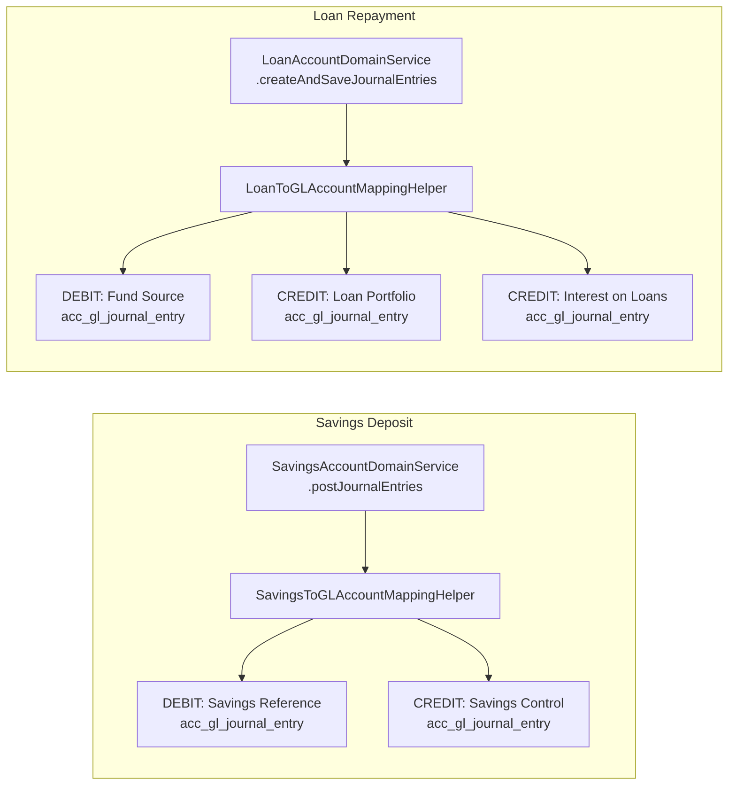

Every financial movement in Apache Fineract results in at least one pair of journal entries — one DEBIT and one CREDIT — that balance to zero. The `JournalEntry` entity is the atomic unit of the general ledger. All automated and manual postings land in the `acc_gl_journal_entry` table. The domain class is in `org.apache.fineract.accounting.journalentry.domain` (fineract-accounting), the REST layer is in `org.apache.fineract.accounting.journalentry.api` (fineract-provider).

## JournalEntry Entity

```java
// org.apache.fineract.accounting.journalentry.domain.JournalEntry
@Entity
@Getter
@Table(name = "acc_gl_journal_entry")
public class JournalEntry extends AbstractAuditableWithUTCDateTimeCustom<Long> {

    @ManyToOne
    @JoinColumn(name = "office_id", nullable = false)
    private Office office;

    @ManyToOne
    @JoinColumn(name = "account_id", nullable = false)
    private GLAccount glAccount;        // Which GL account is debited/credited

    @Column(name = "currency_code", length = 3, nullable = false)
    private String currencyCode;

    @Column(name = "transaction_id", nullable = false, length = 50)
    private String transactionId;       // Shared across the debit/credit pair

    @Column(name = "loan_transaction_id")
    private Long loanTransactionId;     // Set for loan-sourced entries

    @Column(name = "savings_transaction_id")
    private Long savingsTransactionId;  // Set for savings-sourced entries

    @Column(name = "share_transaction_id")
    private Long shareTransactionId;    // Set for share-sourced entries

    @Column(name = "client_transaction_id")
    private Long clientTransactionId;

    @Column(name = "entry_date")
    private LocalDate transactionDate;

    @Column(name = "type_enum", nullable = false)
    private Integer type;               // JournalEntryType.CREDIT (1) or DEBIT (2)

    @Column(name = "amount", scale = 6, precision = 19, nullable = false)
    private BigDecimal amount;

    @Column(name = "manual_entry", nullable = false)
    private boolean manualEntry = false;

    @Column(name = "reversed", nullable = false)
    private boolean reversed = false;

    @Setter
    @ManyToOne(fetch = FetchType.LAZY)
    @JoinColumn(name = "reversal_id")
    private JournalEntry reversalJournalEntry;

    @Column(name = "entity_type_enum", length = 50)
    private Integer entityType;         // PortfolioProductType ordinal

    @Column(name = "entity_id")
    private Long entityId;              // e.g. loan product ID or savings product ID

    @Column(name = "description", length = 500)
    private String description;

    @Column(name = "ref_num")
    private String referenceNumber;

    @Column(name = "submitted_on_date", nullable = false)
    private LocalDate submittedOnDate;
}
```

## JournalEntryType

`JournalEntryType` (in `org.apache.fineract.accounting.journalentry.domain`, fineract-core) defines only two values:

```java
public enum JournalEntryType {
    CREDIT(1, "journalEntryType.credit"),
    DEBIT(2, "journalEntrytType.debit");
}
```

Every row in `acc_gl_journal_entry` is either a pure DEBIT or a pure CREDIT. A complete transaction always produces at minimum one DEBIT row and one CREDIT row with equal total amounts, satisfying the double-entry constraint.

## Static Factory

```java
public static JournalEntry createNew(
    final Office office,
    final PaymentDetail paymentDetail,
    final GLAccount glAccount,
    final String currencyCode,
    final String transactionId,
    final boolean manualEntry,
    final LocalDate transactionDate,
    final JournalEntryType journalEntryType,
    final BigDecimal amount,
    final String description,
    final Integer entityType,
    final Long entityId,
    final String referenceNumber,
    final Long loanTransaction,
    final Long savingsTransaction,
    final Long clientTransaction,
    final Long shareTransactionId) { ... }
```

The `transactionId` string is shared across all debit and credit rows belonging to the same business event (e.g., a single loan repayment generates multiple `JournalEntry` rows all sharing the same `transactionId`).

## Automated Journal Entry Creation

Journal entries are never created directly by application code calling `JournalEntry.createNew(...)` from business logic. Instead, dedicated helper services resolve the correct GL accounts from product mappings and create balanced entry pairs.



## Example: Savings Deposit Journal Entry Pair

When `SavingsAccountDomainService.handleDeposit(...)` runs, the following rows are inserted for a cash deposit of **500 USD** to a savings account:

| `transaction_id` | `type_enum` | `account_id` | `amount` | `gl_code` | GL Account Name |
|---|---|---|---|---|---|
| `S-12345` | 2 (DEBIT) | 3 | 500.00 | 1001 | Savings Reference (Asset) |
| `S-12345` | 1 (CREDIT) | 7 | 500.00 | 2001 | Savings Control (Liability) |

## Manual Journal Entries

Authorised users can post manual journal entries for adjustments or corrections. A manual entry sets `manualEntry = true` and requires:

- At least one debit entry and one credit entry
- Total debits = total credits
- Transaction date not before any `GLClosure` date for the office
- Target GL accounts must have `manualEntriesAllowed = true`

The `JournalEntryCommand` carries the payload:

```java
// org.apache.fineract.accounting.journalentry.command.JournalEntryCommand
public class JournalEntryCommand {
    private Long officeId;
    private LocalDate transactionDate;
    private String currencyCode;
    private String comments;
    private String referenceNumber;
    private Long accountingRuleId;
    private SingleDebitOrCreditEntryCommand[] debits;
    private SingleDebitOrCreditEntryCommand[] credits;
}
```

Each `SingleDebitOrCreditEntryCommand` holds `glAccountId` and `amount`.

## Journal Entry REST API

`JournalEntriesApiResource` in `org.apache.fineract.accounting.journalentry.api` (fineract-provider), base path `/api/v1/journalentries`:

| Method | Path | Description |
|---|---|---|
| `GET` | `/journalentries` | List journal entries; filterable by office, GL account, date range, loan, savings, manual, reversed |
| `GET` | `/journalentries/{journalEntryId}` | Retrieve a single journal entry with optional associations |
| `POST` | `/journalentries` | Create manual journal entry |
| `POST` | `/journalentries/{transactionId}` | Reverse a transaction by its `transactionId` |
| `GET` | `/journalentries/openingbalance` | Retrieve opening balances for an office |
| `GET` | `/journalentries/provisioning` | List provisioning-related entries |
| `GET` | `/journalentries/downloadtemplate` | Download bulk upload template |
| `POST` | `/journalentries/uploadtemplate` | Bulk upload manual journal entries |

### Reversal

When a transaction is reversed, the API posts new CREDIT entries for each original DEBIT and new DEBIT entries for each original CREDIT, all sharing a new `transactionId` linked back via `reversal_id`. The original rows are marked `reversed = true`.

## Accounting Closures

`GLClosure` (table: `acc_gl_closures`) prevents backdated entries into completed accounting periods.

```java
// org.apache.fineract.accounting.closure.domain.GLClosure
@Entity
@Table(name = "acc_gl_closures")
public class GLClosure extends AbstractAuditableWithUTCDateTimeCustom<Long> {
    // office, closingDate, comments
}
```

`GLClosuresApiResource` at `/api/v1/glclosures`:

| Method | Path | Description |
|---|---|---|
| `GET` | `/glclosures` | List closures (filterable by `officeId`) |
| `GET` | `/glclosures/{glClosureId}` | Retrieve single closure |
| `POST` | `/glclosures` | Create new closure |
| `PUT` | `/glclosures/{glClosureId}` | Update closure comments |
| `DELETE` | `/glclosures/{glClosureId}` | Delete a closure |

<Note>
  Closures are office-scoped. A closure for office A does not affect journal entry posting for office B.
</Note>

## Trial Balance

The `TrialBalance` entity (table: `acc_trial_balance_detail`) stores pre-computed debit and credit totals per GL account per period. It is populated by the `UpdateTrialBalanceDetailsTasklet` Spring Batch job in `org.apache.fineract.accounting.glaccount.jobs.updatetrialbalancedetails`.

```java
// org.apache.fineract.accounting.glaccount.domain.TrialBalance
@Entity
@Table(name = "acc_trial_balance_detail")
public class TrialBalance extends AbstractPersistableCustom<Long> {
    // glAccount, office, closingBalance, debitCount, creditCount,
    // createdDate, closingBalance type
}
```

The `JournalEntryRunningBalanceUpdateService` is responsible for maintaining running balance denormalisation on the `JournalEntry` rows themselves, enabling fast balance queries without full table scans.

## JournalEntryData DTO

When journal entries are returned via the REST API, they are projected into `JournalEntryData` (in `org.apache.fineract.accounting.journalentry.data`):

```java
public class JournalEntryData {
    Long id;
    Long officeId;
    String officeName;
    String glAccountName;
    Long glAccountId;
    String glAccountCode;
    EnumOptionData glAccountType;   // ASSET / LIABILITY / etc.
    LocalDate transactionDate;
    EnumOptionData entryType;       // CREDIT / DEBIT
    BigDecimal amount;
    String currencyCode;
    String transactionId;
    boolean manualEntry;
    EnumOptionData entityType;
    Long entityId;
    boolean reversed;
    Long reversalId;
    String referenceNumber;
    TransactionDetailData transactionDetails; // Loan / savings transaction info
}
```

<Tip>
  Use the `?transactionDetails=true` query parameter when calling `GET /journalentries/{id}` to include the associated `TransactionDetailData` showing the originating loan or savings transaction.
</Tip>
