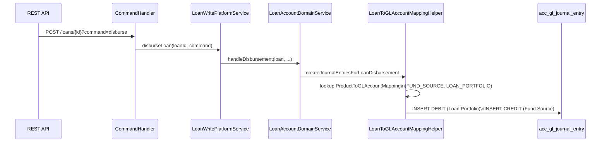

Apache Fineract implements full double-entry bookkeeping across all financial operations. The `fineract-accounting` Maven module is the authoritative home for the general ledger, while `fineract-core` supplies the shared domain types (`GLAccount`, `JournalEntryType`, `AccountingConstants`) that the rest of the platform depends on. Every loan disbursement, repayment, savings deposit, share purchase, and fee collection automatically generates balanced journal entries — no manual intervention required for standard transactions.

## Module Structure

```
fineract-accounting/src/main/java/org/apache/fineract/accounting/
├── accrual/           # Periodic accrual calculation & posting
│   └── api/AccrualAccountingApiResource.java
├── closure/           # Accounting period closures
│   ├── domain/GLClosure.java
│   └── api/GLClosuresApiResource.java
├── common/            # AccountingConstants (all mapping enums)
│   └── AccountingRuleType.java
├── financialactivityaccount/
│   ├── domain/FinancialActivityAccount.java
│   └── api/FinancialActivityAccountsApiResource.java
├── glaccount/         # Chart of accounts (see fineract-core for domain)
│   └── api/GLAccountsApiResource.java
├── journalentry/      # Journal entry write/read services
│   └── api/ (in fineract-provider: JournalEntriesApiResource)
├── producttoaccountmapping/
│   ├── domain/ProductToGLAccountMapping.java
│   └── service/ProductToGLAccountMappingWritePlatformService.java
├── provisioning/      # Loan loss provisioning entries
│   └── api/ProvisioningEntriesApiResource.java
├── rule/              # Accounting rules for manual entries
│   └── domain/AccountingRule.java
└── trialbalance/      # Trial balance jobs

fineract-core/src/main/java/org/apache/fineract/accounting/
├── glaccount/domain/
│   ├── GLAccount.java       # Core GL account entity
│   ├── GLAccountType.java   # ASSET, LIABILITY, EQUITY, INCOME, EXPENSE
│   └── GLAccountUsage.java  # HEADER, DETAIL
├── journalentry/domain/
│   └── JournalEntryType.java  # CREDIT (1), DEBIT (2)
└── common/
    └── AccountingConstants.java  # CashAccountsForLoan, CashAccountsForSavings, etc.
```

## Key Subsystems

<CardGroup cols={2}>
  <Card title="Chart of Accounts" icon="sitemap" href="/accounting/chart-of-accounts">
    `GLAccount` entity in `acc_gl_account`: hierarchical tree of accounts typed as ASSET, LIABILITY, EQUITY, INCOME, or EXPENSE. HEADER accounts group children; DETAIL accounts receive actual postings.
  </Card>
  <Card title="Journal Entries" icon="book" href="/accounting/journal-entries">
    `JournalEntry` entity in `acc_gl_journal_entry`: every financial transaction generates paired DEBIT/CREDIT rows referencing GL accounts. Manual entries, reversals, and period closures are also supported.
  </Card>
  <Card title="Product Account Mapping" icon="arrows-left-right" href="/accounting/product-account-mapping">
    `ProductToGLAccountMapping` in `acc_product_mapping`: links each loan product or savings product's financial activity type to a specific GL account. Drives automatic journal entry routing at transaction time.
  </Card>
  <Card title="Financial Activity Accounts" icon="building-columns">
    `FinancialActivityAccount` in `acc_gl_financial_activity_account`: maps platform-wide activities (e.g., `ASSET_TRANSFER`, `PAYABLE_DIVIDENDS`) to GL accounts independently of any product.
  </Card>
</CardGroup>

## Accounting Rule Types

`AccountingRuleType` (in `org.apache.fineract.accounting.common`) controls which journal entries are posted for a product:

| Rule | Value | Description |
|---|---|---|
| `NONE` | 1 | No accounting — entries are not posted |
| `CASH_BASED` | 2 | Cash accounting — entries post only on actual cash movement |
| `ACCRUAL_PERIODIC` | 3 | Periodic accrual — entries post on schedule (interest receivable/payable) |
| `ACCRUAL_UPFRONT` | 4 | Upfront accrual — income recognised in full at disbursement |

## How Transactions Trigger Journal Entries

Every financial operation in Fineract follows the same pattern: the platform service (loan or savings) calls through to the accounting layer to post journal entries immediately after updating the domain state.

```mermaid
flowchart TD
    A[REST API Request\ne.g. POST /savingsaccounts/{id}?command=deposit] --> B[SavingsAccountsApiResource]
    B --> C[CommandProcessingService]
    C --> D[DepositSavingsAccountCommandHandler]
    D --> E[SavingsAccountWritePlatformServiceJpaRepositoryImpl]
    E --> F[SavingsAccountDomainService.handleDeposit]
    F --> G[SavingsAccount.deposit\nCreate SavingsAccountTransaction]
    G --> H[SavingsAccountDomainService.postJournalEntries]
    H --> I[SavingsAccountToGLAccountMappingHelper\nLookup product → GL account mappings]
    I --> J[JournalEntry created\nDEBIT: Savings Reference\nCREDIT: Savings Control]
    J --> K[acc_gl_journal_entry rows persisted]
```

For **loan transactions**, the equivalent flow goes through `LoanAccountDomainService` → `LoanTransactionToGLAccountMappingHelper`.

## Loan Transaction → Journal Entry Flow



## Accrual Accounting

The `AccrualAccountingApiResource` (at `/api/v1/runaccruals`) triggers periodic or upfront accrual calculations via `AccrualAccountingWritePlatformService`. For savings products under `ACCRUAL_PERIODIC`, this posts interest accruals to:
- **DEBIT** `INTEREST_RECEIVABLE` (or `INTEREST_PAYABLE` for savings liabilities)
- **CREDIT** `INCOME_FROM_INTEREST` / `INTEREST_ON_SAVINGS`

## Period Closures

`GLClosure` (table: `acc_gl_closures`) prevents journal entries from being backdated into a closed accounting period. `GLClosuresApiResource` at `/api/v1/glclosures` manages the create/update/delete lifecycle of closures per office.

```java
// org.apache.fineract.accounting.closure.domain.GLClosure
@Entity
@Table(name = "acc_gl_closures")
public class GLClosure extends AbstractAuditableWithUTCDateTimeCustom<Long> {
    // closingDate, office, comments
}
```

<Warning>
  Once a `GLClosure` is created for an office and date, any attempt to post a journal entry with a transaction date on or before that closure date is rejected. Use the `GLClosureInvalidException` error to diagnose validation failures.
</Warning>

## Trial Balance

The trial balance is maintained by the `UpdateTrialBalanceDetailsTasklet` (Spring Batch job in `org.apache.fineract.accounting.glaccount.jobs.updatetrialbalancedetails`). It aggregates journal entry debits and credits per GL account and stores summary rows in the `acc_trial_balance_detail` table (`TrialBalance` entity).

## Cross-Module Integration Points

| Module | Integration | Description |
|---|---|---|
| `fineract-loan` | `LoanTransactionToGLAccountMappingHelper` | Loan transactions → journal entries |
| `fineract-savings` | `SavingsAccountDomainService.postJournalEntries` | Savings transactions → journal entries |
| `fineract-provider` (shares) | `ShareProductToGLAccountMappingHelper` | Share purchases/dividends → journal entries |
| `fineract-accounting` | `ProvisioningEntriesApiResource` | Loan loss provisions → journal entries |
| `fineract-accounting` | `AccrualAccountingWritePlatformService` | Periodic accrual → journal entries |
