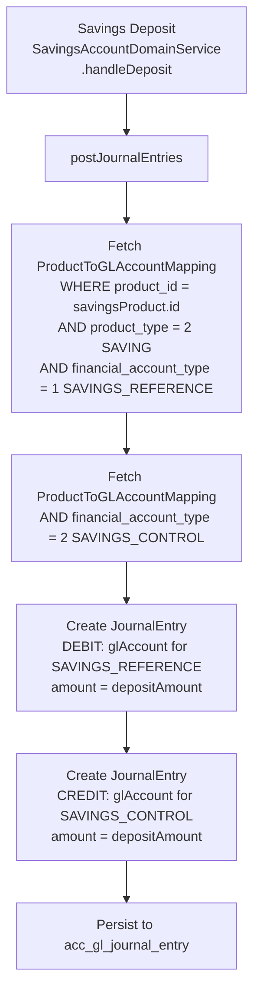

Apache Fineract routes every automated journal entry to the correct general ledger account through a product-to-account mapping layer. Rather than hard-coding GL account IDs in business logic, each loan product, savings product, or share product declares a set of financial activity types, and each type is bound to a specific `GLAccount` at configuration time. At transaction runtime, the platform looks up these mappings and inserts the corresponding debit/credit journal entry rows.

## ProductToGLAccountMapping Entity

The `ProductToGLAccountMapping` entity (table: `acc_product_mapping`, in `org.apache.fineract.accounting.producttoaccountmapping.domain`, fineract-accounting) is the single mapping record:

```java
// org.apache.fineract.accounting.producttoaccountmapping.domain.ProductToGLAccountMapping
@Entity
@Table(name = "acc_product_mapping",
       uniqueConstraints = { @UniqueConstraint(
           columnNames = { "product_id", "product_type", "financial_account_type", "payment_type" },
           name = "financial_action") })
@Getter @Setter @NoArgsConstructor @Accessors(chain = true)
public class ProductToGLAccountMapping extends AbstractPersistableCustom<Long> {

    @ManyToOne(optional = true)
    @JoinColumn(name = "gl_account_id")
    private GLAccount glAccount;

    @Column(name = "product_id", nullable = true)
    private Long productId;             // FK to loan product, savings product, or share product

    @Column(name = "product_type", nullable = true)
    private int productType;            // PortfolioProductType.getValue()

    @Column(name = "financial_account_type", nullable = true)
    private int financialAccountType;   // e.g. CashAccountsForLoan, CashAccountsForSavings

    @ManyToOne
    @JoinColumn(name = "payment_type", nullable = true)
    private PaymentType paymentType;    // Optional: per-payment-type fund source override

    @ManyToOne
    @JoinColumn(name = "charge_id", nullable = true)
    private Charge charge;              // Optional: per-charge income account override

    @ManyToOne
    @JoinColumn(name = "charge_off_reason_id", nullable = true)
    private CodeValue chargeOffReason;

    @ManyToOne
    @JoinColumn(name = "write_off_reason_id", nullable = true)
    private CodeValue writeOffReason;
}
```

The compound unique constraint ensures that for a given `(product_id, product_type, financial_account_type, payment_type)` tuple there is exactly one GL account mapping.

## Product Types

The `product_type` column stores the ordinal value of `PortfolioProductType` (in `org.apache.fineract.portfolio`, fineract-core):

| Enum Constant | Value | Description |
|---|---|---|
| `LOAN` | 1 | Loan products |
| `SAVING` | 2 | Savings, fixed deposit, and recurring deposit products |
| `PROVISIONING` | 3 | Provisioning entries |
| `SHARES` | 4 | Share products |
| `CLIENT` | 5 | Client-level transactions |
| `WORKING_CAPITAL_LOAN` | 6 | Working capital loan products |

## Mapping Keys for Loan Products

`AccountingConstants.CashAccountsForLoan` (cash-based accounting) defines the financial activity types for loan products. Key entries:

| Enum Constant | Value | GL Account Type | Purpose |
|---|---|---|---|
| `FUND_SOURCE` | 1 | ASSET | Source of loan funds (disbursement credit) |
| `LOAN_PORTFOLIO` | 2 | ASSET | Outstanding loan principal |
| `INTEREST_ON_LOANS` | 3 | INCOME | Interest income earned |
| `INCOME_FROM_FEES` | 4 | INCOME | Fee income from loan charges |
| `INCOME_FROM_PENALTIES` | 5 | INCOME | Penalty income |
| `LOSSES_WRITTEN_OFF` | 6 | EXPENSE | Written-off loan principal |
| `TRANSFERS_SUSPENSE` | 10 | ASSET | Inter-office transfer suspense |
| `OVERPAYMENT` | 11 | LIABILITY | Client overpayment liability |
| `INCOME_FROM_RECOVERY` | 12 | INCOME | Income from recovering written-off loans |
| `GOODWILL_CREDIT` | 13 | EXPENSE | Goodwill credit write-off |
| `INCOME_FROM_CHARGE_OFF_INTEREST` | 14 | INCOME | Interest recovered after charge-off |
| `INCOME_FROM_CHARGE_OFF_FEES` | 15 | INCOME | Fees recovered after charge-off |
| `CHARGE_OFF_EXPENSE` | 16 | EXPENSE | Expense at charge-off |
| `CHARGE_OFF_FRAUD_EXPENSE` | 17 | EXPENSE | Fraud write-off expense |
| `INCOME_FROM_CHARGE_OFF_PENALTY` | 18 | INCOME | Penalty recovered after charge-off |

For accrual-based loan products, `AccrualAccountsForLoan` adds:

| Enum Constant | Value | GL Account Type | Purpose |
|---|---|---|---|
| `INTEREST_RECEIVABLE` | 7 | ASSET | Accrued but not yet received interest |
| `FEES_RECEIVABLE` | 8 | ASSET | Accrued fee receivable |
| `PENALTIES_RECEIVABLE` | 9 | ASSET | Accrued penalty receivable |

## Mapping Keys for Savings Products

`AccountingConstants.CashAccountsForSavings` covers regular savings, fixed deposits, and recurring deposits:

| Enum Constant | Value | GL Account Type | Purpose |
|---|---|---|---|
| `SAVINGS_REFERENCE` | 1 | ASSET | Cash/bank reference account (debit on deposit) |
| `SAVINGS_CONTROL` | 2 | LIABILITY | Savings balances owed to clients |
| `INTEREST_ON_SAVINGS` | 3 | EXPENSE | Interest expense paid to savers |
| `INCOME_FROM_FEES` | 4 | INCOME | Fee income from savings charges |
| `INCOME_FROM_PENALTIES` | 5 | INCOME | Penalty income |
| `TRANSFERS_SUSPENSE` | 10 | LIABILITY | Transfer suspense |
| `OVERDRAFT_PORTFOLIO_CONTROL` | 11 | ASSET | Outstanding overdraft balances |
| `INCOME_FROM_INTEREST` | 12 | INCOME | Overdraft interest income |
| `LOSSES_WRITTEN_OFF` | 13 | EXPENSE | Written-off overdraft balances |
| `ESCHEAT_LIABILITY` | 14 | LIABILITY | Unclaimed funds liability |

For accrual-based savings products, `AccrualAccountsForSavings` adds:

| Enum Constant | Value | GL Account Type | Purpose |
|---|---|---|---|
| `FEES_RECEIVABLE` | 15 | ASSET | Accrued fee receivable |
| `PENALTIES_RECEIVABLE` | 16 | ASSET | Accrued penalty receivable |
| `INTEREST_PAYABLE` | 17 | LIABILITY | Interest payable to savers (accrued) |
| `INTEREST_RECEIVABLE` | 18 | ASSET | Overdraft interest receivable (accrued) |

## Mapping Keys for Share Products

`AccountingConstants.CashAccountsForShares`:

| Enum Constant | Value | GL Account Type | Purpose |
|---|---|---|---|
| `SHARES_REFERENCE` | 1 | ASSET | Cash received for share purchases |
| `SHARES_SUSPENSE` | 2 | LIABILITY | Pending share application holding account |
| `INCOME_FROM_FEES` | 3 | INCOME | Fee income from share transactions |
| `SHARES_EQUITY` | 4 | EQUITY | Capital raised through share issuance |

## Helper Services

The mapping system is implemented through a set of helper classes in `org.apache.fineract.accounting.producttoaccountmapping.service`:

<Tabs>
  <Tab title="ProductToGLAccountMappingHelper">
    Base class for all mapping helpers. Contains the core `saveProductToAccountMapping(...)` and `mergeProductToAccountMappingChanges(...)` methods.

    ```java
    // org.apache.fineract.accounting.producttoaccountmapping.service
    //    .ProductToGLAccountMappingHelper
    public void saveProductToAccountMapping(
        final JsonElement element, final String paramName,
        final Long productId, final int placeHolderTypeId,
        final GLAccountType expectedAccountType,
        final PortfolioProductType portfolioProductType) {

        final Long accountId = this.fromApiJsonHelper.extractLongNamed(paramName, element);
        if (accountId != null) { // optional entries may be null
            final GLAccount glAccount = getAccountByIdAndType(paramName, expectedAccountType, accountId);

            final ProductToGLAccountMapping accountMapping = new ProductToGLAccountMapping()
                .setGlAccount(glAccount)
                .setProductId(productId)
                .setProductType(portfolioProductType.getValue())
                .setFinancialAccountType(placeHolderTypeId);
            this.accountMappingRepository.saveAndFlush(accountMapping);
        }
    }
    ```
  </Tab>
  <Tab title="SavingsProductToGLAccountMappingHelper">
    Extends `ProductToGLAccountMappingHelper`. Provides typed convenience methods for savings products:

    ```java
    // org.apache.fineract.accounting.producttoaccountmapping.service
    //    .SavingsProductToGLAccountMappingHelper
    public void saveSavingsToAssetAccountMapping(
        JsonElement element, String paramName,
        Long productId, int placeHolderTypeId) {
        saveProductToAccountMapping(element, paramName, productId,
            placeHolderTypeId, GLAccountType.ASSET, PortfolioProductType.SAVING);
    }

    public void saveSavingsToLiabilityAccountMapping(...) { ... }
    public void saveSavingsToIncomeAccountMapping(...) { ... }
    public void saveSavingsToExpenseAccountMapping(...) { ... }
    ```

    Called at product creation time with the JSON body parameters from `SavingProductAccountingParams`:
    - `savingsReferenceAccountId` → `SAVINGS_REFERENCE`
    - `savingsControlAccountId` → `SAVINGS_CONTROL`
    - `interestOnSavingsAccountId` → `INTEREST_ON_SAVINGS`
    - `incomeFromFeeAccountId` → `INCOME_FROM_FEES`
    - `incomeFromPenaltyAccountId` → `INCOME_FROM_PENALTIES`
    - `transfersInSuspenseAccountId` → `TRANSFERS_SUSPENSE`
    - `overdraftPortfolioControlId` → `OVERDRAFT_PORTFOLIO_CONTROL`
    - `writeOffAccountId` → `LOSSES_WRITTEN_OFF`
    - `escheatLiabilityId` → `ESCHEAT_LIABILITY`
  </Tab>
  <Tab title="ShareProductToGLAccountMappingHelper">
    Extends `ProductToGLAccountMappingHelper` for share products:

    ```java
    // org.apache.fineract.accounting.producttoaccountmapping.service
    //    .ShareProductToGLAccountMappingHelper
    // Maps: shareReferenceId, shareSuspenseId,
    //       incomeFromFeeAccountId, shareEquityId
    ```
  </Tab>
</Tabs>

## ProductToGLAccountMappingWritePlatformService

The top-level service interface in `org.apache.fineract.accounting.producttoaccountmapping.service`:

```java
public interface ProductToGLAccountMappingWritePlatformService {

    void createLoanProductToGLAccountMapping(Long loanProductId, JsonCommand command);

    void createSavingProductToGLAccountMapping(
        Long savingProductId, JsonCommand command, DepositAccountType accountType);

    Map<String, Object> updateLoanProductToGLAccountMapping(
        Long loanProductId, JsonCommand command, boolean accountingRuleChanged,
        AccountingRuleType accountingRuleTypeId, boolean enableIncomeCapitalization,
        boolean enableBuyDownFee, boolean merchantBuyDownFee);

    Map<String, Object> updateSavingsProductToGLAccountMapping(
        Long savingsProductId, JsonCommand command, boolean accountingRuleChanged,
        int accountingRuleTypeId, DepositAccountType accountType);

    void createShareProductToGLAccountMapping(Long shareProductId, JsonCommand command);

    Map<String, Object> updateShareProductToGLAccountMapping(
        Long shareProductId, JsonCommand command, boolean accountingRuleChanged,
        int accountingRuleTypeId);
}
```

These methods are called by the loan product, savings product, and share product write services whenever a product is created or its accounting configuration is updated.

## How Mappings Drive Journal Entries at Transaction Time



For **payment-type-specific** fund sources (e.g., mobile money vs cash), the mapping lookup also matches on `payment_type`. If a payment-type-specific mapping exists, it overrides the default `FUND_SOURCE`/`SAVINGS_REFERENCE` mapping.

For **charge-specific** income accounts, each `Charge` can be linked to a specific income GL account via a `ProductToGLAccountMapping` row with `charge_id` set. This allows fee income from different charge types to post to different income accounts.

## Per-Payment-Type and Per-Charge Overrides

<Accordion title="Payment Channel Fund Source Mapping">
  When a savings product has `paymentChannelToFundSourceMappings`, the system creates one `ProductToGLAccountMapping` row per payment type with `paymentType` set. At transaction time, if the deposit's `PaymentDetail.paymentType` matches a configured mapping, that GL account is used as the fund source instead of the default `SAVINGS_REFERENCE` account.
</Accordion>

<Accordion title="Fee-to-Income Account Mapping">
  `feeToIncomeAccountMappings` in the product configuration creates `ProductToGLAccountMapping` rows with `charge_id` set. When a specific charge is applied, the system looks for a row matching `(productId, productType, INCOME_FROM_FEES, chargeId)`. If found, that account is credited instead of the generic `INCOME_FROM_FEES` account.
</Accordion>

<Accordion title="Penalty-to-Income Account Mapping">
  Works identically to fee-to-income mapping using `penaltyToIncomeAccountMappings` and the `INCOME_FROM_PENALTIES` financial account type.
</Accordion>

## Read Service

`ProductToGLAccountMappingReadPlatformService` (in `org.apache.fineract.accounting.producttoaccountmapping.service`) retrieves existing mappings for display in the product detail view. It returns structured data objects such as `PaymentTypeToGLAccountMapper` and `ChargeToGLAccountMapper` that the REST layer serialises to JSON.

## Example: Complete Loan Product Mapping Configuration

A typical cash-based loan product requires these mandatory mappings:

| Parameter (`LoanProductAccountingParams`) | Financial Account Type | GL Account Type |
|---|---|---|
| `fundSourceAccountId` | `FUND_SOURCE (1)` | ASSET |
| `loanPortfolioAccountId` | `LOAN_PORTFOLIO (2)` | ASSET |
| `interestOnLoanAccountId` | `INTEREST_ON_LOANS (3)` | INCOME |
| `incomeFromFeeAccountId` | `INCOME_FROM_FEES (4)` | INCOME |
| `incomeFromPenaltyAccountId` | `INCOME_FROM_PENALTIES (5)` | INCOME |
| `writeOffAccountId` | `LOSSES_WRITTEN_OFF (6)` | EXPENSE |
| `transfersInSuspenseAccountId` | `TRANSFERS_SUSPENSE (10)` | ASSET |
| `overpaymentLiabilityAccountId` | `OVERPAYMENT (11)` | LIABILITY |

<Warning>
  All mandatory mapping parameters must be provided when creating a product with `accountingRule = CASH_BASED (2)` or higher. Missing mappings cause a `ProductToGLAccountMappingNotFoundException` at transaction time.
</Warning>

<Tip>
  Use `GET /api/v1/loanproducts/{productId}/mappings` or the equivalent savings/share endpoint to inspect the current GL account mappings for any product. The response includes resolved `GLAccountData` objects showing name, code, and type alongside each mapping key.
</Tip>
