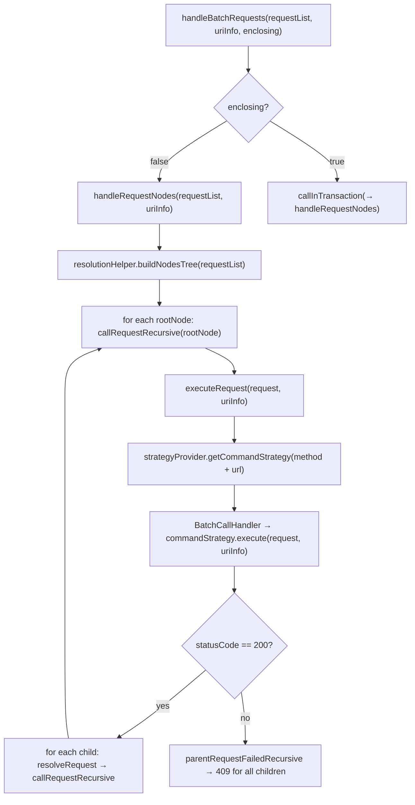
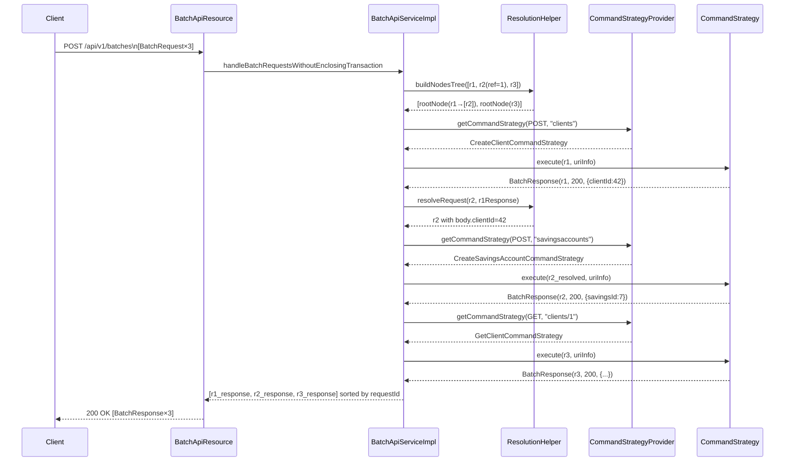

The Apache Fineract Batch API allows a consumer to bundle multiple independent or dependent HTTP sub-requests into a single HTTP POST call. The platform executes each sub-request internally, resolves any cross-request JSONPath dependencies, and returns a consolidated response array. This eliminates the round-trip overhead of sequential API calls — critical for mobile clients on high-latency networks and for bulk data operations.

The Batch API endpoint is `POST /api/v1/batches` and is implemented by `BatchApiResource` in `org.apache.fineract.batch.api`.

## Request and Response Structures

### BatchRequest

```java
// org.apache.fineract.batch.domain.BatchRequest
@NoArgsConstructor @Data @Accessors(chain = true)
public class BatchRequest {
    private Long requestId;        // unique within the batch; used for ordering
    private String relativeUrl;    // path after /api/v1/, e.g. "clients/1"
    private String method;         // "GET", "POST", "PUT", "DELETE"
    private Set<Header> headers;   // optional per-request headers
    private Long reference;        // requestId of parent request (for dependencies)
    private String body;           // JSON body for POST/PUT requests
}
```

### BatchResponse

```java
// org.apache.fineract.batch.domain.BatchResponse
@NoArgsConstructor @Data @Accessors(chain = true)
public class BatchResponse {
    private Long requestId;        // matches the originating BatchRequest.requestId
    private Integer statusCode;    // HTTP status of the sub-request
    private Set<Header> headers;
    private String body;           // JSON-encoded response body as a string
}
```

### Example Batch Payload

The following creates a client and then immediately opens a savings account for that client in one HTTP call, using the client ID returned by request `1` in request `2`:

```json
[
  {
    "requestId": 1,
    "method": "POST",
    "relativeUrl": "clients",
    "headers": [{"name": "Content-Type", "value": "application/json"}],
    "body": "{\"firstname\":\"John\",\"lastname\":\"Doe\",\"officeId\":1,\"dateFormat\":\"dd MMMM yyyy\",\"locale\":\"en\",\"active\":true,\"activationDate\":\"01 March 2011\"}"
  },
  {
    "requestId": 2,
    "reference": 1,
    "method": "POST",
    "relativeUrl": "savingsaccounts",
    "headers": [{"name": "Content-Type", "value": "application/json"}],
    "body": "{\"clientId\":\"$.clientId\",\"productId\":1,\"locale\":\"en\",\"dateFormat\":\"dd MMMM yyyy\",\"submittedOnDate\":\"01 March 2011\"}"
  }
]
```

The `"$.clientId"` in request `2`'s body is a JSONPath expression. `ResolutionHelper` substitutes it with the `clientId` value from request `1`'s response body before executing request `2`.

## BatchApiResource

```java
// org.apache.fineract.batch.api.BatchApiResource
@Path("/v1/batches")
@Component
@RequiredArgsConstructor
public class BatchApiResource {

    @POST
    @Consumes(MediaType.APPLICATION_JSON)
    @Produces(MediaType.APPLICATION_JSON)
    public List<BatchResponse> handleBatchRequests(
            @DefaultValue("false")
            @QueryParam("enclosingTransaction") boolean enclosingTransaction,
            List<BatchRequest> requestList,
            @Context UriInfo uriInfo) {

        this.context.authenticatedUser();
        validateRequestMethodsAllowedOnInstanceType(requestList);

        return enclosingTransaction
            ? service.handleBatchRequestsWithEnclosingTransaction(requestList, uriInfo)
            : service.handleBatchRequestsWithoutEnclosingTransaction(requestList, uriInfo);
    }
}
```

**Query parameter `enclosingTransaction`** (default `false`) selects between the two execution modes described below.

**Read-only mode validation**: When `fineract.mode` is read-only (`readEnabled=true`, `writeEnabled=false`), the resource rejects any batch containing non-GET sub-requests with an `InvalidInstanceTypeMethodException`.

## Execution Modes

<Tabs>
  <Tab title="Without Enclosing Transaction (default)">
    Each root node in the dependency tree executes in its own Spring transaction. If sub-request `3` fails, sub-requests `1` and `2` that already succeeded are **not** rolled back. The response for `3` carries the error; dependent children of `3` receive a `409 Conflict` response indicating their parent failed.

    **Use this mode** when sub-requests are logically independent or when partial success is acceptable.
  </Tab>
  <Tab title="With Enclosing Transaction (enclosingTransaction=true)">
    All sub-requests run inside a single Spring transaction with `ISOLATION_REPEATABLE_READ`. If **any** sub-request fails, the entire transaction is rolled back and a single consolidated error response is returned with HTTP `400`.

    The transaction uses Resilience4j retry logic (`retryConfigurationAssembler.getRetryConfigurationForBatchApiWithEnclosingTransaction()`) to handle optimistic locking conflicts (`ConcurrencyFailureException`) by restarting the whole batch.

    **Use this mode** when atomicity across all sub-requests is required (e.g. creating multiple related entities that must all succeed or all fail together).
  </Tab>
</Tabs>

## ResolutionHelper: Dependency Resolution

`ResolutionHelper` (in `org.apache.fineract.batch.service`) manages the dependency graph between sub-requests.

### Building the Request Tree

```java
public List<BatchRequestNode> buildNodesTree(List<BatchRequest> requests) {
    final List<BatchRequestNode> rootNodes = new ArrayList<>();
    for (BatchRequest request : requests) {
        if (request.getReference() == null) {
            rootNodes.add(new BatchRequestNode(request));  // root node
        } else {
            if (!addDependingRequest(request, rootNodes)) {
                throw new BatchReferenceInvalidException(request.getReference());
            }
        }
    }
    return rootNodes;
}
```

Requests with `reference == null` become root nodes. Requests with a non-null `reference` are recursively attached as children of the node whose `requestId` matches the reference. The result is a forest of `BatchRequestNode` trees. A `BatchReferenceInvalidException` is thrown if a reference points to a non-existent request.

### Resolving Cross-Request References

After a parent request succeeds, `resolveRequest(childRequest, parentResponse)` substitutes JSONPath expressions in the child's `body` and `relativeUrl`:

```java
public BatchRequest resolveRequest(BatchRequest request, BatchResponse parentResponse) {
    final ReadContext responseCtx = JsonPath.parse(parentResponse.getBody());

    // Resolve body fields that contain "$.someField"
    if (request.getBody() != null) {
        JsonObject body = fromJsonHelper.parse(request.getBody()).getAsJsonObject();
        // ... walk every field, substituting JSONPath references
        request.setBody(resolvedBody.toString());
    }

    // Resolve "$.someId" segments in relativeUrl
    String relativeUrl = request.getRelativeUrl();
    if (relativeUrl.contains("$.")) {
        // ... substitute path segments
        request.setRelativeUrl(resolvedUrl);
    }

    return request;
}
```

The helper supports:
- **Simple scalar resolution**: `"$.clientId"` → `"42"`
- **Nested objects and arrays**: recursively walks JSON trees resolving all `$.`-prefixed leaves
- **Date arrays**: `"$[ARRAYDATE]$.activationDate"` converts a `[YYYY, MM, DD]` JSON array from the parent response into a formatted date string using the `dateFormat` field from the child request body

## BatchApiServiceImpl: Execution Engine

`BatchApiServiceImpl` is the core orchestrator:



### CommandStrategyProvider

`CommandStrategyProvider` (in `org.apache.fineract.batch.command`) maps a `CommandContext` (HTTP method + relative URL) to a `CommandStrategy` implementation. Each strategy's `execute(BatchRequest, UriInfo)` method internally calls the appropriate JAX-RS resource class, returning a `BatchResponse`. `UnknownCommandStrategy` is the fallback for unrecognised URLs.

### BatchFilter and BatchRequestPreprocessor

`BatchApiServiceImpl` supports two extension points:

- **`BatchFilter`** (list): applied as a chain around `commandStrategy.execute()`. Filters can inspect or modify requests and responses (e.g. request correlation IDs).
- **`BatchRequestPreprocessor`** (list): run before strategy selection using `runPreprocessors()`. Preprocessors return `Either<RuntimeException, BatchRequest>` — returning a `Left` short-circuits the request with an error response.

## Error Handling

| Scenario | Behaviour |
|---|---|
| A sub-request returns non-200 | Children of that request receive `409` with message "Parent request with id X was erroneous!" |
| `BatchReferenceInvalidException` (bad reference) | Entire batch aborted; single error response returned |
| Exception during enclosing transaction | Transaction rolled back; consolidated error with the first failing request's details |
| `ConcurrencyFailureException` in enclosing transaction | Retried with exponential backoff (Resilience4j config) |

<Warning>
When `enclosingTransaction=true`, the entire batch is retried on concurrency failures. Ensure all sub-requests are idempotent or that the retry count is set appropriately in `fineract.retry.instances.execute-command.*`.
</Warning>

## Execution Flow Summary



<Tip>
The final response list is always sorted by `requestId` regardless of execution order. This makes the response predictable even when request trees are processed in different traversal orders.
</Tip>
