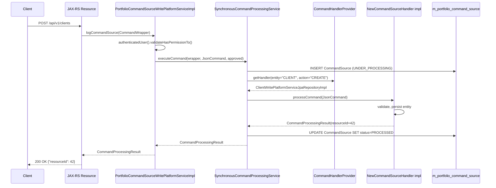

Apache Fineract implements a Command/Query Responsibility Segregation (CQRS) pattern for all write operations. Every mutation — creating a client, disbursing a loan, posting a journal entry — is represented as a typed command object that is dispatched to a dedicated handler, optionally stored for audit, and wrapped with lifecycle hooks. The platform has two command layers: the modern generic command system introduced in `fineract-command`, and the legacy portfolio command infrastructure in `fineract-core/commands` that all existing domain APIs still use.

## Modern Command System (fineract-command)

### Command\<T\>

```java
// org.apache.fineract.command.core.Command
@Data
@FieldNameConstants
public class Command<T> implements Serializable {
    private Long commandId;
    private String idempotencyKey;
    private String ipAddress;
    private Instant createdAt;
    private Instant updatedAt;
    private Instant executedAt;
    private Instant approvedAt;
    private Instant rejectedAt;
    private String initiatedByUsername;
    private String executedByUsername;
    private String approvedByUsername;
    private String rejectedByUsername;
    private String error;
    private T payload;          // the typed request payload
}
```

`Command<T>` is a generic envelope. The business payload is the `payload` field; the surrounding fields carry identity, timestamps, and user attribution for a full audit trail.

### CommandState

```java
// org.apache.fineract.command.core.CommandState
public enum CommandState {
    INVALID,
    PROCESSED,
    AWAITING_APPROVAL,
    REJECTED,
    UNDER_PROCESSING,
    ERROR,
    UNKNOWN
}
```

State transitions: `UNDER_PROCESSING` → `PROCESSED` (success) or `ERROR` (failure). `AWAITING_APPROVAL` and `REJECTED` support maker-checker workflows.

### CommandHandler\<REQ, RES\>

```java
// org.apache.fineract.command.core.CommandHandler
public interface CommandHandler<REQ, RES> {

    RES handle(Command<REQ> command);

    default RES fallback(Command<REQ> command, Throwable t) {
        throw t;   // override for specialised fallback behaviour
    }

    default boolean matches(Command<REQ> command) {
        TypeToken<REQ> handlerType = new TypeToken<>(getClass()) {};
        return handlerType.getRawType()
               .isAssignableFrom(command.getPayload().getClass());
    }
}
```

The `matches()` default uses Guava `TypeToken` to resolve the generic parameter `REQ` at runtime and check type compatibility against the command payload's class. This allows the `CommandHandlerManager` to select the correct handler by type inspection without requiring any registry annotation.

### CommandHandlerManager

```java
// org.apache.fineract.command.core.CommandHandlerManager
@FunctionalInterface
public interface CommandHandlerManager {
    <REQ, RES> RES handle(Command<REQ> command);
}
```

`CommandHandlerManager` is a functional interface that locates and invokes the right `CommandHandler` for a given command. The default implementation iterates through all registered `CommandHandler` beans and selects the first one whose `matches(command)` returns `true`.

### CommandDispatcher

```java
// org.apache.fineract.command.core.CommandDispatcher
public interface CommandDispatcher {
    <REQ, RES> Supplier<RES> dispatch(Command<REQ> command);
}
```

`dispatch()` returns a `Supplier<RES>` rather than the result directly, allowing the caller to block (call `get()`) or chain asynchronously. Three implementations exist:

<Tabs>
  <Tab title="Synchronous (default)">
    The default synchronous dispatcher delegates directly to `CommandHandlerManager.handle()` wrapped with hook invocations. Active when neither async nor disruptor is enabled.
  </Tab>
  <Tab title="AsyncCommandDispatcher">
    Enabled by `fineract.command.async.enabled=true`. Submits the command to a `CompletableFuture.supplyAsync()` and blocks for up to 3 seconds on `get()`.

    ```java
    // org.apache.fineract.command.async.implementation.AsyncCommandDispatcher
    @ConditionalOnProperty(value = "fineract.command.async.enabled",
                           havingValue = "true")
    public class AsyncCommandDispatcher implements CommandDispatcher {
        public <REQ, RES> Supplier<RES> dispatch(Command<REQ> command) {
            CompletableFuture<RES> future = CompletableFuture.supplyAsync(() -> {
                hookManager.before(command);
                RES response = handlerManager.handle(command);
                hookManager.after(command, response);
                return response;
            }).whenComplete((r, t) -> {
                if (t != null) hookManager.error(command, t);
            });
            return () -> future.get(3, SECONDS);
        }
    }
    ```
    **Note**: Marked WIP — not production-ready.
  </Tab>
  <Tab title="DisruptorCommandDispatcher">
    Enabled by `fineract.command.disruptor.enabled=true`. Uses the LMAX Disruptor ring buffer to hand off commands to an event handler. Provides lock-free, high-throughput command processing.

    ```java
    // org.apache.fineract.command.disruptor.implementation.DisruptorCommandDispatcher
    @ConditionalOnProperty(value = "fineract.command.disruptor.enabled",
                           havingValue = "true")
    public class DisruptorCommandDispatcher implements CommandDispatcher, Closeable {
        private final Disruptor<CommandEvent> disruptor;

        public <REQ, RES> Supplier<RES> dispatch(Command<REQ> command) {
            CommandEvent<REQ, RES> event = next(command); // publish to ring buffer
            return event.getFuture()::join;
        }
    }
    ```
    **Note**: Marked WIP — not production-ready.
  </Tab>
</Tabs>

### Lifecycle Hooks

Three hook interfaces allow cross-cutting concerns to be injected around command execution:

```java
@FunctionalInterface
public interface CommandHookBefore<REQ> {
    void onBefore(Command<REQ> command);
}

@FunctionalInterface
public interface CommandHookAfter<REQ, RES> {
    void onAfter(Command<REQ> command, RES response);
}

@FunctionalInterface
public interface CommandHookError<REQ> {
    void onError(Command<REQ> command, Throwable error);
}
```

`CommandHookManager` is the aggregating interface that calls all registered hook beans:

```java
public interface CommandHookManager {
    void before(Command command);
    void after(Command command, Object response);
    void error(Command command, Throwable error);
}
```

### CommandStore

```java
// org.apache.fineract.command.core.CommandStore
public interface CommandStore {
    <T> T getRequestById(Long id);
    <T> T getResponseById(Long id);
    CommandState getStateById(Long id);
    <T> T getRequestByKey(String key);
    <T> T getResponseByKey(String key);
    CommandState getStateByKey(String key);
    void store(Command<?> command, Object response, CommandState state);
}
```

`CommandStore` provides durable persistence for command state. The JDBC-backed implementation (`JdbcCommandStore` in `fineract-command-jdbc`) writes to a `commands` table. The `AuditCommandHookAfter` bean calls `store()` on success, setting state to `PROCESSED` and recording execution timestamps:

```java
// org.apache.fineract.command.audit.hook.AuditCommandHookAfter
@Component
@Order(COMMAND_HOOK_AUDIT_AFTER)
@ConditionalOnProperty(value = "fineract.command.hooks.audit-post",
                       havingValue = "true")
final class AuditCommandHookAfter implements CommandHookAfter<Object, Object> {
    public void onAfter(Command<Object> command, Object response) {
        command.setExecutedByUsername(command.getInitiatedByUsername());
        command.setUpdatedAt(Instant.now());
        command.setExecutedAt(Instant.now());
        store.store(command, response, PROCESSED);
    }
}
```

## Legacy Command System (fineract-core/commands)

All existing JAX-RS resources in Fineract's domain modules use the legacy command infrastructure. The two systems coexist; the modern system is currently a parallel track.

### @CommandType Annotation

```java
// org.apache.fineract.commands.annotation.CommandType
@Retention(RetentionPolicy.RUNTIME)
@Target(ElementType.TYPE)
public @interface CommandType {
    String entity();   // e.g. "CLIENT", "LOAN", "SAVINGSACCOUNT"
    String action();   // e.g. "CREATE", "DISBURSE", "APPROVE"
}
```

Handler classes (implementations of `NewCommandSourceHandler`) annotate themselves with `@CommandType`. `CommandHandlerProvider` (in `org.apache.fineract.commands.provider`) scans all Spring beans for this annotation at startup and builds a registry keyed by `(entity, action)` pair.

### CommandWrapper and CommandWrapperBuilder

`CommandWrapper` is an immutable descriptor for a write operation. The fluent `CommandWrapperBuilder` (in `org.apache.fineract.commands.service`) has a factory method for every action across every entity — for example:

```java
CommandWrapper wrapper = new CommandWrapperBuilder()
    .createClient()
    .withJson(apiRequestBodyAsJson)
    .build();
```

Or for a loan disbursement:

```java
CommandWrapper wrapper = new CommandWrapperBuilder()
    .disburseLoan(loanId)
    .withJson(apiRequestBodyAsJson)
    .build();
```

### PortfolioCommandSourceWritePlatformService

This service (interface `PortfolioCommandSourceWritePlatformService`, implementation `PortfolioCommandSourceWritePlatformServiceImpl`) is the entry point for all API write operations:

```java
// org.apache.fineract.commands.service.PortfolioCommandSourceWritePlatformServiceImpl
public CommandProcessingResult logCommandSource(CommandWrapper wrapper) {
    // 1. Authenticate and authorise
    context.authenticatedUser(wrapper).validateHasPermissionTo(
        wrapper.getTaskPermissionName());
    validateIsUpdateAllowed();

    // 2. Build JsonCommand from wrapper JSON + path parameters
    JsonElement parsedCommand = fromApiJsonHelper.parse(wrapper.getJson());
    JsonCommand command = JsonCommand.from(
        wrapper.getJson(), parsedCommand, fromApiJsonHelper,
        wrapper.getEntityName(), wrapper.getEntityId(), ...);

    // 3. Route to SynchronousCommandProcessingService
    return processAndLogCommandService.executeCommand(
        wrapper, command, isApprovedByChecker);
}
```

### SynchronousCommandProcessingService

`SynchronousCommandProcessingService.executeCommand()` performs:

1. **Idempotency check** — if a `CommandSource` with the same idempotency key already exists in `PROCESSED` state, return its stored result without re-executing.
2. **Command source persistence** — inserts a `CommandSource` record in `m_portfolio_command_source` with status `UNDER_PROCESSING`.
3. **Handler dispatch** — looks up the `NewCommandSourceHandler` via `CommandHandlerProvider` using `(entity, action)`, invokes `handler.processCommand(jsonCommand)`.
4. **Result persistence** — updates `CommandSource` to `PROCESSED` with execution timestamp.
5. **Maker-checker rollback** — if maker-checker is enabled and the command is not yet approved, rolls back the DB transaction but retains the `CommandSource` in `AWAITING_APPROVAL` state.

### Write Request Sequence



### Maker-Checker Workflow

When maker-checker is enabled for a permission, the following applies:

- On the **maker's** request: the transaction is rolled back but the `CommandSource` record remains in `AWAITING_APPROVAL` state.
- A **checker** (different user with checker permission) calls `approveEntry(commandSourceId)` on `PortfolioCommandSourceWritePlatformService`, which re-executes the persisted `CommandSource` JSON payload with `isApprovedByChecker = true`, bypassing the rollback.
- The checker can alternatively call `rejectEntry(commandSourceId)` to mark the `CommandSource` as rejected and trigger any registered `CleanupService` implementations.

The same-maker-checker restriction (`configurationService.isSameMakerCheckerEnabled()`) prevents a maker from approving their own commands unless explicitly enabled.

## Idempotency

Both command layers support idempotency:

- **Modern layer**: `Command.idempotencyKey` field; `CommandStore` is keyed by idempotency key.
- **Legacy layer**: The `Idempotency-Key` HTTP header (configurable via `fineract.idempotency-key-header-name`) is resolved by `IdempotencyKeyResolver` and stored in `CommandSource`. If a duplicate key arrives before the first execution completes, `IdempotencyKeyGenerator` produces a response from the cached result.
