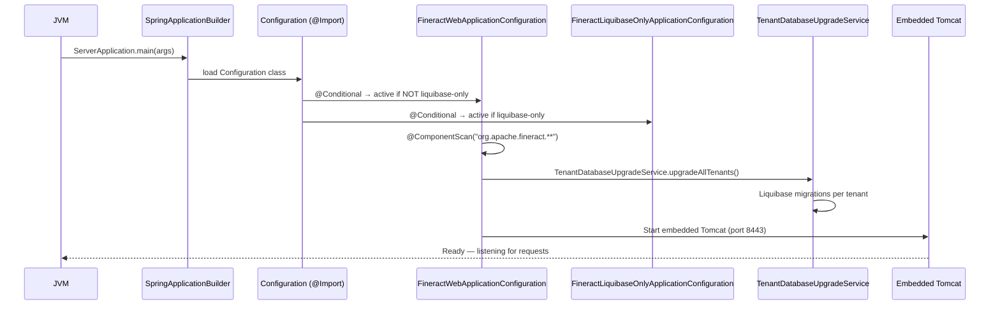

The `fineract-provider` module is the top-level assembly and bootstrap artifact. It contains almost no business logic of its own; its role is to compose every other module into a runnable Spring Boot application. The compiled output is a bootJar (`fineract-provider.jar`) with an embedded Tomcat container, or optionally a WAR (built by the separate `:fineract-war` project) for deployment to an external servlet container.

## Module Overview

- **Gradle project**: `:fineract-provider`
- **Runnable artifact**: `fineract-provider/build/libs/fineract-provider.jar`
- **Java entry point**: `org.apache.fineract.ServerApplication`
- **Root config class**: `org.apache.fineract.infrastructure.core.boot.FineractWebApplicationConfiguration`
- **Application properties**: `fineract-provider/src/main/resources/application.properties`

## ServerApplication

`ServerApplication` is the standard Spring Boot entry point. It extends `SpringBootServletInitializer` for optional Tomcat WAR deployment while also supporting the self-contained embedded-Tomcat JAR mode:

```java
// org.apache.fineract.ServerApplication
public class ServerApplication extends SpringBootServletInitializer {

    @Import({ FineractWebApplicationConfiguration.class,
              FineractLiquibaseOnlyApplicationConfiguration.class })
    private static final class Configuration {}

    @Override
    protected SpringApplicationBuilder configure(SpringApplicationBuilder builder) {
        return configureApplication(builder);
    }

    private static SpringApplicationBuilder configureApplication(
            SpringApplicationBuilder builder) {
        return builder.sources(Configuration.class);
    }

    public static void main(String[] args) throws IOException {
        configureApplication(new SpringApplicationBuilder(ServerApplication.class))
            .run(args);
    }
}
```

The inner `Configuration` class is annotated with `@Import` so that Spring sees both root configuration classes regardless of whether the application starts via `main()` or via a servlet container. The two imports are:

- **`FineractWebApplicationConfiguration`** — the full application context (web mode)
- **`FineractLiquibaseOnlyApplicationConfiguration`** — a minimal context used when the `liquibase-only` profile is active (runs only DB migrations, no API server)

## FineractWebApplicationConfiguration

Located at `org.apache.fineract.infrastructure.core.boot.FineractWebApplicationConfiguration` (in the `fineract-provider` source tree), this abstract `@Configuration` class is the root of the Spring context for normal operation:

```java
@Configuration
@EnableAutoConfiguration(exclude = {
    DataSourceAutoConfiguration.class,
    HibernateJpaAutoConfiguration.class,
    DataSourceTransactionManagerAutoConfiguration.class,
    GsonAutoConfiguration.class,
    JdbcTemplateAutoConfiguration.class,
    LiquibaseAutoConfiguration.class
})
@EnableTransactionManagement
@EnableWebSecurity
@EnableConfigurationProperties({ FineractProperties.class, LiquibaseProperties.class })
@ComponentScan(basePackages = "org.apache.fineract.**")
@IntegrationComponentScan(basePackages = "org.apache.fineract.**")
@Conditional(FineractWebApplicationCondition.class)
public abstract class FineractWebApplicationConfiguration
        implements InitializingBean {

    @Override
    public void afterPropertiesSet() throws Exception {
        log.warn("Fineract is running in web application mode");
    }
}
```

### Autoconfiguration Exclusions

Fineract manually wires its own datasources to support multi-tenant database isolation, so it excludes Spring Boot's standard autoconfiguration for:

| Excluded Class | Reason |
|---|---|
| `DataSourceAutoConfiguration` | Fineract creates per-tenant `HikariDataSource` instances via `TenantDataSourceFactory`, not a single auto-configured datasource. |
| `HibernateJpaAutoConfiguration` | JPA `EntityManagerFactory` is configured by Fineract's own `JpaConfig` (in `fineract-core`) with a routing datasource. |
| `DataSourceTransactionManagerAutoConfiguration` | Fineract uses `ExtendedJpaTransactionManager` wired in its own config. |
| `GsonAutoConfiguration` | Fineract registers its own `Gson` bean with custom serializers/deserializers for date types. |
| `JdbcTemplateAutoConfiguration` | JDBC templates are created per-datasource. |
| `LiquibaseAutoConfiguration` | Migrations are applied per-tenant using `TenantDatabaseUpgradeService`, not via Boot's single-datasource Liquibase autoconfiguration. |

### ComponentScan

The `@ComponentScan(basePackages = "org.apache.fineract.**")` annotation makes Spring discover all `@Component`, `@Service`, `@Repository`, and `@Configuration` classes across all JAR files in the classpath that belong to the `org.apache.fineract` root package. This is how Jersey resources, JPA repositories, Spring services, and command handlers from every domain module are activated without explicit imports.

`@IntegrationComponentScan` additionally scans for Spring Integration components (messaging channels and handlers) under the same package.

## FineractWebApplicationCondition

`FineractWebApplicationCondition` (in `fineract-core`) extends `ProfileCondition` and activates `FineractWebApplicationConfiguration` only when the `liquibase-only` Spring profile is **not** active:

```java
// org.apache.fineract.infrastructure.core.condition.FineractWebApplicationCondition
public class FineractWebApplicationCondition extends ProfileCondition {
    @Override
    protected boolean matches(List<String> activeProfiles) {
        return !activeProfiles.contains(FineractProfiles.LIQUIBASE_ONLY);
    }
}
```

Conversely, `FineractLiquibaseOnlyApplicationConfiguration` activates only when the `liquibase-only` profile **is** present via `FineractLiquibaseOnlyApplicationCondition`.

## FineractLiquibaseOnlyApplicationConfiguration

This secondary configuration class (also in `fineract-provider`) is used exclusively for the `liquibase-only` Spring profile — a mode where Fineract starts, runs all pending Liquibase migrations for every registered tenant, and then shuts down without starting the HTTP server:

```java
@Conditional(FineractLiquibaseOnlyApplicationCondition.class)
@EnableConfigurationProperties({ FineractProperties.class, LiquibaseProperties.class })
@Import({ HikariCpConfig.class, JdbcConfig.class })
@ComponentScan(basePackages = {
    "org.apache.fineract.infrastructure.core.service.migration",
    "org.apache.fineract.infrastructure.core.service.database",
    "org.apache.fineract.infrastructure.core.service.tenant"
})
public class FineractLiquibaseOnlyApplicationConfiguration implements InitializingBean {
    @Override
    public void afterPropertiesSet() {
        log.warn("Fineract is running in Liquibase only mode");
    }
}
```

Only the migration, database utility, and tenant-service packages are scanned — the full domain context is not loaded, keeping startup fast.

## Spring Profiles

Defined in `FineractProfiles` (package `org.apache.fineract.infrastructure.core.boot`):

| Profile | Effect |
|---|---|
| *(none / default)* | Full web application mode with all APIs active. |
| `liquibase-only` | Only `FineractLiquibaseOnlyApplicationConfiguration` activates; no API server starts. Use for schema-migration-only deployments in CI or Kubernetes init containers. |
| `diagnostics` | Enables additional performance diagnostics beans. |
| `test` | Enables test fixtures and in-memory overrides. **Must not be used in production.** |

## Startup Flow



<Note>
The default port is `8443` (HTTPS). The embedded Tomcat uses a self-signed certificate by default, which must be replaced for production. Port and SSL configuration are in `application.properties` under standard Spring Boot `server.*` properties.
</Note>

## Key Configuration Properties

The `application.properties` in `fineract-provider/src/main/resources/` defines defaults for all `fineract.*` properties. Representative entries:

```properties
# Embedded server
server.port=8443
server.ssl.enabled=true

# Tenant master DB
fineract.tenant.host=localhost
fineract.tenant.port=5432
fineract.tenant.username=root
fineract.tenant.password=postgres
fineract.tenant.identifier=default
fineract.tenant.name=fineract_default

# Operational mode (all enabled by default)
fineract.mode.read-enabled=true
fineract.mode.write-enabled=true
fineract.mode.batch-worker-enabled=true
fineract.mode.batch-manager-enabled=true

# Idempotency key header
fineract.idempotency-key-header-name=Idempotency-Key
```

All properties can be overridden via environment variables using the Spring relaxed-binding convention: dots become underscores, all uppercase, prefixed with the root key (e.g. `FINERACT_TENANT_HOST`).
