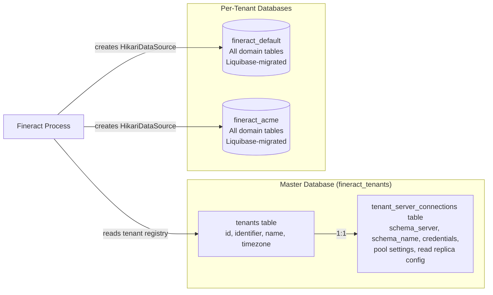
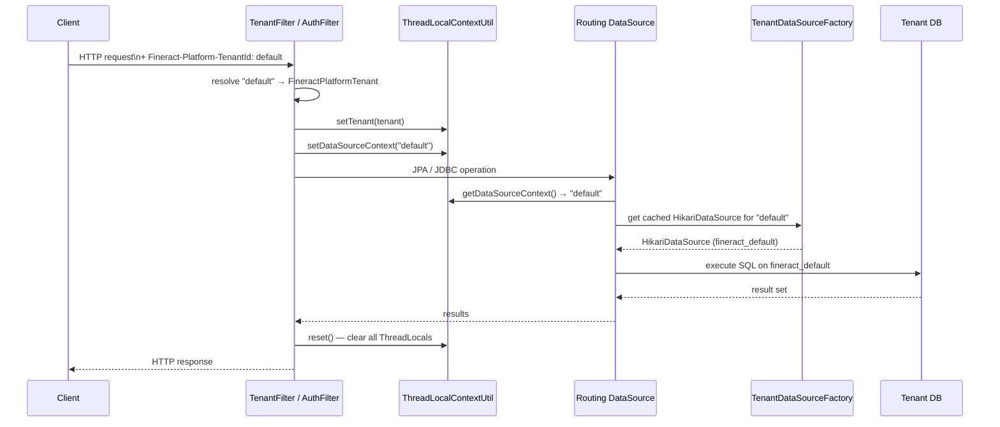

Apache Fineract implements full per-tenant database isolation: every tenant gets its own database schema (or database instance), its own HikariCP connection pool, and its own independently-migrated Liquibase changelog. Tenant resolution is performed per HTTP request and stored in a thread-local, making it transparent to domain logic. This page explains the complete tenant lifecycle from registration to per-request routing.

## Tenant Database Model

Fineract uses two distinct database tiers:



The **master database** (`fineract_tenants` by default) stores the tenant registry and the JDBC connection parameters for every registered tenant. The **tenant databases** (`fineract_default`, `fineract_acme`, etc.) contain all domain tables and are managed entirely by Liquibase; they are isolated from each other.

<Note>
The default setup uses separate databases. The schema names are arbitrary — the `schemaName` field in `tenant_server_connections` controls which database Fineract connects to for a given tenant.
</Note>

## Core Domain Classes

### FineractPlatformTenant

```java
// org.apache.fineract.infrastructure.core.domain.FineractPlatformTenant
@Jacksonized @Builder @EqualsAndHashCode @RequiredArgsConstructor @Getter
public class FineractPlatformTenant implements Serializable {
    private final Long id;
    private final String tenantIdentifier;     // e.g. "default"
    private final String name;                 // e.g. "Default Demo Tenant"
    private final String timezoneId;           // e.g. "Asia/Kolkata"
    private final FineractPlatformTenantConnection connection;
}
```

This immutable value object is the in-memory representation of a tenant. It is stored in `ThreadLocalContextUtil.tenantContext` for the duration of each request.

### FineractPlatformTenantConnection

```java
// org.apache.fineract.infrastructure.core.domain.FineractPlatformTenantConnection
@Getter @Builder @AllArgsConstructor @Jacksonized
public class FineractPlatformTenantConnection implements Serializable {
    private final String schemaServer;
    private final String schemaServerPort;
    private final String schemaName;            // tenant database name
    private final String schemaUsername;
    private final String schemaPassword;        // stored encrypted
    private final String schemaConnectionParameters;
    private final String readOnlySchemaServer;  // optional read replica
    private final String readOnlySchemaName;
    // ... HikariCP pool parameters: maxActive, minIdle, maxIdle, ...
    private final boolean autoUpdateEnabled;    // run Liquibase on startup?
    private final String masterPasswordHash;    // for credential decryption
}
```

The password fields are stored encrypted in the master database. `TenantDataSourceFactory` decrypts them using `DatabasePasswordEncryptor` before creating a HikariCP pool. The `masterPasswordHash` is validated against the configured `fineract.database.default-master-password` before any decryption occurs.

`FineractPlatformTenantConnection` also provides two static utilities:

```java
public static String toJdbcUrl(
    String protocol, String host, String port, String db, String parameters)

public static String resolveProtocol(String driver)
// Supports: org.postgresql.Driver → "jdbc:postgresql"
//           com.mysql.cj.jdbc.Driver → "jdbc:mysql"
//           org.mariadb.jdbc.Driver → "jdbc:mariadb"
```

## TenantDataSourceFactory

```java
// org.apache.fineract.infrastructure.core.service.migration.TenantDataSourceFactory
@Component
public class TenantDataSourceFactory {

    public HikariDataSource create(FineractPlatformTenant tenant) {
        HikariDataSource dataSource = new HikariDataSource();
        FineractPlatformTenantConnection conn = tenant.getConnection();

        // Validate master password before decrypting stored credentials
        if (!databasePasswordEncryptor.isMasterPasswordHashValid(
                conn.getMasterPasswordHash())) {
            throw new IllegalArgumentException("Invalid master password");
        }

        dataSource.setUsername(conn.getSchemaUsername());
        dataSource.setPassword(
            databasePasswordEncryptor.decrypt(conn.getSchemaPassword()));

        String protocol = resolveProtocol(hikariConfig.getDriverClassName());
        String jdbcUrl = toJdbcUrl(protocol,
            conn.getSchemaServer(), conn.getSchemaServerPort(),
            conn.getSchemaName(), conn.getSchemaConnectionParameters());
        dataSource.setJdbcUrl(jdbcUrl);
        return dataSource;
    }
}
```

`TenantDataSourceFactory.create(FineractPlatformTenant)` is called once per tenant during startup (and potentially when a new tenant is provisioned at runtime). The resulting `HikariDataSource` is cached and reused for all subsequent requests from that tenant.

## Per-Request Tenant Resolution: ThreadLocalContextUtil

```java
// org.apache.fineract.infrastructure.core.service.ThreadLocalContextUtil
public final class ThreadLocalContextUtil {

    private static final ThreadLocal<FineractPlatformTenant> tenantContext
        = new ThreadLocal<>();
    private static final ThreadLocal<String> contextHolder       // datasource key
        = new ThreadLocal<>();
    private static final ThreadLocal<String> authTokenContext    = new ThreadLocal<>();
    private static final ThreadLocal<HashMap<BusinessDateType, LocalDate>>
        businessDateContext = new ThreadLocal<>();
    private static final ThreadLocal<ActionContext> actionContext = new ThreadLocal<>();

    public static FineractPlatformTenant getTenant() { return tenantContext.get(); }
    public static void setTenant(FineractPlatformTenant tenant) {
        tenantContext.set(tenant);
    }
    public static void clearTenant() { tenantContext.remove(); }

    // Called once for all five contexts at the start of async operations
    public static void init(FineractContext fineractContext) { ... }

    // Must be called after every request to prevent thread-pool leaks
    public static void reset() { ... }
}
```

`ThreadLocalContextUtil` is the single source of truth for the active tenant within a thread. The `Fineract-Platform-TenantId` HTTP header (e.g. `default`) is read by a servlet filter early in the request lifecycle, resolved to a `FineractPlatformTenant` from the master database, and set via `setTenant()`. The routing `DataSource` implementation reads `getDataSourceContext()` to route JPA queries to the correct per-tenant pool.

<Warning>
Any code that spawns new threads (async jobs, `@Async` methods, Spring Batch partitions) must propagate the `FineractContext` snapshot manually using `ThreadLocalContextUtil.getContext()` on the parent thread and `ThreadLocalContextUtil.init(context)` on the child thread. Failing to do so results in `null` tenant context and database routing failures.
</Warning>

## Per-Request Flow



## Liquibase Per-Tenant Migrations

On startup `TenantDatabaseUpgradeService` (in `org.apache.fineract.infrastructure.core.service.migration`) iterates over every tenant registered in the master database and applies pending Liquibase changesets to that tenant's schema. The migration runs only if `FineractPlatformTenantConnection.autoUpdateEnabled` is `true`.

The Liquibase changelog root is typically at `db/changelog/db.changelog-master.xml` within the classpath. Each module contributes its own changelog files, which are included via `includeAll` directives. Migrations are keyed by changeset ID and author, so they are idempotent and safe to re-run.

<Tip>
To run only the Liquibase migrations without starting the API server, activate the `liquibase-only` Spring profile. This loads `FineractLiquibaseOnlyApplicationConfiguration` which scans only `org.apache.fineract.infrastructure.core.service.migration`, `...database`, and `...tenant` packages — avoiding the full Spring context startup cost.
</Tip>

## Tenant Configuration Reference

All tenant-specific defaults are under `fineract.tenant.*` in `FineractProperties.FineractTenantProperties`:

```properties
# Master DB connection
fineract.tenant.host=localhost
fineract.tenant.port=5432
fineract.tenant.username=root
fineract.tenant.password=mysql
fineract.tenant.identifier=default
fineract.tenant.name=Default Demo Tenant
fineract.tenant.description=Default Demo Tenant
fineract.tenant.timezone=Asia/Kolkata
fineract.tenant.master-password=fineract

# Optional read-replica
fineract.tenant.read-only-host=localhost
fineract.tenant.read-only-port=5432

# Per-tenant pool size overrides (applied globally to all tenants)
fineract.tenant.config.min-pool-size=-1    # -1 = use DB-stored value
fineract.tenant.config.max-pool-size=-1
fineract.tenant.config.leak-detection-threshold=0
```

<Note>
The `fineract.tenant.*` properties configure the **master database** connection and the **default tenant** metadata. Per-tenant JDBC coordinates (host, port, schema, credentials) are stored in `tenant_server_connections` in the master database, not in application properties.
</Note>
