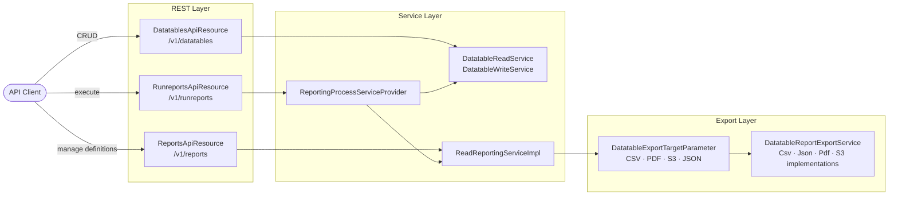

Fineract ships a powerful **dataqueries engine** that exposes two closely related capabilities over REST: *dynamic datatables* that let you extend any core entity with custom columns, and *registered reports* that execute stored SQL or Pentaho report definitions against tenant data. Both features share the same underlying SQL execution layer (`ReadReportingServiceImpl`) and the same export pipeline (`DatatableExportTargetParameter`).

## Two Features, One Engine

<CardGroup cols={2}>
  <Card title="Datatables" icon="table">
    Extend core entities (`m_client`, `m_loan`, etc.) with custom tables. Managed via `DatatablesApiResource` at `/api/v1/datatables`.
  </Card>
  <Card title="Reports" icon="chart-bar">
    Execute named SQL or Pentaho reports with typed parameters. Managed via `ReportsApiResource` and executed via `RunreportsApiResource` at `/api/v1/reports` and `/api/v1/runreports`.
  </Card>
</CardGroup>



## Datatables: Dynamic Entity Extension

### Registration and Storage

Every custom table is registered in the `x_registered_table` database table, which maps to the `RegisteredDatatable` JPA entity:

```java
// RegisteredDatatable.java
@Entity
@Table(name = "x_registered_table")
public class RegisteredDatatable extends AbstractPersistableCustom<Long> {

    @Column(name = "registered_table_name", nullable = false)
    private String datatableName;

    @Column(name = "application_table_name", nullable = false)
    private String entity;          // e.g. "m_client", "m_loan"

    @Column(name = "entity_subtype", nullable = true)
    private String subtype;

    @Column(name = "category", nullable = false)
    private int category;
}
```

The `DatatablesApiResource` (annotated `@Path("/v1/datatables")`) is the REST entry point. It delegates reads to `DatatableReadService` and writes to `DatatableWriteService`:

```java
// DatatablesApiResource.java — list all registered datatables
@GET
@Produces({ MediaType.APPLICATION_JSON })
public String getDatatables(@QueryParam("apptable") final String apptable,
                            @Context final UriInfo uriInfo) {
    final List<DatatableData> result = this.datatableReadService.retrieveDatatableNames(apptable);
    return this.toApiJsonSerializer.serialize(result);
}
```

### REST Endpoints

| Method | Path | Description |
|---|---|---|
| `GET` | `/api/v1/datatables` | List all registered datatables (filter by `?apptable=m_client`) |
| `POST` | `/api/v1/datatables` | Create and register a new datatable |
| `GET` | `/api/v1/datatables/{datatableName}` | Retrieve datatable column metadata |
| `PUT` | `/api/v1/datatables/{datatableName}` | Update datatable column definitions |
| `DELETE` | `/api/v1/datatables/{datatableName}` | Deregister and drop the datatable |
| `POST` | `/api/v1/datatables/{datatableName}/{apptableId}` | Insert a row linked to an entity |
| `GET` | `/api/v1/datatables/{datatableName}/{apptableId}` | Read rows for an entity |
| `PUT` | `/api/v1/datatables/{datatableName}/{apptableId}` | Update a one-to-one row |
| `DELETE` | `/api/v1/datatables/{datatableName}/{apptableId}` | Delete rows for an entity |

### Entity-Datatable Checks

The `EntityDatatableChecksApiResource` (at `/api/v1/entityDatatableChecks`) allows administrators to make specific datatables **mandatory** at configured workflow states (e.g., require a KYC datatable to be filled before a loan can be disbursed). The domain entity is `EntityDatatableChecks`.

## Reports: Registered SQL and Pentaho Reports

### Report Domain Model

Reports are stored in the `stretchy_report` database table, mapped to the `Report` JPA entity:

```java
// Report.java
@Entity
@Table(name = "stretchy_report",
       uniqueConstraints = { @UniqueConstraint(columnNames = { "report_name" }, name = "unq_report_name") })
public final class Report extends AbstractPersistableCustom<Long> {

    @Column(name = "report_name", nullable = false, unique = true)
    private String reportName;

    @Column(name = "report_type", nullable = false)
    private String reportType;   // "Table", "Chart", "SMS", "Pentaho"

    @Column(name = "report_subtype")
    private String reportSubType;

    @Column(name = "report_category")
    private String reportCategory;

    @Column(name = "description")
    private String description;
    // ...reportSql, coreReport, useReport, reportParameters
}
```

Report parameters link via `stretchy_report_parameter` and the `ReportParameter` / `ReportParameterUsage` domain entities.

### Managing Reports via REST

`ReportsApiResource` (at `/api/v1/reports`) exposes full CRUD:

```java
@Path("/v1/reports")
@Tag(name = "Reports", description = "Non-core reports can be added, updated and deleted.")
public class ReportsApiResource {

    private static final Set<String> RESPONSE_DATA_PARAMETERS = new HashSet<>(
        Arrays.asList("id", "reportName", "reportType", "reportSubType",
                      "reportCategory", "description", "reportSql",
                      "coreReport", "useReport", "reportParameters"));
    // ...
}
```

| Method | Path | Description |
|---|---|---|
| `GET` | `/api/v1/reports` | List all reports with their parameters |
| `POST` | `/api/v1/reports` | Create a new report definition |
| `GET` | `/api/v1/reports/{id}` | Retrieve a single report definition |
| `PUT` | `/api/v1/reports/{id}` | Update a report definition |
| `DELETE` | `/api/v1/reports/{id}` | Delete a non-core report |

### Executing Reports

Report execution goes through `RunreportsApiResource` at `/api/v1/runreports`:

```java
@Path("/v1/runreports")
@Tag(name = "Run Reports", description = "API for executing predefined reports with dynamic parameters")
public class RunreportsApiResource {

    @GET
    @Path("{reportName}")
    @Produces({ MediaType.APPLICATION_JSON, "text/csv",
                "application/vnd.ms-excel", "application/pdf", "text/html" })
    public Response runReport(
        @PathParam("reportName") final String reportName,
        @Context final UriInfo uriInfo,
        @QueryParam("exportCSV") final Boolean exportCSV,
        ...
    ) { ... }

    @GET
    @Path("/availableExports/{reportName}")
    public Response retrieveAllAvailableExports(...) { ... }
}
```

The resource resolves the report type (`Table`, `Chart`, `SMS`, `Pentaho`) from `ReadReportingService.getReportType()` and hands off to the correct `ReportingProcessService` implementation via `ReportingProcessServiceProvider`.

## SQL Parameter Injection

SQL report parameters are passed as query parameters prefixed with `R_`. The `AbstractReportingProcessService.getReportParams()` method converts them into `${paramName}` substitution tokens:

```java
// AbstractReportingProcessService.java
@Override
public Map<String, String> getReportParams(final MultivaluedMap<String, String> queryParams) {
    final Map<String, String> reportParams = new HashMap<>();
    for (Map.Entry<String, List<String>> entry : queryParams.entrySet()) {
        if (entry.getKey().startsWith("R_")) {
            String pKey = "${" + entry.getKey().substring(2) + "}";
            String pValue = entry.getValue().get(0);
            sqlValidator.validate(pValue);    // SQL injection prevention
            reportParams.put(pKey, pValue);
        }
    }
    return reportParams;
}
```

**Example:** `GET /api/v1/runreports/Client+Listing?R_officeId=1&exportCSV=true` passes `${officeId}=1` into the report SQL.

<Warning>
All `R_` parameter values are validated by `SqlValidator` against the configured SQL injection prevention patterns defined in `application.properties` (`fineract.sql-validation.profiles.*`). Queries that match a pattern trigger a rejection.
</Warning>

## Export Targets

The `DatatableExportTargetParameter` enum declares five output modes, resolved from query parameters:

```java
// DatatableExportTargetParameter.java
public enum DatatableExportTargetParameter {
    CSV("exportCSV"),
    PDF("exportPDF"),
    S3("exportS3"),
    JSON("exportJSON"),
    PRETTY_JSON("pretty");

    public static DatatableExportTargetParameter resolverExportTarget(
            final MultivaluedMap<String, String> queryParams) {
        for (DatatableExportTargetParameter parameter : values()) {
            String parameterName = parameter.getValue();
            if ("true".equalsIgnoreCase(queryParams.getFirst(parameterName))) {
                return parameter;
            }
        }
        return JSON;  // default
    }
}
```

Each mode is served by a dedicated `DatatableReportExportService` implementation:

| Implementation | Export Target |
|---|---|
| `CsvDatatableReportExportServiceImpl` | `exportCSV=true` → `text/csv` |
| `JsonDatatableReportExportService` | `exportJSON=true` or default → `application/json` |
| `PdfDatatableReportExportService` | `exportPDF=true` → `application/pdf` |
| `S3DatatableReportExportServiceImpl` | `exportS3=true` → uploads to S3 bucket |

S3 export is enabled via:
```properties
fineract.report.export.s3.enabled=${FINERACT_REPORT_EXPORT_S3_ENABLED:false}
fineract.report.export.s3.bucket=${FINERACT_REPORT_EXPORT_S3_BUCKET_NAME:}
```

## The `DatatableReportingProcessService`

The `DatatableReportingProcessService` is the built-in `ReportingProcessService` for SQL-based reports. It is registered for the report types `Table`, `Chart`, and `SMS`:

```java
@Service
@ReportService(type = { "Table", "Chart", "SMS" })
public class DatatableReportingProcessService extends AbstractReportingProcessService {

    @Override
    public Response processRequest(String reportName,
                                   MultivaluedMap<String, String> queryParams) {
        DatatableExportTargetParameter exportMode =
            DatatableExportTargetParameter.resolverExportTarget(queryParams);
        final Map<String, String> reportParams = getReportParams(queryParams);
        ResponseHolder response = findReportExportService(exportMode)
            .orElseThrow(...)
            .export(reportName, queryParams, reportParams, parameterTypeValue);
        // build and return JAX-RS Response
    }
}
```

## Pentaho Integration

Fineract supports Pentaho report execution as an optional report type (`"Pentaho"`). Pentaho is not bundled in the core artifact — a `PentahoReportingProcessServiceImpl` can be provided by a custom module that implements `ReportingProcessService` and carries `@ReportService(type = { "Pentaho" })`. When present, it is automatically picked up by `ReportingProcessServiceProvider`.

<Note>
Pentaho `.prpt` report files were historically stored in a filesystem path and later moved to a database table via changeset `0018_pentaho_reports_to_table.xml`.
</Note>

## Report Mailing Jobs

The `ReportMailingJobApiResource` (at `/api/v1/reportmailingjobs`) allows scheduling reports to be executed on a cron-style schedule and emailed to a configured recipient list. The `ExecuteReportMailingJobsTasklet` Spring Batch tasklet performs the actual execution.

<Tabs>
  <Tab title="Create Mailing Job">
    ```http
    POST /api/v1/reportmailingjobs
    Content-Type: application/json
    Fineract-Platform-TenantId: default

    {
      "name": "Weekly Client Report",
      "reportName": "Client Listing",
      "emailRecipients": "admin@example.com",
      "emailSubject": "Weekly Client Report",
      "startDateTime": "2024-01-01 08:00:00",
      "recurrence": "FREQ=WEEKLY;INTERVAL=1"
    }
    ```
  </Tab>
  <Tab title="List Mailing Jobs">
    ```http
    GET /api/v1/reportmailingjobs
    Fineract-Platform-TenantId: default
    ```
  </Tab>
</Tabs>
