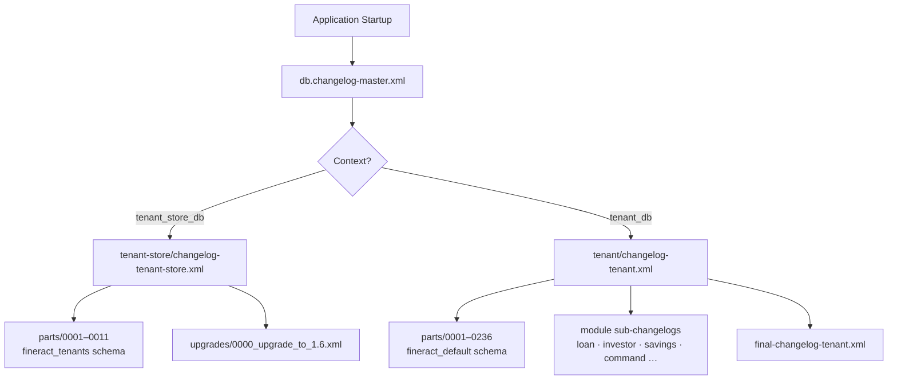

Apache Fineract uses [Liquibase](https://www.liquibase.org/) as its sole mechanism for database schema creation and migration. Every structural change — from adding a column to creating a Spring Batch table — lives as a versioned XML changeset that is applied automatically at application startup. There are **two parallel changelog paths**: one that manages the shared tenant registry (`fineract_tenants`) and one that manages each tenant's operational schema (typically `fineract_default`).

## Changelog Architecture

The master entry point is `db/changelog/db.changelog-master.xml` (under `fineract-provider/src/main/resources/`). Liquibase contexts route execution to the correct sub-tree at startup:

```xml
<!-- db/changelog/db.changelog-master.xml -->
<include file="tenant-store/initial-switch-changelog-tenant-store.xml"
         context="tenant_store_db AND initial_switch"/>
<include file="tenant-store/changelog-tenant-store.xml"
         context="tenant_store_db AND !initial_switch"/>
<include file="tenant/initial-switch-changelog-tenant.xml"
         context="tenant_db AND initial_switch"/>
<include file="tenant/changelog-tenant.xml"
         context="tenant_db AND !initial_switch"/>
<!-- module sub-changelogs: loan, investor, savings ... -->
<include file="db/changelog/tenant/module/loan/module-changelog-master.xml"
         context="tenant_db AND !initial_switch"/>
<include file="db/changelog/tenant/module/investor/module-changelog-master.xml"
         context="tenant_db AND !initial_switch"/>
<include file="db/changelog/tenant/module/savings/parts/module-changelog-master.xml"
         context="tenant_db AND !initial_switch"/>
<!-- custom module changelogs (opt-in via custom_changelog context) -->
<includeAll path="db/custom-changelog" errorIfMissingOrEmpty="false"
            context="tenant_db AND !initial_switch AND custom_changelog"/>
<include file="/db/changelog/tenant/module/progressiveloan/module-changelog-master.xml"
         context="tenant_db AND !initial_switch"/>
<include file="db/changelog/tenant/module/loanorigination/module-changelog-master.xml"
         context="tenant_db AND !initial_switch"/>
<include file="db/changelog/tenant/module/command/module-changelog-master.xml"
         context="tenant_db AND !initial_switch"/>
<include file="db/changelog/tenant/module/workingcapitalloan/module-changelog-master.xml"
         context="tenant_db AND !initial_switch"/>
<!-- Scripts to run after the modules were initialized -->
<include file="tenant/final-changelog-tenant.xml"
         context="tenant_db AND !initial_switch"/>
```

<Tip>
The `initial_switch` context is used when migrating a legacy (pre-Liquibase) Fineract installation. Fresh installations always run under `!initial_switch`.
</Tip>



## The Tenant Store Changelog (`tenant-store/`)

The `fineract_tenants` database stores the multi-tenant registry. Its changelogs live in:

```
db/changelog/tenant-store/
├── changelog-tenant-store.xml          # main include list
├── initial-switch-changelog-tenant-store.xml
├── parts/
│   ├── 0001_initial_schema.xml         # tenant_server_connections + tenants tables
│   ├── 0002_initial_data.xml           # default tenant seed data
│   ├── 0003_reset_postgresql_sequences.xml
│   ├── 0004_readonly_database_connection.xml
│   ├── 0005_jdbc_connection_string.xml
│   ├── 0006_drop_retry_parameter_columns.xml
│   ├── 0007_encrypt_existing_tenant_passwords.xml
│   ├── 0007_x_extend_tenant_ro_passwords.xml
│   ├── 0008_encrypt_existing_ro_tenant_passwords.xml
│   ├── 0009_set_and_encrypt_ro_if_not_exists.xml
│   ├── 0010_set_datetime_precision.xml
│   └── 0011_standardize_character_set_and_collation.xml
└── upgrades/
    └── 0000_upgrade_to_1.6.xml         # legacy migration path
```

<Accordion title="Key tables created by 0001_initial_schema.xml">

| Table | Purpose |
|---|---|
| `tenant_server_connections` | JDBC connection details per tenant (host, port, schema name, credentials, pool config) |
| `tenants` | Maps tenant identifier (e.g. `default`) to its `tenant_server_connections` row and timezone |
| `timezones` | Reference list of all IANA timezone identifiers |

The `0002_initial_data.xml` file seeds the default tenant using Liquibase parameters injected from `application.properties`:

```xml
<insert tableName="tenant_server_connections">
    <column name="schema_server"   value="${fineract.tenant.host}"/>
    <column name="schema_name"     value="${fineract.tenant.schema-name}"/>
    <column name="schema_server_port" value="${fineract.tenant.port}"/>
    <column name="schema_username" value="${fineract.tenant.username}"/>
    <column name="schema_password" value="${fineract.tenant.password}"/>
</insert>
```

</Accordion>

## The Tenant Changelog (`tenant/`)

Each tenant's operational database is created and upgraded by this path. As of the current main branch, the `parts/` directory contains **236 numbered changesets** plus module-level sub-changelogs:

```
db/changelog/tenant/
├── changelog-tenant.xml               # includes parts/0003 onward
├── final-changelog-tenant.xml         # runs after all module changelogs
├── initial-switch-changelog-tenant.xml
└── parts/
    ├── 0001_initial_schema.xml        # 100+ core tables
    ├── 0002_initial_data.xml          # seed data (permissions, currencies …)
    ├── 0003_postgresql_specific_initial_data.xml
    ├── 0004_camelcase_column_renaming.xml
    └── … (0005 – 0236)
```

<Accordion title="Core tables created in 0001_initial_schema.xml (selected)">

**Accounting**
- `acc_gl_account` — chart of accounts
- `acc_gl_journal_entry` — double-entry journal entries
- `acc_gl_closure` — period-end accounting closures
- `acc_product_mapping` — product-to-GL account mappings

**Client & Organisation**
- `m_client` — individual or entity clients
- `m_office` — hierarchical branch office structure
- `m_staff` — loan officers and other staff

**Lending**
- `m_loan` — loan accounts
- `m_loan_transaction` — disbursements, repayments, charges
- `m_loan_repayment_schedule` — instalment schedule
- `m_loan_charge` — fees and penalties attached to loans

**Savings**
- `m_savings_account` — savings/current/fixed deposit accounts
- `m_savings_account_transaction` — credits and debits

**Reporting & Datatables**
- `stretchy_report` — report definitions (maps to `Report` JPA entity)
- `stretchy_report_parameter` — parameter definitions for reports
- `stretchy_parameter` — reusable parameter objects
- `x_registered_table` — registered datatables (maps to `RegisteredDatatable` JPA entity)
- `x_table_column_code_mappings` — code-list lookups for datatable columns

**Spring Batch / Jobs**
- `job` — scheduled job definitions
- `job_run_history` — execution history

</Accordion>

<Note>
The `parts/` filenames use a zero-padded four-digit prefix that determines the execution order within the changelog include list. Never re-number or delete an existing file — Liquibase tracks applied changesets by author+id pairs stored in the `DATABASECHANGELOG` table.
</Note>

## Module Sub-Changelogs

Individual Gradle subprojects can own their own changelog directories that are wired into the master file:

```
fineract-provider/src/main/resources/db/changelog/tenant/module/
├── loan/
├── investor/
├── savings/parts/
├── progressiveloan/
├── loanorigination/
├── command/
└── workingcapitalloan/
```

Custom deployments can add changelogs under `db/custom-changelog/` (enabled via the `custom_changelog` Liquibase context):

```xml
<includeAll path="db/custom-changelog"
            errorIfMissingOrEmpty="false"
            context="tenant_db AND !initial_switch AND custom_changelog"/>
```

This `<includeAll>` is placed in `db.changelog-master.xml` after the core module changelogs, allowing custom modules to extend the schema after the built-in tables are created.

## How Liquibase Runs at Startup

Liquibase is triggered by Spring Boot's auto-configuration, controlled by these properties in `application.properties`:

```properties
spring.liquibase.enabled=${FINERACT_LIQUIBASE_ENABLED:true}
spring.liquibase.changeLog=classpath:/db/changelog/db.changelog-master.xml

# Parameters injected into changelog XML as ${...} expressions:
spring.liquibase.parameters.fineract.tenant.identifier=${fineract.tenant.identifier}
spring.liquibase.parameters.fineract.tenant.schema-name=${fineract.tenant.name}
spring.liquibase.parameters.fineract.tenant.host=${fineract.tenant.host}
spring.liquibase.parameters.fineract.tenant.port=${fineract.tenant.port}
spring.liquibase.parameters.fineract.tenant.username=${fineract.tenant.username}
spring.liquibase.parameters.fineract.tenant.password=${fineract.tenant.password}
```

<Warning>
Due to an outstanding Liquibase thread-safety issue ([liquibase/liquibase#7227](https://github.com/liquibase/liquibase/pull/7227)) the tenant upgrade executor is deliberately restricted to a single thread:

```properties
fineract.task-executor.tenant-upgrade-task-executor-core-pool-size=1
fineract.task-executor.tenant-upgrade-task-executor-max-pool-size=1
fineract.task-executor.tenant-upgrade-task-executor-queue-capacity=${FINERACT_TENANT_UPGRADE_TASK_EXECUTOR_QUEUE_CAPACITY:100}
```
</Warning>

## Database Support

<CardGroup cols={3}>
  <Card title="PostgreSQL" icon="database">
    **Primary target.** PostgreSQL 18.x is used in all CI pipelines and is the recommended production database.
  </Card>
  <Card title="MySQL / MariaDB" icon="database">
    **Deprecated.** MySQL and MariaDB are considered legacy and may be removed in a future release. Compose files exist for testing only.
  </Card>
  <Card title="Multi-database" icon="server">
    Each tenant can point to a different physical database server — connection details live in `tenant_server_connections`.
  </Card>
</CardGroup>

## The `fineract-db/` Legacy Directory

The `fineract-db/` directory at the repository root contains **pre-Liquibase SQL artefacts** for historical reference and demo purposes:

```
fineract-db/
├── mifospltaform-tenants-first-time-install.sql   # legacy manual install script
├── old-schema-files/                               # original DDL/DML files
└── multi-tenant-demo-backups/                      # sample tenant dumps
    ├── bare-bones-demo/
    ├── default-demo/
    ├── ceda/
    ├── latam-demo/
    └── gk-maarg/
```

<Warning>
Do **not** use the SQL files in `fineract-db/` for new deployments. They are kept for migration archaeology only. All new schema management must go through Liquibase changesets.
</Warning>

## Adding a New Changeset

<Steps>
  <Step title="Choose the right path">
    Tenant registry changes go under `tenant-store/parts/`. Operational schema changes go under `tenant/parts/` or a module sub-changelog directory.
  </Step>
  <Step title="Create the XML file">
    Follow the zero-padded naming convention. Use the next available number:
    ```xml
    <!-- tenant/parts/0237_my_new_feature.xml -->
    <databaseChangeLog xmlns="http://www.liquibase.org/xml/ns/dbchangelog" ...>
        <changeSet author="myname" id="1">
            <addColumn tableName="m_loan">
                <column name="new_field" type="VARCHAR(50)"/>
            </addColumn>
        </changeSet>
    </databaseChangeLog>
    ```
  </Step>
  <Step title="Register it in the include list">
    Add an `<include>` entry at the bottom of `changelog-tenant.xml` (or the relevant module changelog master).
  </Step>
  <Step title="Test locally">
    Run `./gradlew :fineract-provider:bootRun` against a fresh database. Liquibase will apply the new changeset and report success or failure in the startup logs.
  </Step>
</Steps>
