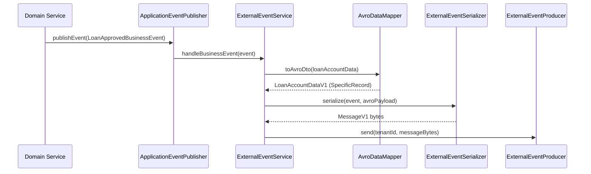

The `fineract-avro-schemas` module defines the Apache Avro schemas used to serialize all external business events published to Kafka or JMS. Every event Fineract publishes is wrapped in a `MessageV1` envelope and the domain-specific payload is embedded as Avro-encoded bytes. This page describes the schema structure, where schemas live, how Java classes are generated, and how the serialization pipeline maps domain objects to Avro records.

## Module Location

```
fineract-avro-schemas/
└── src/main/avro/
    ├── MessageV1.avsc               # Outer envelope
    ├── BulkMessageItemV1.avsc       # Single item in a bulk payload
    ├── BulkMessagePayloadV1.avsc    # Bulk batch wrapper
    ├── client/v1/
    ├── document/v1/
    ├── fixeddeposit/v1/
    ├── generic/v1/
    ├── gl/v1/
    ├── group/v1/
    ├── loan/v1/
    ├── recurringdeposit/v1/
    ├── savings/v1/
    ├── share/v1/
    └── workingcapitalloan/v1/
```

## The MessageV1 Envelope

Every external event is serialized as a `MessageV1` record (namespace `org.apache.fineract.avro`):

```json MessageV1.avsc
{
    "name": "MessageV1",
    "namespace": "org.apache.fineract.avro",
    "type": "record",
    "fields": [
        { "name": "id",             "type": "long",   "doc": "The ID of the message" },
        { "name": "source",         "type": "string", "doc": "Unique identifier of the source service" },
        { "name": "type",           "type": "string", "doc": "Event type, e.g. LoanApprovedBusinessEvent" },
        { "name": "category",       "type": "string", "doc": "Event category, e.g. LOAN" },
        { "name": "createdAt",      "type": "string", "doc": "UTC ISO_LOCAL_DATE_TIME, e.g. 2011-12-03T10:15:30" },
        { "name": "businessDate",   "type": "string", "doc": "Business date ISO_LOCAL_DATE, e.g. 2011-12-03" },
        { "name": "tenantId",       "type": "string", "doc": "Tenant identifier, e.g. default" },
        { "name": "idempotencyKey", "type": "string", "doc": "Consumer de-duplication key" },
        { "name": "dataschema",     "type": "string", "doc": "Fully qualified Avro schema name for payload" },
        { "name": "data",           "type": "bytes",  "doc": "Avro-serialized domain payload" }
    ]
}
```

The `dataschema` field tells consumers the schema of the `data` bytes — for example `org.apache.fineract.avro.loan.v1.LoanAccountDataV1`. Consumers use this to select the correct Avro reader schema.

## Domain Payload Schemas

### Loan Schemas (`loan/v1/`)

| Schema | Description |
|--------|-------------|
| `LoanAccountDataV1` | Full loan account snapshot (id, accountNo, externalId, externalOwnerId, etc.) |
| `LoanAccountSummaryDataV1` | Summarized loan data for lightweight events |
| `LoanTransactionDataV1` | A single loan transaction (repayment, disbursement, etc.) |
| `LoanChargeDataRangeViewV1` | Charge data scoped to a loan |
| `DelinquencyBucketDataV1` | Delinquency bucket classification |
| `DelinquencyRangeDataV1` | Delinquency range definition |
| `LoanApplicationTimelineDataV1` | Loan lifecycle timeline data |
| `LoanAmountDataV1` | Principal/interest/fee breakdown |
| `LoanAccountDelinquencyRangeDataV1` | Delinquency range on a specific loan |
| `LoanAccountStayedLockedDataV1` | Record of an account that stayed locked after COB |
| `LoanAccountsStayedLockedDataV1` | Bulk wrapper for locked accounts |
| `CollectionDataV1` | Collection schedule data |

### Client Schemas (`client/v1/`)

| Schema | Description |
|--------|-------------|
| `ClientDataV1` | Full client record |
| `ClientTimelineDataV1` | Client activation/closure timeline |
| `ClientCollateralManagementV1` | Collateral management data |

### Savings Schemas (`savings/v1/`)

Savings account snapshots and transaction records for savings business events.

### Fixed & Recurring Deposit Schemas

`fixeddeposit/v1/FixedDepositAccountDataV1` and `recurringdeposit/v1/` contain account snapshots for term deposit events.

### Other Schemas

| Directory | Key Schemas |
|-----------|------------|
| `group/v1/` | `GroupGeneralDataV1`, `GroupRoleDataV1` |
| `document/v1/` | `DocumentDataV1` |
| `gl/v1/` | `GLAccountDataV1` |
| `share/v1/` | Share account data |
| `workingcapitalloan/v1/` | Working capital loan data |
| `generic/v1/` | `CommandProcessingResultV1`, `CurrencyDataV1`, `EnumOptionDataV1`, `CalendarDataV1`, `CodeValueDataV1` |

## Code Generation

Avro Java classes are generated at build time by the Avro Gradle plugin. The generated classes implement `org.apache.avro.specific.SpecificRecord`, which means they have a static `SCHEMA$` field and typed getters/setters.

The generated classes land in `fineract-avro-schemas/build/generated-main-avro-java/` and are published as part of the `fineract-avro-schemas` artifact consumed by all other modules.

## Serialization Pipeline

The serialization pipeline in `fineract-provider` converts domain `Data` objects (e.g., `LoanAccountData`) into Avro `SpecificRecord` instances via mapper classes.



### Mapper Pattern

Mappers live at:
```
fineract-provider/src/main/java/org/apache/fineract/infrastructure/event/
  external/service/serialization/mapper/
    loan/
    client/
    savings/
    fixeddeposit/
    recurringdeposit/
    share/
    document/
    workingcapitalloan/
```

Each mapper uses MapStruct or hand-written mapping to convert the Fineract `Data` DTO into the corresponding Avro `SpecificRecord`.

### Serializer Pattern

Serializers live at:
```
fineract-provider/src/main/java/org/apache/fineract/infrastructure/event/
  external/service/serialization/serializer/
    loan/
    client/
    savings/
    ...
```

Each serializer is an `AbstractBusinessEventSerializer` implementation that:
1. Accepts the business event type it handles.
2. Calls the mapper to get the Avro payload.
3. Wraps the payload in `MessageV1` with the `dataschema` field set to the payload's Avro namespace + name.
4. Returns the final serialized bytes.

## BulkMessagePayloadV1

For bulk/batched delivery, multiple `BulkMessageItemV1` records are wrapped in `BulkMessagePayloadV1`:

```json BulkMessagePayloadV1.avsc (structure)
{
    "name": "BulkMessagePayloadV1",
    "namespace": "org.apache.fineract.avro",
    "type": "record",
    "fields": [
        { "name": "messages", "type": { "type": "array", "items": "BulkMessageItemV1" } }
    ]
}
```

## Related Pages

- [External Events](/events/external-events) — how events are raised and the ExternalEventService
- [Kafka & JMS Transport](/events/kafka-jms) — how serialized bytes are delivered
- [Loan COB](/loan/cob-close-of-business) — COB events that trigger external event publishing
