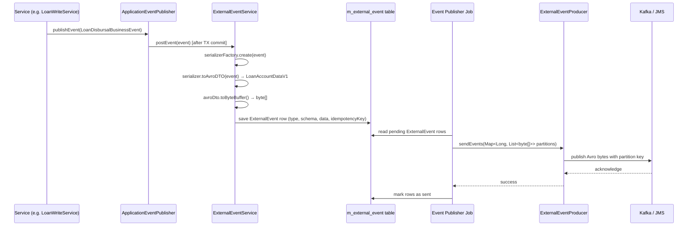

Apache Fineract ships a first-class external event framework that translates every significant domain change — a loan disbursement, a savings deposit, a client creation — into a structured, versioned message that downstream systems can consume reliably. The pipeline is transactional: events are persisted to the `m_external_event` table inside the same database transaction that triggered the domain change, guaranteeing at-least-once delivery before any message transport is involved.

## Business events vs. external events

The framework has two layers that complement each other.

**Business events** are Spring `ApplicationEvent` subclasses raised synchronously inside a service method. Every business event extends `AbstractBusinessEvent<T>` (package `org.apache.fineract.infrastructure.event.business.domain`) and carries a typed domain object via `get()`. They exist purely inside the JVM and are never serialised on their own.

**External events** are the durable, transport-ready representation. `ExternalEventService` (package `org.apache.fineract.infrastructure.event.external.service`, module `fineract-core`) converts a business event into an `ExternalEvent` JPA entity and persists it. A background publisher thread then reads those rows and hands them off to whichever `ExternalEventProducer` is configured.

<CardGroup cols={2}>
  <Card title="AbstractBusinessEvent" icon="bolt">
    Base class for all in-process domain events. Carries a typed payload via `get()` and declares `getType()` / `getCategory()` for routing.
  </Card>
  <Card title="ExternalEventService" icon="database">
    Persists serialized Avro bytes to `m_external_event` within the originating transaction, ensuring no events are lost on crash.
  </Card>
  <Card title="ExternalEventConfiguration" icon="sliders">
    Per-event-type toggle stored in `m_external_event_configuration`. Operators can enable or disable individual event types at runtime.
  </Card>
  <Card title="ExternalEventProducer" icon="paper-plane">
    Pluggable transport interface. Kafka and JMS implementations ship out of the box; a spring-events fallback is also available.
  </Card>
</CardGroup>

## How events are raised

A service method publishes a business event through Spring's `ApplicationEventPublisher`. `ExternalEventService.postEvent()` is wired as an `@TransactionalEventListener` so it only runs once the surrounding transaction commits successfully.

```java
// Example: inside a loan disbursement service
applicationEventPublisher.publishEvent(new LoanDisbursalBusinessEvent(loan));
```

Inside `postEvent()`, the service selects the correct `BusinessEventSerializer` from `BusinessEventSerializerFactory`, converts the domain data to an Avro `SpecificRecord` (e.g. `LoanAccountDataV1`), serialises it to bytes via `toByteBuffer()`, and saves an `ExternalEvent` row:

```java
// ExternalEventService (fineract-core)
BusinessEventSerializer serializer = serializerFactory.create(event);
String schema = serializer.getSupportedSchema().getName();
ByteBufferSerializable avroDto = dataEnricherProcessor.enrich(serializer.toAvroDTO(event));
byte[] data = byteBufferConverter.convert(avroDto.toByteBuffer());
repository.save(new ExternalEvent(eventType, eventCategory, schema, data, idempotencyKey, aggregateRootId));
```

## Real event class names

<Tabs>
  <Tab title="Loan events">
    Events in package `org.apache.fineract.infrastructure.event.business.domain.loan` and its sub-packages (`charge`, `repayment`, `transaction`, `reaging`, `reamortization`) — all in the `fineract-loan` module:

    | Class | Description |
    |---|---|
    | `LoanCreatedBusinessEvent` | New loan application submitted |
    | `LoanApprovedBusinessEvent` | Loan approved by officer |
    | `LoanDisbursalBusinessEvent` | First or subsequent disbursement |
    | `LoanRepaymentBusinessEvent` | Repayment posted |
    | `LoanDelinquencyRangeChangeBusinessEvent` | Delinquency bucket changed |
    | `LoanChargeOffPostBusinessEvent` | Loan charged off |
    | `LoanWrittenOffPostBusinessEvent` | Loan written off |
    | `LoanReAgeBusinessEvent` | Loan re-aged |
    | `LoanReAmortizeBusinessEvent` | Loan re-amortized |
    | `LoanBalanceChangedBusinessEvent` | Outstanding balance changed |
    | `LoanTransactionMakeRepaymentPostBusinessEvent` | Repayment transaction posted |
    | `LoanAddChargeBusinessEvent` | Charge added to loan |
    | `LoanWaiveChargeBusinessEvent` | Charge waived |

    Charge events live in the `charge` sub-package; transaction events live in the `transaction` sub-package.
  </Tab>
  <Tab title="Savings events">
    Events in package `org.apache.fineract.infrastructure.event.business.domain.savings`:

    | Class | Description |
    |---|---|
    | `SavingsCreateBusinessEvent` | Account created |
    | `SavingsApproveBusinessEvent` | Account approved |
    | `SavingsActivateBusinessEvent` | Account activated |
    | `SavingsDepositBusinessEvent` | Deposit posted |
    | `SavingsWithdrawalBusinessEvent` | Withdrawal posted |
    | `SavingsCloseBusinessEvent` | Account closed |
    | `SavingsPostInterestBusinessEvent` | Interest posted |
    | `SavingsRejectBusinessEvent` | Application rejected |
    | `SavingsAccountForceWithdrawalBusinessEvent` | Force withdrawal applied |
  </Tab>
  <Tab title="Client & Group events">
    Events in `org.apache.fineract.infrastructure.event.business.domain.client`:

    | Class | Description |
    |---|---|
    | `ClientCreateBusinessEvent` | Client record created |
    | `ClientActivateBusinessEvent` | Client activated |
    | `ClientRejectBusinessEvent` | Client application rejected |

    Group events in `...domain.group`:

    | Class | Description |
    |---|---|
    | `GroupsCreateBusinessEvent` | Group created |
    | `CentersCreateBusinessEvent` | Center created |

    Fixed/recurring deposit events in `...domain.deposit`:
    - `FixedDepositAccountCreateBusinessEvent`
    - `RecurringDepositAccountCreateBusinessEvent`
  </Tab>
</Tabs>

## Event configuration API

The `ExternalEventConfigurationApiResource` (path `/v1/externalevents/configuration`, package `org.apache.fineract.infrastructure.event.external.api`) exposes two endpoints:

```
GET  /api/v1/externalevents/configuration      — list all event types with enabled/disabled status
PUT  /api/v1/externalevents/configuration      — bulk enable or disable event types
```

The configuration is backed by the `m_external_event_configuration` table and the `ExternalEventConfiguration` JPA entity. Each row has a `type` string (the class simple name, e.g. `LoanApprovedBusinessEvent`) and an `enabled` boolean. Only enabled event types are persisted by `ExternalEventService`.

```json
// PUT /api/v1/externalevents/configuration
{
  "externalEventConfigurations": {
    "LoanApprovedBusinessEvent": true,
    "LoanDisbursalBusinessEvent": true,
    "SavingsCreateBusinessEvent": false
  }
}
```

## Delivery guarantees

<Steps>
  <Step title="Transactional persistence">
    `ExternalEventService.postEvent()` runs inside a `@Transactional` method. The `ExternalEvent` row is written in the same DB transaction as the domain change. If the transaction rolls back, no event row is created.
  </Step>
  <Step title="Idempotency key generation">
    `ExternalEventIdempotencyKeyGenerator` assigns a deterministic key to every event. Consumers can use this key to deduplicate messages delivered more than once.
  </Step>
  <Step title="Partitioned batching">
    The background publisher groups rows by `aggregateRootId`, forming a `Map<Long, List<byte[]>>` of partitions. This preserves per-entity ordering across Kafka partitions or JMS queues.
  </Step>
  <Step title="Transport acknowledgement">
    `KafkaExternalEventProducer` waits for broker acknowledgements up to `fineract.events.external.producer.kafka.timeout-in-seconds` before throwing `AcknowledgementTimeoutException`. Unacknowledged events remain in `m_external_event` for retry.
  </Step>
</Steps>

## Serialization mapper pattern

Each domain type has a dedicated mapper that converts the JPA/data object to its Avro counterpart:

| Mapper | Avro Target |
|---|---|
| `LoanAccountDataMapper` | `LoanAccountDataV1` |
| `LoanTransactionDataMapper` | `LoanTransactionDataV1` |
| `LoanChargeDataMapper` | `LoanChargeDataV1` |
| `SavingsAccountDataMapper` | `SavingsAccountDataV1` |
| `SavingsAccountTransactionDataMapper` | `SavingsAccountTransactionDataV1` |
| `ClientDataMapper` | `ClientDataV1` |
| `FixedDepositAccountDataMapper` | `FixedDepositAccountDataV1` |
| `RecurringDepositAccountDataMapper` | `RecurringDepositAccountDataV1` |

MapStruct is used under the hood; the generated implementation wires `LoanAccountData` → `LoanAccountDataV1` field by field.

## Sequence diagram



<Note>
  External events are disabled by default. Set `fineract.events.external.enabled=true` in `application.properties` (or via the `FINERACT_EXTERNAL_EVENTS_ENABLED` environment variable) to activate the pipeline. You must also enable a transport producer (Kafka or JMS) and individually enable each event type via the configuration API.
</Note>
