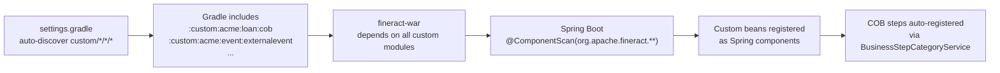

Apache Fineract provides a first-class extension system through its `custom/` directory. Custom modules are standard Gradle subprojects that are auto-discovered at build time and included in the Spring Boot assembly. They can contribute new COB business steps, loan transaction processors, external event handlers, REST API resources, and any other Spring-managed bean — without modifying the core modules.

## Directory Layout

Custom modules follow a three-level hierarchy under `custom/`:

```
custom/
├── {company}/
│   ├── {category}/
│   │   ├── {module}/
│   │   │   ├── build.gradle
│   │   │   └── src/main/java/...
│   │   │   └── src/main/resources/...
└── docker/        # Custom Docker image build
```

The `settings.gradle` root file auto-discovers all custom modules at build time:

```groovy settings.gradle
file("${rootDir}/custom").eachDir { companyDir ->
    if ('build' != companyDir.name && 'docker' != companyDir.name) {
        file("${rootDir}/custom/${companyDir.name}").eachDir { categoryDir ->
            if ('build' != categoryDir.name) {
                file("${rootDir}/custom/${companyDir.name}/${categoryDir.name}").eachDir { moduleDir ->
                    if ('build' != moduleDir.name) {
                        include ":custom:${companyDir.name}:${categoryDir.name}:${moduleDir.name}"
                    }
                }
            }
        }
    }
}
```

Any directory matching `custom/{company}/{category}/{module}/` is automatically included as a Gradle subproject.

## The `acme` Example Modules

Fineract ships example custom modules under `custom/acme/` that serve as reference implementations:

```
custom/acme/
├── event/
│   ├── externalevent/   # Custom external event producer
│   └── starter/         # Spring Boot auto-configuration starter
├── loan/
│   ├── cob/             # Custom COB business step
│   ├── job/             # Custom batch job
│   ├── processor/       # Custom loan transaction processor
│   └── starter/         # Spring Boot auto-configuration starter
└── note/
    ├── service/          # Override of note service
    └── starter/          # Spring Boot auto-configuration starter
```

### Custom COB Business Step (`acme/loan/cob`)

A custom COB step implements the `LoanCOBBusinessStep` interface from `fineract-loan`. The reference implementation in `custom/acme/loan/cob/` is `AcmeNoopBusinessStep`:

```java custom/acme/loan/cob/AcmeNoopBusinessStep.java
@Slf4j
@Component
@RequiredArgsConstructor
public class AcmeNoopBusinessStep implements LoanCOBBusinessStep, InitializingBean {

    private static final String ENUM_STYLED_NAME = "ACME_LOAN_NOOP";
    private static final String HUMAN_READABLE_NAME = "ACME Loan Noop";

    // NOTE: just to demonstrate that dependency injection is working
    private final LoanAccountDomainService loanAccountDomainService;

    @Override
    public Loan execute(Loan input) {
        return input;
    }

    @Override
    public String getEnumStyledName() {
        return ENUM_STYLED_NAME;
    }

    @Override
    public String getHumanReadableName() {
        return HUMAN_READABLE_NAME;
    }
}
```

Custom steps are picked up automatically by Spring component scanning. The companion `acme/loan/starter` module wires them together via a Spring Boot auto-configuration class registered in `META-INF/spring/org.springframework.boot.autoconfigure.AutoConfiguration.imports`.

### Custom Loan Transaction Processor (`acme/loan/processor`)

Custom modules can provide alternative `LoanRepaymentScheduleTransactionProcessor` implementations. The processor is selected by name in the loan product configuration.

### Custom External Event Handler (`acme/event/externalevent`)

Custom modules can subscribe to `AbstractBusinessEvent` subclasses and publish them to custom targets, or enrich/filter events before they reach the standard `ExternalEventProducer`.

## Module Loading Flow



<Note>
The `@ComponentScan(basePackages = "org.apache.fineract.**")` in `FineractWebApplicationConfiguration` scans all packages under `org.apache.fineract`, including packages contributed by custom modules, as long as the module is on the classpath.
</Note>

## Custom Docker Image

The `custom/docker/` directory builds a Docker image that includes all custom modules. It extends the standard `apache/fineract` base image and adds the custom module JARs to the WAR's `WEB-INF/lib/` or equivalent location.

## Starter Modules Pattern

Each `{category}/starter` module contains the Spring Boot auto-configuration that wires the sibling modules together. This pattern follows the standard Spring Boot starter convention:

```
acme/loan/starter/
└── src/main/resources/
    └── META-INF/
        └── spring/
            └── org.springframework.boot.autoconfigure.AutoConfiguration.imports
```

The `AutoConfiguration.imports` file lists the `@Configuration` classes to activate, giving full control over conditional bean registration.

## Related Pages

- [COB Close-of-Business](/loan/cob-close-of-business) — the business step interface custom modules implement
- [Instance Modes](/extensibility/instance-modes) — controlling which custom modules activate per node
- [Build System](/deployment/build-system) — how Gradle assembles custom modules into the final WAR
