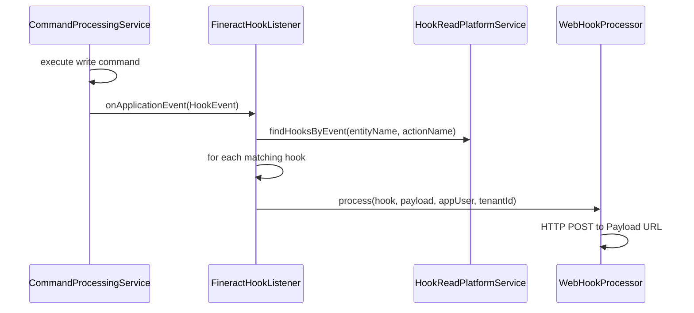

Fineract's hook subsystem provides a webhook-style integration mechanism. After a write command completes on a core entity (loan, client, savings account, etc.), the system dispatches registered hooks with the event payload. Hooks can target an HTTP endpoint or a JMS destination.

The hooks subsystem lives at:
```
fineract-provider/src/main/java/org/apache/fineract/infrastructure/hooks/
├── api/          # HookApiResource
├── command/      # HookCreateCommand, HookUpdateCommand, HookDeleteCommand
├── data/         # HookData, HookCreateRequest, HookCreateResponse
├── domain/       # Hook, HookTemplate, HookResource, HookConfiguration, HookSchema
├── handler/      # Command handlers for CRUD
├── listener/     # FineractHookListener (implements HookListener; dispatches after write commands)
├── mapper/       # HookEventMapper, HookFieldMapper
└── processor/    # WebHookProcessor, ElasticSearchHookProcessor, TwilioHookProcessor, HookProcessorProvider
```

## Domain Model

### `Hook` Entity (`m_hook`)

The `Hook` entity represents a registered webhook:

```java Hook.java
@Entity
@Table(name = "m_hook")
public final class Hook extends AbstractAuditableCustom {
    @Column(name = "name")
    private String name;

    @Column(name = "is_active")
    private Boolean isActive;

    @OneToMany(cascade = CascadeType.ALL, mappedBy = "hook", fetch = FetchType.EAGER)
    private Set<HookResource> events;       // which entity+action events fire this hook

    @OneToMany(cascade = CascadeType.ALL, mappedBy = "hook", fetch = FetchType.EAGER)
    private Set<HookConfiguration> config;  // key-value config (URL, JMS destination, etc.)

    @ManyToOne
    @JoinColumn(name = "template_id")
    private HookTemplate template;          // the template defining the payload schema

    @ManyToOne
    @JoinColumn(name = "ugd_template_id")
    private Template ugdTemplate;           // optional UGD template override
}
```

### `HookResource` Entity (`m_hook_registered_events`)

Each `HookResource` row defines one entity+action pair that triggers the hook:

```java HookResource.java
@Entity
@Table(name = "m_hook_registered_events")
public class HookResource extends AbstractPersistableCustom<Long> {
    @Column(name = "entity_name")   private String entityName;   // e.g. "LOAN", "CLIENT"
    @Column(name = "action_name")   private String actionName;   // e.g. "CREATE", "APPROVE"
}
```

### `HookTemplate` Entity (`m_hook_templates`)

A `HookTemplate` defines the payload template schema. It has a name and a set of `HookSchema` field definitions.

### `HookConfiguration`

Key-value configuration pairs for the hook, stored in `m_hook_configuration`. For web hooks, the typical keys are `Payload URL` and `Content Type`. For JMS hooks, a JMS destination name.

## Hook Templates

Built-in hook templates define the two supported delivery mechanisms:

| Template Name | Type | Description |
|---------------|------|-------------|
| `Web` | HTTP POST | Sends payload to an HTTP URL |
| `SMS Bridge` | JMS | Sends payload to a JMS destination |

Retrieve available templates via `GET /v1/hooks/template`.

## Event Matrix

Hooks fire on `{entityName}/{actionName}` combinations. Standard entity names include:

- `LOAN` — actions: `CREATE`, `APPROVE`, `DISBURSE`, `REPAYMENT`, `WRITE_OFF`, `CLOSE`, `REJECT`, `RESCHEDULE`
- `CLIENT` — actions: `CREATE`, `ACTIVATE`, `CLOSE`, `REJECT`
- `SAVINGS` — actions: `CREATE`, `ACTIVATE`, `DEPOSIT`, `WITHDRAWAL`, `CLOSE`
- `GROUP` — actions: `CREATE`, `ACTIVATE`, `CLOSE`

## REST API

### `HookApiResource` (`/v1/hooks`)

| Method | Path | Description |
|--------|------|-------------|
| `GET` | `/v1/hooks` | List all registered hooks |
| `GET` | `/v1/hooks/{hookId}` | Get a specific hook |
| `POST` | `/v1/hooks` | Register a new hook |
| `PUT` | `/v1/hooks/{hookId}` | Update a hook |
| `DELETE` | `/v1/hooks/{hookId}` | Delete a hook |
| `GET` | `/v1/hooks/template` | Get hook template metadata |

### Example: Create a Web Hook

```json POST /v1/hooks
{
    "name": "Loan Approval Notifier",
    "isActive": true,
    "templateId": 1,
    "events": [
        { "entityName": "LOAN", "actionName": "APPROVE" }
    ],
    "config": [
        { "fieldName": "Payload URL",   "fieldValue": "https://example.com/fineract/webhook" },
        { "fieldName": "Content Type",  "fieldValue": "json" }
    ]
}
```

## Hook Dispatch Flow



`FineractHookListener` implements the `HookListener` interface (`ApplicationListener<HookEvent>`) and receives a `HookEvent` after each write command completes. It looks up all hooks registered for the fired entity+action pair via `HookReadPlatformService` and dispatches each one via the appropriate `HookProcessor` (resolved by `HookProcessorProvider`).

<Note>
Hooks fire after the transaction commits. If the HTTP endpoint is unavailable, the delivery is not retried by default — hooks are fire-and-forget. For reliable delivery, use the External Events system with Kafka instead.
</Note>

## Related Pages

- [External Events](/events/external-events) — the more reliable event streaming system
- [Datatables](/extensibility/datatables) — entity datatable checks that trigger at lifecycle events
- [Custom Modules](/extensibility/custom-modules) — adding custom hook processors via the extension system
