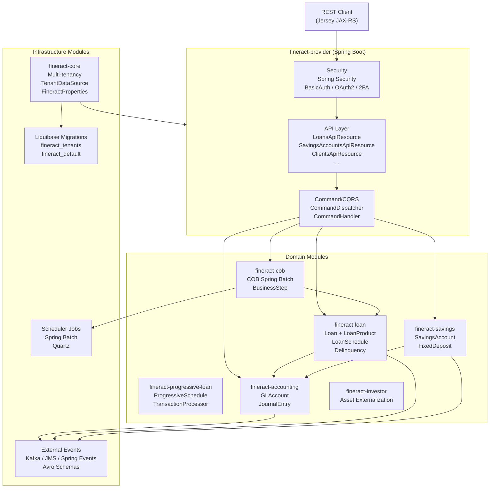

Apache Fineract is an open-source, multi-tenant core banking platform built on Spring Boot. It provides production-grade infrastructure for loans, savings, deposits, double-entry accounting, and group-lending operations. This wiki is an internal engineering reference — it maps the real source-code architecture and is intended for developers and coding agents who need to understand, navigate, or extend the codebase.

The entry point is `ServerApplication.main()` in `fineract-provider/src/main/java/org/apache/fineract/ServerApplication.java`. The system runs as a self-contained Spring Boot JAR (or deployable WAR), exposes a REST API via Jersey (JAX-RS), and persists data in per-tenant PostgreSQL databases managed by Liquibase.

## High-Level Architecture

## Subsystem Map

<CardGroup cols={2}>
  <Card title="Overview & Architecture" icon="sitemap" href="/overview/introduction">
    Project classification, top-level module structure, and how subsystems connect.
  </Card>
  <Card title="Core Infrastructure" icon="server" href="/core/fineract-core">
    fineract-core, fineract-provider, multi-tenancy, command/CQRS pattern, and batch API.
  </Card>
  <Card title="Security" icon="shield" href="/security/overview">
    Spring Security configuration, Basic Auth, OAuth2, two-factor auth, and role/permission model.
  </Card>
  <Card title="Loan Subsystem" icon="money-bill" href="/loan/overview">
    Loan products, lifecycle state machine, schedule engines (cumulative & progressive), origination, delinquency, and COB.
  </Card>
  <Card title="Savings & Deposits" icon="piggy-bank" href="/savings/overview">
    Savings accounts, fixed deposits, recurring deposits, and share accounts.
  </Card>
  <Card title="Accounting" icon="book" href="/accounting/overview">
    Double-entry general ledger, chart of accounts, journal entries, product-to-account mapping, and accruals.
  </Card>
  <Card title="Client & Group Management" icon="users" href="/portfolio/clients">
    Client entities, group/center hierarchy for group-lending, and collateral management.
  </Card>
  <Card title="Background Jobs & COB" icon="clock" href="/jobs/scheduler-framework">
    Quartz scheduler, Spring Batch close-of-business pipeline, partitioned jobs, and business steps.
  </Card>
  <Card title="Events & Messaging" icon="bell" href="/events/external-events">
    External event framework, Kafka/JMS producers, Avro schemas, and event serialization.
  </Card>
  <Card title="Extensibility & Customization" icon="puzzle-piece" href="/extensibility/custom-modules">
    Custom module system, dynamic datatables, webhook hooks, and instance-mode switching.
  </Card>
  <Card title="Data & Reporting" icon="database" href="/data/liquibase-schema">
    Liquibase migrations, tenant vs. tenant-store schemas, dataqueries, and the reporting engine.
  </Card>
  <Card title="Build & Deployment" icon="rocket" href="/deployment/build-system">
    Gradle multi-project build, Docker Compose configurations, Kubernetes manifests, and environment configuration.
  </Card>
</CardGroup>

## Where to Start

For a first read, follow this path through the codebase:

1. **[Architecture Overview](/overview/architecture)** — understand the layered structure and module dependency graph.
2. **[fineract-provider](/core/fineract-provider)** — the Spring Boot assembly module: `ServerApplication.java`, `FineractWebApplicationConfiguration`, and Jersey registration.
3. **[Multi-tenancy](/core/multi-tenancy)** — `TenantDataSourceFactory`, `FineractPlatformTenant`, and how per-request tenant switching works.
4. **[Command Pattern](/core/command-pattern)** — `CommandDispatcher`, `CommandHandler`, and the audit trail that wraps every write operation.
5. **[Loan Overview](/loan/overview)** — the largest subsystem; start here before reading lifecycle, schedule, or COB pages.

Key entry-point files:
- `fineract-provider/src/main/java/org/apache/fineract/ServerApplication.java`
- `fineract-provider/src/main/resources/application.properties`
- `fineract-core/src/main/java/org/apache/fineract/infrastructure/core/config/FineractProperties.java`
- `fineract-loan/src/main/java/org/apache/fineract/portfolio/loanaccount/domain/Loan.java`
- `fineract-cob/src/main/java/org/apache/fineract/cob/service/` (COB business step infrastructure)
