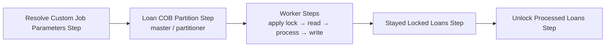

The **Loan Close of Business (LOAN_COB)** job is the most critical nightly batch process in Apache Fineract. It advances each active loan's business date by one day and executes a configurable sequence of business steps — applying charges, accruing interest, classifying delinquency, and more — for every non-closed loan in the portfolio. The job is implemented as a Spring Batch partitioned job, distributing loan IDs across multiple worker partitions for parallel processing.

## Job Identity

| Constant | Value | Source |
|----------|-------|--------|
| `JOB_NAME` | `LOAN_COB` | `LoanCOBConstant.JOB_NAME` |
| `JOB_HUMAN_READABLE_NAME` | `Loan COB` | `LoanCOBConstant.JOB_HUMAN_READABLE_NAME` |
| `LOAN_COB_JOB_NAME` | `LOAN_CLOSE_OF_BUSINESS` | `LoanCOBConstant.LOAN_COB_JOB_NAME` |
| `LOAN_COB_PARTITIONER_STEP` | `Loan COB partition - Step` | `LoanCOBConstant.LOAN_COB_PARTITIONER_STEP` |
| `LOAN_COB_WORKER_STEP` | `loanCOBWorkerStep` | `LoanCOBConstant.LOAN_COB_WORKER_STEP` |
| `INLINE_LOAN_COB_JOB_NAME` | `INLINE_LOAN_COB` | `LoanCOBConstant.INLINE_LOAN_COB_JOB_NAME` |

These constants are defined in `org.apache.fineract.cob.loan.LoanCOBConstant` (extending `COBConstant` from `fineract-cob`).

## Job Definition

The LOAN_COB job is assembled in `LoanCOBManagerConfiguration` in `org.apache.fineract.cob.loan` and is conditional on `BatchManagerCondition` (i.e., only instantiated when `fineract.mode.batch-manager-enabled=true`):

```java
// LoanCOBManagerConfiguration.java
@Bean(name = "loanCOBJob")
public Job loanCOBJob(LoanCOBPartitioner partitioner) {
    return new JobBuilder(JobName.LOAN_COB.name(), jobRepository)
        .listener(new COBExecutionListenerRunner(applicationContext, JobName.LOAN_COB.name()))
        .start(resolveCustomJobParametersStep())   // Step 1: Resolve custom parameters
        .next(loanCOBStep(partitioner))            // Step 2: Partitioned loan processing
        .next(stayedLockedStep())                  // Step 3: Report stayed-locked loans
        .next(unlockProcessedLoansStep())          // Step 4: Release locks
        .incrementer(new RunIdIncrementer())
        .build();
}
```



## COB Date Advancement

The `COBConstant.NUMBER_OF_DAYS_BEHIND` constant is set to `1L`. The `LoanCOBPartitioner` passes this to `CommonPartitioner`, which calculates the target business date as `today - 1 day`. Each partition's `ExecutionContext` carries the `BusinessDate` parameter, which worker steps use as the date for calculations.

The `BusinessDateResolver` in `org.apache.fineract.cob.resolver` extracts the business date from the `JobParameter` named `BusinessDate` (constant `COBConstant.BUSINESS_DATE_PARAMETER_NAME`).

## Step 1 — Resolve Custom Job Parameters

`ResolveLoanCOBCustomJobParametersTasklet` resolves any custom job parameters (stored in the `job_custom_parameter` table via `ConfigJobParameterService`) and sets them into the `JobExecutionContext`. This allows operators to override the default COB business date for catch-up runs.

## Step 2 — Partitioned Loan Processing

This is the core step, implemented as a remote-partitioning master step in `LoanCOBManagerConfiguration`:

```java
@Bean("loanCOBStep")
public Step loanCOBStep(LoanCOBPartitioner partitioner) {
    return stepBuilderFactory.get(LoanCOBConstant.LOAN_COB_PARTITIONER_STEP)
        .partitioner(LoanCOBConstant.LOAN_COB_WORKER_STEP, partitioner)
        .pollInterval(propertyService.getPollInterval(JOB_NAME))
        .outputChannel(outboundRequests)
        .build();
}
```

`LoanCOBPartitioner` divides eligible loan IDs into groups of `partitionSize` (default 100) using `getPartitions()` from `CommonPartitioner`. Each partition is an `ExecutionContext` entry keyed as `partition_0`, `partition_1`, etc., holding a list of loan IDs and the set of business step names/orders to execute.

## Step 2 (Worker) — Per-Loan Processing Pipeline

The worker side is configured in `LoanCOBWorkerConfiguration` (conditional on `BatchWorkerCondition`):

```java
@Bean(name = LoanCOBConstant.LOAN_COB_WORKER_STEP)
public Step loanCOBWorkerStep() {
    return stepBuilderFactory.get("Loan COB worker - Step")
        .inputChannel(inboundRequests)
        .<Loan, Loan>chunk(propertyService.getChunkSize(JobName.LOAN_COB.name()), transactionManager)
        .reader(cobWorkerItemReader())
        .processor(cobWorkerItemProcessor())
        .writer(cobWorkerItemWriter())
        .faultTolerant()
        .retry(Exception.class)
        .retryLimit(propertyService.getRetryLimit(LoanCOBConstant.JOB_NAME))
        .skip(Exception.class)
        .skipLimit(propertyService.getChunkSize(LoanCOBConstant.JOB_NAME) + 1)
        .listener(loanItemListener())
        .listener(cobWorkerStepListener())
        .build();
}
```

### Reader — LoanItemReader

`LoanItemReader` reads `Loan` entities from `LoanRepository` using loan IDs supplied in the partition's `ExecutionContext`. Before reading, `BeforeStepLockingItemReaderHelper` acquires a COB lock on the batch of IDs, preventing concurrent modifications.

### Processor — LoanItemProcessor

`LoanItemProcessor` delegates to `COBBusinessStepService.runBusinessSteps()`, which iterates the ordered list of `LoanCOBBusinessStep` implementations configured for the `LOAN_CLOSE_OF_BUSINESS` job name.

### Writer — LoanItemWriter

`LoanItemWriter` persists the modified `Loan` entities via `LoanRepository` and then calls `loanLockingService` to remove the COB lock on successfully processed loans.

## Business Steps

Business steps implement the `LoanCOBBusinessStep` interface (extending `COBBusinessStep<Loan>` from `fineract-cob`), which requires:

```java
// org.apache.fineract.cob.COBBusinessStep
T execute(T input);
String getEnumStyledName();
String getHumanReadableName();
```

The active business steps for each loan are:

<Accordion title="APPLY_CHARGE_TO_OVERDUE_LOANS — ApplyChargeToOverdueLoansBusinessStep">
Applies overdue charges to loans with past-due installments. Retrieves `OverdueLoanScheduleData` via `LoanReadPlatformService.retrieveAllOverdueInstallmentsForLoan()` and delegates to `LoanChargeWritePlatformService.applyOverdueChargesForLoan()`.

```
Enum name: APPLY_CHARGE_TO_OVERDUE_LOANS
Class: org.apache.fineract.cob.loan.ApplyChargeToOverdueLoansBusinessStep
```
</Accordion>

<Accordion title="ADD_PERIODIC_ACCRUAL_ENTRIES — AddPeriodicAccrualEntriesBusinessStep">
Posts periodic accrual journal entries for interest-bearing loans. Calls `LoanAccrualsProcessingService.addPeriodicAccruals(businessDate, loan)`. Throws `BusinessStepException` wrapping `MultiException` on failure to ensure the loan is skipped cleanly.

```
Enum name: ADD_PERIODIC_ACCRUAL_ENTRIES
Class: org.apache.fineract.cob.loan.AddPeriodicAccrualEntriesBusinessStep
```
</Accordion>

<Accordion title="LOAN_INTEREST_RECALCULATION — LoanInterestRecalculationCOBBusinessStep">
Recalculates interest for variable-rate or compound-interest loans when past-due installments exist. Skipped for NPA loans, charged-off loans, loans without interest recalculation enabled, or loans that do not allow recalculation on past-due balances.

```
Enum name: LOAN_INTEREST_RECALCULATION
Class: org.apache.fineract.cob.loan.LoanInterestRecalculationCOBBusinessStep
```
</Accordion>

<Accordion title="SET_LOAN_DELINQUENCY_TAGS — SetLoanDelinquencyTagsBusinessStep">
Classifies the loan into a delinquency range bucket based on days past due. Raises a `LoanDelinquencyRangeChangeBusinessEvent` when the range changes. Considers active delinquency pause actions via `DelinquencyEffectivePauseHelper`.

```
Enum name: SET_LOAN_DELINQUENCY_TAGS
Class: org.apache.fineract.cob.loan.SetLoanDelinquencyTagsBusinessStep
```
</Accordion>

<Accordion title="UPDATE_LOAN_ARREARS_AGING — UpdateLoanArrearsAgingBusinessStep">
Updates the loan's arrears aging record in `m_loan_arrears_aging`. Delegates to `LoanArrearsAgeingUpdateHandler.updateLoanArrearsAgeingDetails()`.

```
Enum name: UPDATE_LOAN_ARREARS_AGING
Class: org.apache.fineract.cob.loan.UpdateLoanArrearsAgingBusinessStep
```
</Accordion>

<Accordion title="CHECK_LOAN_REPAYMENT_DUE / OVERDUE">
Two separate steps:
- `CheckLoanRepaymentDueBusinessStep` — fires `LoanRepaymentDueBusinessEvent` for installments whose due date falls within the configured advance-notice period.
- `CheckLoanRepaymentOverdueBusinessStep` — fires `LoanRepaymentOverdueBusinessEvent` for installments that have become overdue as of the COB date.
</Accordion>

<Accordion title="ACCRUAL_ACTIVITY_POSTING — AccrualActivityPostingBusinessStep">
Posts accrual activity entries for progressive-interest loans. Complements `ADD_PERIODIC_ACCRUAL_ENTRIES` for loans using the progressive model.
</Accordion>

<Accordion title="CHECK_DUE_INSTALLMENTS — CheckDueInstallmentsBusinessStep">
Validates installment due dates and fires notifications for loans with upcoming payment obligations.
</Accordion>

## Locking Mechanism

Fineract uses a database-backed locking table (`m_loan_account_lock`) to prevent API requests from modifying loans while COB is processing them. The lock owner is tracked by the `LockOwner` enum.

```mermaid
sequenceDiagram
    participant M as Manager Step (ApplyLoanLockTasklet)
    participant DB as m_loan_account_lock
    participant W as Worker (LoanItemReader)
    participant A as API Request

    M->>DB: INSERT lock rows for partition's loan IDs (LOAN_COB_CHUNK_PROCESSING)
    W->>DB: Read loan IDs; verify locks held
    A->>DB: Attempt operation on locked loan
    DB-->>A: 423 Locked (COBApiFilter intercepts)
    W->>DB: Process loan, complete
    W->>DB: DELETE lock rows for processed loans
```

Key classes in the locking system:

| Class | Package | Role |
|-------|---------|------|
| `AccountLockService` | `org.apache.fineract.cob.service` | Interface defining lock query and cleanup operations |
| `LoanLockingServiceImpl` | `org.apache.fineract.cob.loan` | Concrete implementation for loan-level locks |
| `ApplyLoanLockTasklet` | `org.apache.fineract.cob.loan` | Acquires COB locks before a worker partition starts |
| `UnlockProcessedLoansTasklet` | `org.apache.fineract.cob.loan` | Releases locks after the partition step completes |
| `ChunkProcessingLoanItemListener` | `org.apache.fineract.cob.listener` | After-chunk callback that removes locks for successfully processed items |
| `StayedLockedLoansTasklet` | `org.apache.fineract.cob.loan` | Reports loans that remained locked after the step finished |
| `COBApiFilter` | `org.apache.fineract.infrastructure.jobs.filter` | HTTP filter that returns 423 for API requests targeting locked loans |

## Step 3 — Stayed Locked Loans

`StayedLockedLoansTasklet` identifies loans still holding a lock after the main partition step completes (indicating a processing failure). It fires a `LoanAccountsStayedLockedBusinessEvent` so downstream systems (e.g., notification services) can alert operators.

## Step 4 — Unlock Processed Loans

`UnlockProcessedLoansTasklet` calls `AccountLockService.updateCobAndRemoveLocks()` to advance the `lastClosedBusinessDate` on successfully processed loans and clean up any remaining lock records.

## Inline COB Trigger

The inline COB allows bypassing the scheduled job to immediately process a specific list of loan IDs — useful when an API request needs to update a loan whose COB hasn't run yet for today.

```
POST /api/v1/jobs/LOAN_COB/inline
Content-Type: application/json

{ "loanIds": [101, 205, 306] }
```

The inline job is orchestrated by `InlineLoanCOBExecutorServiceImpl` (dispatched by `InlineJobType.LOAN_COB`) using the `LoanInlineCOBConfig` Spring Batch configuration. `InlineCOBLoanItemReader`, `InlineCOBLoanItemProcessor`, and `InlineCOBLoanItemWriter` form the inline pipeline, with `InlineLoanCOBBuildExecutionContextTasklet` constructing the execution context.

`LoanCOBApiFilter` and `LoanCOBFilterHelperImpl` intercept incoming REST calls and automatically trigger inline COB when a request targets a loan that has a pending COB date.

## Error Handling and Retry

The worker step is configured with `faultTolerant()`, which enables:

- **Retry**: Up to `retryLimit` attempts per item on any `Exception`. Controlled by `LOAN_COB_RETRY_LIMIT` (default 5).
- **Skip**: Items that exhaust retries are skipped. The skip limit equals `chunkSize + 1` to allow the entire chunk to proceed even if one item fails repeatedly.
- **Skip Listener**: `ChunkProcessingLoanItemListener` handles `onSkipInProcess` and `onSkipInWrite` callbacks to log failures and release locks on skipped loans.

## Configuration Reference

All partitioned job properties are under `fineract.partitioned-job.partitioned-job-properties[0]` in `application.properties`:

| Property | Env Var | Default | Description |
|----------|---------|---------|-------------|
| `chunk-size` | `LOAN_COB_CHUNK_SIZE` | `100` | Loans processed per Spring Batch chunk (transaction boundary) |
| `partition-size` | `LOAN_COB_PARTITION_SIZE` | `100` | Loan IDs per partition slice |
| `retry-limit` | `LOAN_COB_RETRY_LIMIT` | `5` | Max retry attempts per loan item |
| `thread-pool-core-pool-size` | `LOAN_COB_THREAD_POOL_CORE_POOL_SIZE` | `5` | Worker thread pool core size |
| `thread-pool-max-pool-size` | `LOAN_COB_THREAD_POOL_MAX_POOL_SIZE` | `5` | Worker thread pool max size |
| `thread-pool-queue-capacity` | `LOAN_COB_THREAD_POOL_QUEUE_CAPACITY` | `20` | Worker thread pool queue capacity |
| `poll-interval` | `LOAN_COB_POLL_INTERVAL` | `500` | ms between manager polls for completed partitions |

<Note>
Thread pool settings in `LoanCOBWorkerConfiguration.cobTaskExecutor()` use `ContextAwareTaskDecorator` to propagate the Spring Security context and Fineract tenant context to worker threads.
</Note>

<Warning>
Setting `LOAN_COB_THREAD_POOL_MAX_POOL_SIZE` to 1 forces synchronous execution (`SyncTaskExecutor`) — useful for debugging but not recommended in production with large loan portfolios.
</Warning>

For details on how the partitioning infrastructure works, see [Spring Batch Partitioning](/jobs/spring-batch-partitioning).
