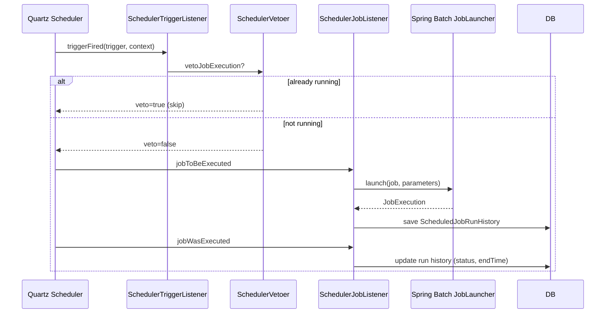
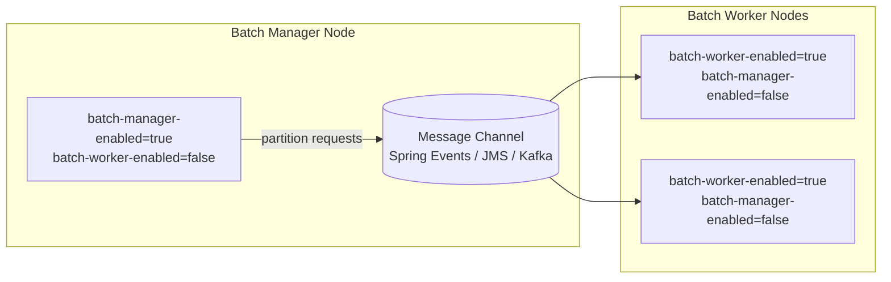

Apache Fineract includes a Quartz-based scheduler framework that drives all background processing — from periodic interest accrual and charge application to the nightly Close of Business (COB) run. The framework persists job metadata in the `job` table, records execution history in `job_run_history`, and bridges into Spring Batch for multi-step partitioned jobs. Every Fineract node can operate as a scheduler node, a batch worker node, or both, depending on runtime configuration flags.

## Core Domain Classes

<CardGroup cols={2}>
  <Card title="ScheduledJobDetail" icon="database">
    JPA entity mapped to the `job` table. Holds `jobName`, `cronExpression`, `taskPriority`, `nodeId`, `previousRunStartTime`, `nextRunTime`, and the `isActive` flag.
    <br/>Package: `org.apache.fineract.infrastructure.jobs.domain`
  </Card>
  <Card title="ScheduledJobRunHistory" icon="clock-rotate-left">
    JPA entity mapped to `job_run_history`. Captures start/end times, trigger type (auto/manual), status, and error message for each execution.
    <br/>Package: `org.apache.fineract.infrastructure.jobs.domain`
  </Card>
  <Card title="SchedulerDetail" icon="gear">
    Singleton entity that stores global scheduler state: whether the scheduler is `active` or in `standby` mode, and the `preferredJobName`.
    <br/>Package: `org.apache.fineract.infrastructure.jobs.domain`
  </Card>
  <Card title="JobParameter" icon="sliders">
    Key-value parameters attached to a job execution, allowing runtime customisation (e.g., specifying a date range).
    <br/>Package: `org.apache.fineract.infrastructure.jobs.domain`
  </Card>
</CardGroup>

## REST API — SchedulerJobApiResource

`SchedulerJobApiResource` in `org.apache.fineract.infrastructure.jobs.api` is mounted at **`/api/v1/jobs`**.

<Tabs>
  <Tab title="Job Listing & Detail">
    | Method | Path | Description |
    |--------|------|-------------|
    | `GET` | `/v1/jobs` | Returns all registered jobs with cron expression, next/previous run times, and active status |
    | `GET` | `/v1/jobs/{jobId}` | Retrieves a single job by numeric ID |
    | `GET` | `/v1/jobs/{jobId}?shortName=true` | Retrieves a job by its `short_name` identifier |
    | `GET` | `/v1/jobs/{jobId}/runhistory` | Returns paginated run history for a job |
  </Tab>
  <Tab title="Job Control">
    | Method | Path | Description |
    |--------|------|-------------|
    | `POST` | `/v1/jobs/{jobId}?command=executeJob` | Triggers immediate manual execution |
    | `PUT` | `/v1/jobs/{jobId}` | Updates cron expression, display name, or active flag |
  </Tab>
  <Tab title="Scheduler Control">
    The scheduler state endpoint is `SchedulerApiResource` at `/api/v1/scheduler`:

    | Method | Path | Description |
    |--------|------|-------------|
    | `GET` | `/v1/scheduler` | Returns current scheduler status (`active` or `standby`) |
    | `POST` | `/v1/scheduler?command=start` | Starts the scheduler (activates all Quartz triggers) |
    | `POST` | `/v1/scheduler?command=stop` | Suspends all scheduled runs (standby mode) |
  </Tab>
  <Tab title="Inline Jobs">
    `InlineJobApiResource` at `/api/v1/jobs/{jobName}/inline` provides synchronous, on-demand execution of selected jobs (e.g., COB for specific loan IDs) outside the normal Quartz schedule:

    ```
    POST /api/v1/jobs/LOAN_COB/inline
    { "loanIds": [101, 102, 103] }
    ```

    Supported inline job types are defined in the `InlineJobType` enum:
    - `LOAN_COB` → dispatches to `InlineLoanCOBExecutorServiceImpl`
    - `WC_LOAN_COB` → dispatches to `InlineWorkingCapitalLoanCOBExecutorServiceImpl`
  </Tab>
</Tabs>

## Job Registration

`JobRegisterServiceImpl` in `org.apache.fineract.infrastructure.jobs.service` bootstraps Quartz `JobDetail` and `CronTrigger` objects from `ScheduledJobDetail` entities at startup. The service:

1. Reads all `ScheduledJobDetail` records from the database.
2. Creates Quartz `JobDetail` instances keyed by `jobName` + `groupName`.
3. Schedules `CronTrigger` objects using the stored `cronExpression`.
4. Registers `SchedulerJobListener`, `SchedulerTriggerListener`, and `SchedulerVetoer` with the Quartz scheduler.

The `SchedulerVetoer` prevents concurrent execution: if a job is already `RUNNING`, subsequent triggers are vetoed until the current run completes.

## Execution Flow



## Job Execution History

Run history is stored in `ScheduledJobRunHistory` and accessible via `GET /v1/jobs/{jobId}/runhistory`. Each record contains:

| Field | Description |
|-------|-------------|
| `version` | Incrementing counter for each run |
| `startTime` | Job start timestamp |
| `endTime` | Job completion timestamp |
| `status` | `success` or `failed` |
| `errorMessage` | Exception message on failure |
| `errorLog` | Full stack trace on failure |
| `triggerType` | `auto` (Quartz-scheduled) or `manual` (API-triggered) |

## Stuck Job Recovery

The `StuckJobExecutorServiceImpl` handles jobs that got stuck in a `RUNNING` state (e.g., due to a node crash). A configurable threshold controls when a running job is considered stuck:

```properties
# application.properties
fineract.job.stuck-retry-threshold=${FINERACT_JOB_STUCK_RETRY_THRESHOLD:5}
```

When the threshold (in minutes) is exceeded, `StuckJobListener` invokes `StuckJobExecutorService.resumeStuckJob(jobName)`. For regular tasklet-based jobs, this calls `jobOperator.restart(jobId)`. For partitioned jobs (like `LOAN_COB`), it uses a specialised restart path via `JobExecutionRepository`.

## Instance Modes

Fineract supports splitting scheduling responsibilities between node types using two boolean flags in `application.properties`:

```properties
fineract.mode.batch-worker-enabled=${FINERACT_MODE_BATCH_WORKER_ENABLED:true}
fineract.mode.batch-manager-enabled=${FINERACT_MODE_BATCH_MANAGER_ENABLED:true}
```

Both default to `true` (single-node mode). In a multi-node deployment you typically separate them:



| Mode | Role | Spring Configuration |
|------|------|---------------------|
| **batch-manager** | Drives the master step, creates partitions, distributes work via message channel | `ManagerConfig` activates `DirectChannel outboundRequests` |
| **batch-worker** | Receives partition step-execution requests, processes loan chunks | `WorkerConfig` activates `QueueChannel inboundRequests` |

<Note>
When both flags are `true` (the default), the same JVM handles both roles using Spring Events (in-process message passing), requiring no external messaging infrastructure.
</Note>

## Spring Batch Integration

Partitioned jobs use Spring Batch's remote-partitioning support via `RemotePartitioningManagerStepBuilderFactory` and `RemotePartitioningWorkerStepBuilderFactory` from `spring-batch-integration`. The only registered partitioned job is `LOAN_COB` (see the `PartitionedJob` enum):

```java
// org.apache.fineract.infrastructure.jobs.data.partitionedjobs.PartitionedJob
public enum PartitionedJob {
    LOAN_COB(LoanCOBConstant.LOAN_COB_PARTITIONER_STEP);
}
```

For full details on partitioned job configuration, see [Spring Batch Partitioning](/jobs/spring-batch-partitioning).

## Key Configuration Properties

| Property | Env Var | Default | Description |
|----------|---------|---------|-------------|
| `fineract.job.stuck-retry-threshold` | `FINERACT_JOB_STUCK_RETRY_THRESHOLD` | `5` | Minutes before a running job is considered stuck |
| `fineract.mode.batch-worker-enabled` | `FINERACT_MODE_BATCH_WORKER_ENABLED` | `true` | Enables the batch-worker role on this node |
| `fineract.mode.batch-manager-enabled` | `FINERACT_MODE_BATCH_MANAGER_ENABLED` | `true` | Enables the batch-manager role on this node |

<Tip>
In a single-node development environment both manager and worker flags should remain `true`. Only set them asymmetrically when deploying dedicated batch-manager and batch-worker pods in a Kubernetes cluster.
</Tip>
