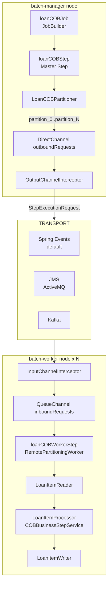

Apache Fineract uses [Spring Batch's remote partitioning](https://docs.spring.io/spring-batch/docs/current/reference/html/scalability.html#partitioning) feature to horizontally scale the Loan Close of Business job. A **batch-manager** node divides the loan portfolio into numbered partitions and sends step-execution requests over a message channel. One or more **batch-worker** nodes receive those requests and process their assigned loan IDs concurrently. Three message transport options are supported: in-process Spring Events, JMS (ActiveMQ), and Apache Kafka.

## Architecture Overview



## Manager Configuration

### ManagerConfig

`ManagerConfig` in `org.apache.fineract.infrastructure.springbatch` is activated when `fineract.mode.batch-manager-enabled=true`:

```java
// ManagerConfig.java
@Configuration
@EnableBatchIntegration
@ConditionalOnProperty(value = "fineract.mode.batch-manager-enabled", havingValue = "true")
public class ManagerConfig {
    @Bean
    public DirectChannel outboundRequests() { return new DirectChannel(); }

    @Bean
    public OutputChannelInterceptor outputInterceptor() { return new OutputChannelInterceptor(); }
}
```

The `DirectChannel outboundRequests` is the Spring Integration channel through which the master step pushes `StepExecutionRequest` messages. `OutputChannelInterceptor` enriches outgoing messages with tenant context (`ContextualMessage` wrapper) before they leave the manager.

### LoanCOBManagerConfiguration

`LoanCOBManagerConfiguration` in `org.apache.fineract.cob.loan` wires the partitioned master step using `RemotePartitioningManagerStepBuilderFactory`:

```java
// LoanCOBManagerConfiguration.java
@Bean("loanCOBStep")
public Step loanCOBStep(LoanCOBPartitioner partitioner) {
    return stepBuilderFactory.get(LoanCOBConstant.LOAN_COB_PARTITIONER_STEP)
        .partitioner(LoanCOBConstant.LOAN_COB_WORKER_STEP, partitioner)
        .pollInterval(propertyService.getPollInterval(JOB_NAME))
        .outputChannel(outboundRequests)
        .build();
}
```

The `pollInterval` (default 500 ms, configurable via `LOAN_COB_POLL_INTERVAL`) sets how frequently the manager polls the Spring Batch `JobRepository` to check whether all remote partitions have completed.

## Worker Configuration

### WorkerConfig

`WorkerConfig` in `org.apache.fineract.infrastructure.springbatch` is activated when `fineract.mode.batch-worker-enabled=true`:

```java
// WorkerConfig.java
@Configuration
@ConditionalOnProperty(value = "fineract.mode.batch-worker-enabled", havingValue = "true")
public class WorkerConfig {
    @Bean
    public QueueChannel inboundRequests() { return new QueueChannel(); }

    @Bean
    public InputChannelInterceptor inputInterceptor() { return new InputChannelInterceptor(); }
}
```

`QueueChannel inboundRequests` buffers incoming `StepExecutionRequest` messages. `InputChannelInterceptor` deserialises the `ContextualMessage` and restores the tenant context so downstream processing runs in the correct tenant scope.

### LoanCOBWorkerConfiguration

`LoanCOBWorkerConfiguration` in `org.apache.fineract.cob.loan` configures the worker step using `RemotePartitioningWorkerStepBuilderFactory`:

```java
// LoanCOBWorkerConfiguration.java
@Bean(name = LoanCOBConstant.LOAN_COB_WORKER_STEP)
public Step loanCOBWorkerStep() {
    SimpleStepBuilder<Loan, Loan> builder = stepBuilderFactory
        .get("Loan COB worker - Step")
        .inputChannel(inboundRequests)
        .<Loan, Loan>chunk(propertyService.getChunkSize(JobName.LOAN_COB.name()), transactionManager)
        .reader(cobWorkerItemReader())
        .processor(cobWorkerItemProcessor())
        .writer(cobWorkerItemWriter())
        .faultTolerant()
        .retry(Exception.class)
        .retryLimit(propertyService.getRetryLimit(LoanCOBConstant.JOB_NAME))
        .skip(Exception.class)
        .skipLimit(propertyService.getChunkSize(LoanCOBConstant.JOB_NAME) + 1)
        .listener(loanItemListener())
        .listener(cobWorkerStepListener());

    if (propertyService.getThreadPoolMaxPoolSize(LoanCOBConstant.JOB_NAME) > 1) {
        builder.taskExecutor(cobTaskExecutor());
    }
    return builder.build();
}
```

When `LOAN_COB_THREAD_POOL_MAX_POOL_SIZE > 1`, a `ThreadPoolTaskExecutor` named `cobTaskExecutor()` is injected, enabling parallel chunk processing within a single worker. The decorator `ContextAwareTaskDecorator` in `org.apache.fineract.cob.loan` propagates thread-local context (security principal, tenant ID) to each worker thread:

```java
// ContextAwareTaskDecorator.java (fineract-loan)
// Copies SecurityContext and ThreadLocalContextUtil state to spawned threads
```

## Partitioner — LoanCOBPartitioner

`LoanCOBPartitioner` in `org.apache.fineract.cob.loan` extends `CommonPartitioner` (from `fineract-cob`, `org.apache.fineract.cob.common`) and implements Spring Batch's `Partitioner` interface:

```java
// LoanCOBPartitioner.java
@Override
public Map<String, ExecutionContext> partition(int gridSize) {
    int partitionSize = propertyService.getPartitionSize(LoanCOBConstant.JOB_NAME);
    Set<BusinessStepNameAndOrder> cobBusinessSteps =
        cobBusinessStepService.getCOBBusinessSteps(LoanCOBBusinessStep.class, LoanCOBConstant.LOAN_COB_JOB_NAME);
    return getPartitions(partitionSize, cobBusinessSteps);
}
```

`CommonPartitioner.getPartitions()` does the following:

1. Retrieves all non-closed loan IDs from `RetrieveIdService` (implemented by `RetrieveAllNonClosedIdServiceImpl`).
2. Computes the target COB business date as `today - NUMBER_OF_DAYS_BEHIND` (= 1 day).
3. Splits loan IDs into pages of `partitionSize` (default 100).
4. For each page, creates an `ExecutionContext` keyed as `partition_0`, `partition_1`, …, containing the loan IDs list, business steps, and business date.
5. Returns the complete `Map<String, ExecutionContext>` to the master step.

Each partition key follows the pattern defined in `COBConstant`:
```java
public static final String PARTITION_KEY    = "partition";
public static final String PARTITION_PREFIX = "partition_";
```

## Message Transport Options

The transport layer connects the manager's `outboundRequests` channel to the workers' `inboundRequests` channel. Three implementations are provided, each activated by a conditional annotation:

<Tabs>
  <Tab title="Spring Events (default)">
    **Active when**: `fineract.remote-job-message-handler.spring-events.enabled=true`

    Uses Spring's `ApplicationEventPublishingMessageHandler` to publish `StepExecutionRequest` objects as in-process Spring application events. `SpringEventWorkerConfig` subscribes to these events via a `QueueChannel` adapter.

    ```java
    // SpringEventManagerConfig.java
    @Bean
    public IntegrationFlow outboundFlow() {
        ApplicationEventPublishingMessageHandler handler = new ApplicationEventPublishingMessageHandler();
        return IntegrationFlow.from(outboundRequests)
            .intercept(outputInterceptor)
            .log(LoggingHandler.Level.DEBUG)
            .handle(handler)
            .get();
    }
    ```

    **Suitable for**: Single-node deployments, development, and testing. No external infrastructure required.

    **Limitation**: All work stays in-process. Cannot distribute load to other JVMs.
  </Tab>
  <Tab title="JMS / ActiveMQ">
    **Active when**: `fineract.remote-job-message-handler.jms.enabled=true`

    `JmsManagerConfig` pushes `StepExecutionRequest` messages to an ActiveMQ queue. `JmsWorkerConfig` sets up a `JmsBatchWorkerMessageListener` that reads from the same queue and forwards messages to the `inboundRequests` channel.

    ```properties
    fineract.remote-job-message-handler.jms.enabled=true
    fineract.remote-job-message-handler.jms.request-queue-name=JMS-request-queue
    fineract.remote-job-message-handler.jms.broker-url=tcp://127.0.0.1:61616
    fineract.remote-job-message-handler.jms.broker-username=
    fineract.remote-job-message-handler.jms.broker-password=
    ```

    **Suitable for**: Multi-node deployments using an existing ActiveMQ broker.
  </Tab>
  <Tab title="Apache Kafka">
    **Active when**: `fineract.remote-job-message-handler.kafka.enabled=true`

    `KafkaManagerConfig` writes partition requests to a Kafka topic. `KafkaRemoteMessageListener` consumes messages on the worker side and routes them to `inboundRequests`.

    ```properties
    fineract.remote-job-message-handler.kafka.enabled=true
    fineract.remote-job-message-handler.kafka.topic.name=job-topic
    fineract.remote-job-message-handler.kafka.topic.replicas=1
    fineract.remote-job-message-handler.kafka.topic.partitions=10
    fineract.remote-job-message-handler.kafka.bootstrap-servers=localhost:9092
    fineract.remote-job-message-handler.kafka.consumer.group-id=fineract-consumer-group-id
    fineract.remote-job-message-handler.kafka.topic.auto-create=true
    ```

    **Suitable for**: Large-scale deployments requiring durable message delivery and multiple worker pods.

    <Note>
    When `auto-create=true`, Fineract will automatically create the Kafka topic if it does not exist, using the configured `replicas` and `partitions` values. This requires the Kafka broker to have auto-topic-creation enabled or the Fineract application to have admin privileges.
    </Note>
  </Tab>
</Tabs>

<Warning>
Only one transport should be enabled at a time. Enabling both `spring-events` and `jms` simultaneously will cause duplicate step execution requests.
</Warning>

## PartitionedJobProperties Configuration Class

The `FineractProperties.PartitionedJobProperty` inner class (in `org.apache.fineract.infrastructure.core.config.FineractProperties`) is the configuration model for per-job tuning:

```java
// FineractProperties.java
public static class PartitionedJobProperty {
    private String  jobName;
    private Integer chunkSize;
    private Integer partitionSize;
    private Integer threadPoolCorePoolSize;
    private Integer threadPoolMaxPoolSize;
    private Integer threadPoolQueueCapacity;
    private Integer retryLimit;
    private Integer pollInterval;
}
```

These values are read by `PropertyServiceImpl` in `org.apache.fineract.infrastructure.springbatch`, which implements the `PropertyService` interface:

```java
// PropertyServiceImpl.java
public Integer getChunkSize(String jobName)     { ... }
public Integer getPartitionSize(String jobName) { ... }
public Integer getRetryLimit(String jobName)    { ... }
public Integer getThreadPoolCorePoolSize(...)   { ... }
public Integer getThreadPoolMaxPoolSize(...)    { ... }
public Integer getThreadPoolQueueCapacity(...)  { ... }
public Integer getPollInterval(String jobName)  { ... }
```

## Full Property Reference

All properties for `LOAN_COB` are under the `fineract.partitioned-job.partitioned-job-properties[0]` namespace:

| Property | Env Var | Default | Description |
|----------|---------|---------|-------------|
| `job-name` | — | `LOAN_COB` | Matches against `JobName.LOAN_COB.name()` |
| `chunk-size` | `LOAN_COB_CHUNK_SIZE` | `100` | Loans per chunk (transaction boundary) |
| `partition-size` | `LOAN_COB_PARTITION_SIZE` | `100` | Loan IDs per partition slice |
| `thread-pool-core-pool-size` | `LOAN_COB_THREAD_POOL_CORE_POOL_SIZE` | `5` | Worker thread pool core threads |
| `thread-pool-max-pool-size` | `LOAN_COB_THREAD_POOL_MAX_POOL_SIZE` | `5` | Worker thread pool max threads |
| `thread-pool-queue-capacity` | `LOAN_COB_THREAD_POOL_QUEUE_CAPACITY` | `20` | Worker thread pool queue depth |
| `retry-limit` | `LOAN_COB_RETRY_LIMIT` | `5` | Max retries per item before skip |
| `poll-interval` | `LOAN_COB_POLL_INTERVAL` | `500` | Manager poll interval (ms) |

Remote message handler properties:

| Property | Env Var | Default |
|----------|---------|---------|
| `fineract.remote-job-message-handler.spring-events.enabled` | `FINERACT_REMOTE_JOB_MESSAGE_HANDLER_SPRING_EVENTS_ENABLED` | `true` |
| `fineract.remote-job-message-handler.jms.enabled` | `FINERACT_REMOTE_JOB_MESSAGE_HANDLER_JMS_ENABLED` | `false` |
| `fineract.remote-job-message-handler.jms.request-queue-name` | `FINERACT_REMOTE_JOB_MESSAGE_HANDLER_JMS_QUEUE_NAME` | `JMS-request-queue` |
| `fineract.remote-job-message-handler.jms.broker-url` | `FINERACT_REMOTE_JOB_MESSAGE_HANDLER_JMS_BROKER_URL` | `tcp://127.0.0.1:61616` |
| `fineract.remote-job-message-handler.kafka.enabled` | `FINERACT_REMOTE_JOB_MESSAGE_HANDLER_KAFKA_ENABLED` | `false` |
| `fineract.remote-job-message-handler.kafka.bootstrap-servers` | `FINERACT_REMOTE_JOB_MESSAGE_HANDLER_KAFKA_BOOTSTRAP_SERVERS` | `localhost:9092` |
| `fineract.remote-job-message-handler.kafka.topic.name` | `FINERACT_REMOTE_JOB_MESSAGE_HANDLER_KAFKA_TOPIC_NAME` | `job-topic` |
| `fineract.remote-job-message-handler.kafka.consumer.group-id` | `FINERACT_REMOTE_JOB_MESSAGE_HANDLER_KAFKA_CONSUMER_GROUPID` | `fineract-consumer-group-id` |

## Registered Partitioned Jobs

The `PartitionedJob` enum in `org.apache.fineract.infrastructure.jobs.data.partitionedjobs` lists all jobs that use remote partitioning. Currently only `LOAN_COB` is registered:

```java
// PartitionedJob.java
public enum PartitionedJob {
    LOAN_COB(LoanCOBConstant.LOAN_COB_PARTITIONER_STEP);

    private final String partitionerStepName;
}
```

`StuckJobExecutorServiceImpl` uses `PartitionedJob.existsByJobName(jobName)` to determine whether to use the partitioned-job restart path when resuming a stuck job.

<Tip>
For a deep dive into the business steps that run within each worker partition, and the locking mechanism that protects loans during processing, see [Loan COB Job](/jobs/loan-cob-job).
</Tip>
