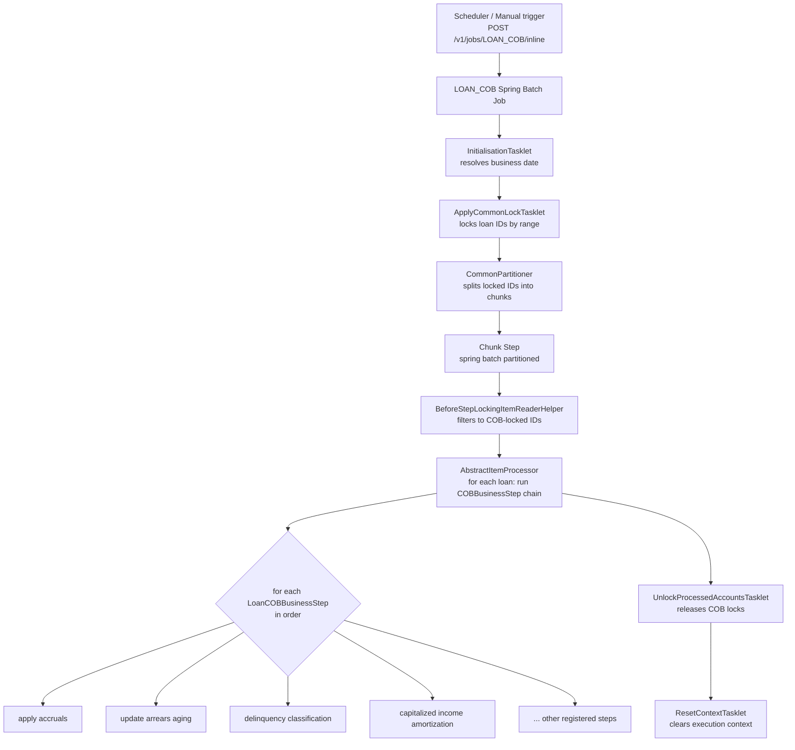

Close-of-Business (COB) is the nightly batch process that advances every active loan account to the next business date. It applies accruals, updates arrears aging, classifies delinquency, processes capitalized income amortization, and performs any other date-sensitive book-keeping that must happen exactly once per business day. COB is implemented as a Spring Batch job called `LOAN_COB` and uses a configurable chain of `COBBusinessStep` implementations so that new steps can be added without changing the batch infrastructure.

## Architecture Overview



## LOAN_COB Job Constants

`COBConstant` (package `org.apache.fineract.cob`) defines the key parameter names used across the batch framework:

| Constant | Value | Purpose |
|---|---|---|
| `BUSINESS_DATE_PARAMETER_NAME` | `"BusinessDate"` | The target business date for the run |
| `IS_CATCH_UP_PARAMETER_NAME` | `"IS_CATCH_UP"` | Whether this is a catch-up run (processing missed dates) |
| `INLINE_IDS_PARAMETER_NAME` | `"LoanIds"` | Specific loan IDs for an inline (ad-hoc) run |
| `COB_PARAMETER` | `"loanCobParameter"` | Key for the `COBParameter` object in execution context |
| `PARTITION_KEY` / `PARTITION_PREFIX` | `"partition"` / `"partition_"` | Keys used by `CommonPartitioner` |
| `NUMBER_OF_DAYS_BEHIND` | `1L` | Default number of days the COB runs behind the current date |

## Business Step Framework

### COBBusinessStep Interface

`COBBusinessStep<T>` (package `org.apache.fineract.cob`) is the generic SPI for all COB processing steps:

```java
public interface COBBusinessStep<T extends AbstractPersistableCustom<Long>> {
    T execute(T input);
    String getEnumStyledName();   // e.g. "APPLY_CHARGE_TO_OVERDUE_LOANS"
    String getHumanReadableName(); // e.g. "Apply charge to overdue loans"
}
```

### LoanCOBBusinessStep

`LoanCOBBusinessStep` (package `org.apache.fineract.cob.loan` in `fineract-loan`) is the loan-specific specialization:

```java
public interface LoanCOBBusinessStep extends COBBusinessStep<Loan> {
    // Inherits execute(Loan), getEnumStyledName(), getHumanReadableName()
}
```

Every loan COB step — accruals, arrears, delinquency, etc. — implements `LoanCOBBusinessStep`. Steps are discovered at startup by `COBBusinessStepService` and ordered by the configuration stored in the `m_batch_business_steps` table.

### BusinessStepCategory

`BusinessStepCategory` (package `org.apache.fineract.cob.service`) currently defines a single category:

```java
public enum BusinessStepCategory {
    LOAN("LOAN");
}
```

This category value links step configurations to the `LOAN_COB` job partition, ensuring loan steps are never mixed with potential future categories.

### COBBusinessStepService

`COBBusinessStepServiceImpl` (package `org.apache.fineract.cob`) is injected into `AbstractItemProcessor`. It resolves the ordered `TreeMap<Long, String>` (step order → step bean name) from the execution context and calls `COBBusinessStep.execute(item)` for each step in sequence.

## Step Execution: AbstractItemProcessor

`AbstractItemProcessor<I>` (package `org.apache.fineract.cob.processor`) is the Spring Batch `ItemProcessor` that drives the per-loan step chain:

```java
@Override
public I process(@NonNull I item) throws Exception {
    Set<BusinessStepNameAndOrder> businessSteps =
            (Set<BusinessStepNameAndOrder>) executionContext.get("businessSteps");
    TreeMap<Long, String> businessStepMap = getBusinessStepMap(businessSteps);
    I alreadyProcessedLoan = cobBusinessStepService.run(businessStepMap, item);
    setLastRun(alreadyProcessedLoan);
    return alreadyProcessedLoan;
}
```

Concrete subclasses call `setBusinessDate(StepExecution)` in a `@BeforeStep` method (resolved by `BusinessDateResolver`) and implement `setLastRun(I)` to stamp the loan's last COB date after all steps complete.

## Account Locking

The COB lock mechanism prevents concurrent modification of loan accounts while batch processing is running. Two classes manage this:

### ApplyCommonLockTasklet

`ApplyCommonLockTasklet` (package `org.apache.fineract.cob.tasklet`) is an abstract Spring Batch `Tasklet` that runs before the partitioned chunk step:

<Steps>
  <Step title="Resolve loan IDs">
    Reads `COBParameter` (min/max account ID range) from the execution context. Calls `RetrieveIdService.retrieveAllNonClosedLoansByLastClosedBusinessDateAndMinAndMaxLoanId(…)` to obtain the target loan IDs for this COB run.
  </Step>
  <Step title="Skip already-locked IDs">
    Calls `LockingService.findLockIdsByLoanIdIn(partition)` to identify loans already locked by another owner. Removes those from the to-be-processed list.
  </Step>
  <Step title="Apply locks">
    Calls `LockingService.applyLock(toBeProcessedLoanIds, getLockOwner())` in a `PROPAGATION_REQUIRES_NEW` transaction to atomically acquire COB chunk-processing locks. Retries up to 3 times on failure.
  </Step>
</Steps>

Subclasses implement `getCOBParameter()` (returns the execution context key) and `getLockOwner()` (returns `LockOwner.LOAN_COB_CHUNK_PROCESSING` or similar).

### BeforeStepLockingItemReaderHelper

`BeforeStepLockingItemReaderHelper` (package `org.apache.fineract.cob.service`) is called at the start of each partition's reader step. It:

1. Reads the loan ID range from the execution context.
2. Fetches all non-closed loans in that range using `RetrieveIdService`.
3. Intersects with `LockingService.findLockIdsByLoanIdInAndLockOwner(loanIds, LockOwner.LOAN_COB_CHUNK_PROCESSING)`.
4. Returns only the IDs that are properly locked — preventing accidental processing of unlocked accounts.

This double-checking ensures that even if the lock application had a partial failure, the processor never works on unlocked accounts.

### AccountLockService

`AccountLockService<T extends AccountLock>` (package `org.apache.fineract.cob.service`) is the interface for managing COB account locks:

```java
public interface AccountLockService<T extends AccountLock> {
    List<T>  getLockedLoanAccountByPage(int page, int limit);
    boolean  isLoanHardLocked(Long loanId);
    boolean  isLockOverrulable(Long loanId);
    void     updateCobAndRemoveLocks();
    int      removeOrphanedLocksForProcessedAccounts();
}
```

`AbstractAccountLockService` (same package) provides the base implementation. `isLoanHardLocked` is used by the REST API layer to reject transactions on loans that are currently in COB processing. `isLockOverrulable` distinguishes between hard locks (set during chunk processing) and soft locks that can be bypassed by certain privileged operations.

### UnlockProcessedAccountsTasklet

`UnlockProcessedAccountsTasklet` (package `org.apache.fineract.cob.tasklet`) runs after the chunk step completes. It calls `AccountLockService.updateCobAndRemoveLocks()` to stamp the loan's last-closed business date and release all chunk-processing locks. `removeOrphanedLocksForProcessedAccounts()` cleans up any locks left by failed partitions.

## Loan-Specific COB Steps

Loan COB steps are registered as `LoanCOBBusinessStep` beans in `fineract-loan` (and optionally `fineract-progressive-loan`). Their execution order is stored in `m_batch_business_steps`. Typical steps include:

<Accordion title="Apply Accruals">
  Processes periodic interest and fee accruals for each loan. Uses `LoanAccrualsProcessingService` and `LoanAccrualActivityProcessingService` (both in `org.apache.fineract.portfolio.loanaccount.service`) to post `ACCRUAL` and `ACCRUAL_ACTIVITY` transactions. For progressive loans, the `ProgressiveLoanInterestScheduleModel` provides the per-period accrual breakdown.
</Accordion>

<Accordion title="Update Arrears Aging">
  Recalculates the days-in-arrears for each loan using `LoanArrearsAgingService` / `LoanArrearsAgingServiceImpl`. Posts updated arrears figures to the `m_loan_arrears_aging` table. The `graceOnArrearsAgeing` product setting is respected so that short-term overdue amounts do not inflate aging statistics.
</Accordion>

<Accordion title="Delinquency Classification">
  Calls `DelinquencyWritePlatformService.applyDelinquencyTagToLoan(LoanScheduleDelinquencyData, …)` to assign or update the loan's delinquency tag based on the configured `DelinquencyBucket`. The classification considers the days-past-due of each installment, effective `LoanDelinquencyAction` records (`PAUSE`, `RESUME`), and the product's bucket mapping.

  Domain classes involved:
  - `LoanDelinquencyTagHistory` — persisted tag assignment history
  - `LoanInstallmentDelinquencyTag` — per-installment tag
  - `DelinquencyBucketMappings` — range-to-label mapping
  - `LoanDelinquencyAction` — pause/resume actions that can suspend classification
</Accordion>

<Accordion title="Capitalized Income Amortization">
  For loans with `LoanCapitalizedIncomeStrategy` configured, the COB step calls `LoanCapitalizedIncomeAmortizationProcessingService` (package `org.apache.fineract.portfolio.loanaccount.service`) to post `CAPITALIZED_INCOME_AMORTIZATION` transactions. Similarly, buy-down fee amortization is processed by `LoanBuyDownFeeAmortizationProcessingService`.
</Accordion>

<Accordion title="Loan Charge to Overdue Loans">
  Evaluates overdue installments and applies penalty charges (overdue fees) configured as `LoanOverdueInstallmentCharge` records. This step checks whether the overdue threshold matches a configured penalty charge's grace period before posting.
</Accordion>

## Partitioning

`CommonPartitioner` (package `org.apache.fineract.cob.common`) splits the full loan ID range into partitions keyed `partition_0`, `partition_1`, … Each partition is processed by a separate Spring Batch step execution, enabling parallel processing across multiple threads or nodes. The partition size is controlled by `fineract.loan-cob.partition-size`.

## Catch-Up Runs

When the `IS_CATCH_UP` parameter is `true`, the COB job processes all loans whose `last_closed_business_date` is behind the current business date — not just loans that are one day behind. `RetrieveIdService` uses this flag in its query to widen the loan selection window. The `CatchUpFlagResolver` utility extracts the flag from the `StepExecution` parameters for use in both tasklets and the item reader helper.

## Inline (Ad-Hoc) Runs

Operators can trigger COB for specific loan IDs using the inline job parameter:

```
POST /v1/jobs/LOAN_COB/inline
{
  "loanIds": [1001, 1002, 1003]
}
```

When `INLINE_IDS_PARAMETER_NAME` ("LoanIds") is present, `ApplyCommonLockTasklet` skips the range-based ID retrieval and locks only the specified IDs directly. This is useful for correcting individual accounts without running a full nightly batch.

## Listeners

<CardGroup cols={2}>
  <Card title="FineractCOBBeforeJobListener" icon="play">
    Runs before the job starts. Resolves and stores the business date in the job execution context.
  </Card>
  <Card title="FineractCOBAfterJobListener" icon="stop">
    Runs after job completion. Cleans up execution state, fires job-level completion events.
  </Card>
  <Card title="CobWorkerStepListener" icon="gear">
    Step-level listener. Copies execution context between steps and logs step outcomes for monitoring.
  </Card>
  <Card title="JobExecutionContextCopyListener" icon="copy">
    Propagates the job execution context into the step execution context so that partitioned workers share the same business date and step configuration.
  </Card>
</CardGroup>

<Warning>
  Never modify a loan account (post transactions, update charges, etc.) while the COB lock is held. The REST API checks `AccountLockService.isLoanHardLocked(loanId)` and returns a 409 Conflict for locked accounts. Inline COB runs follow the same locking protocol as the nightly batch.
</Warning>

<Tip>
  To inspect the COB step configuration and order for the `LOAN` category, query `GET /v1/business-step/LOAN`. The response lists every registered `LoanCOBBusinessStep` with its current execution order, human-readable name, and enum-styled name.
</Tip>
