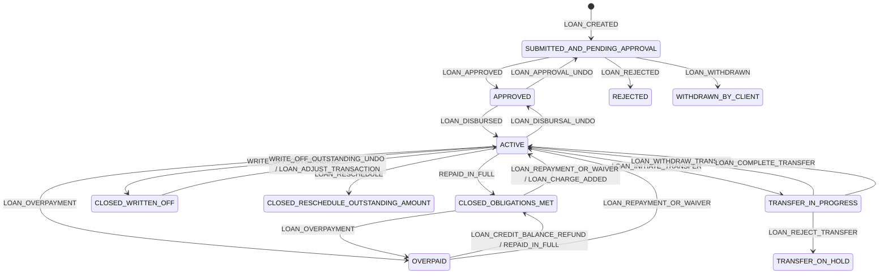
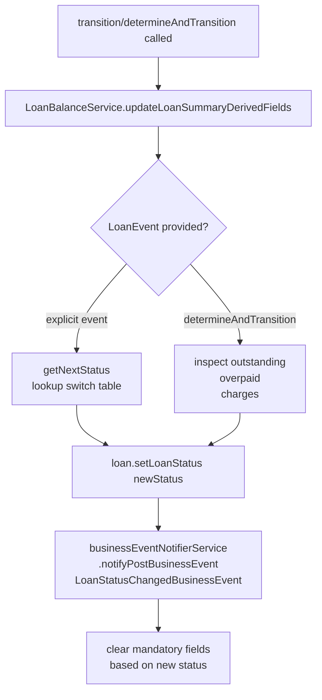

Every loan in Apache Fineract moves through a well-defined lifecycle implemented as a formal state machine. The `LoanLifecycleStateMachine` interface (package `org.apache.fineract.portfolio.loanaccount.domain`) defines three operations — `dryTransition`, `transition`, and `determineAndTransition` — and the `DefaultLoanLifecycleStateMachine` Spring `@Component` provides the concrete implementation. Understanding the states and the events that move between them is essential for anyone integrating with or extending the platform.

## Loan Status States

The `LoanStatus` enum (same package) defines every possible status a loan can occupy. The statuses below are used throughout the codebase as the source-of-truth for all conditional logic:

<Tabs>
  <Tab title="Pre-Disbursement">
    | Status | Description |
    |---|---|
    | `SUBMITTED_AND_PENDING_APPROVAL` | Application submitted; awaiting officer review |
    | `APPROVED` | Application approved; not yet disbursed |
    | `REJECTED` | Application rejected; terminal state |
    | `WITHDRAWN_BY_CLIENT` | Applicant withdrew; terminal state |
  </Tab>
  <Tab title="Active">
    | Status | Description |
    |---|---|
    | `ACTIVE` | Loan disbursed; repayments being collected |
    | `TRANSFER_IN_PROGRESS` | Loan is being transferred between offices/branches |
    | `TRANSFER_ON_HOLD` | Transfer was rejected; loan on hold pending resolution |
  </Tab>
  <Tab title="Closed">
    | Status | Description |
    |---|---|
    | `CLOSED_OBLIGATIONS_MET` | All principal, interest, and charges fully repaid |
    | `CLOSED_WRITTEN_OFF` | Outstanding balance written off |
    | `CLOSED_RESCHEDULE_OUTSTANDING_AMOUNT` | Closed pending rescheduling of the remaining balance |
    | `OVERPAID` | Client has paid more than the total outstanding amount |
  </Tab>
</Tabs>

### Sub-statuses

`LoanSubStatus` (same domain package) carries supplementary state alongside the main status:

| Sub-Status | Value | Meaning |
|---|---|---|
| `FORECLOSED` | 100 | Loan was foreclosed |
| `CONTRACT_TERMINATION` | 900 | Loan terminated via `CONTRACT_TERMINATION` transaction |

## State Diagram

## LoanEvent Enum

Every transition is driven by a `LoanEvent` value. Events are declared in `org.apache.fineract.portfolio.loanaccount.domain.LoanEvent`:

<Accordion title="Full LoanEvent list">
  | Event | Typical Trigger |
  |---|---|
  | `LOAN_CREATED` | Application submitted |
  | `LOAN_APPROVED` | Officer approves application |
  | `LOAN_APPROVAL_UNDO` | Approval reversed |
  | `LOAN_REJECTED` | Application rejected |
  | `LOAN_WITHDRAWN` | Applicant withdraws |
  | `LOAN_DISBURSED` | Disbursement posted |
  | `LOAN_DISBURSAL_UNDO` | Disbursement reversed |
  | `LOAN_DISBURSAL_UNDO_LAST` | Last tranche disbursement reversed |
  | `LOAN_REPAYMENT_OR_WAIVER` | Repayment, waiver, or chargeback posted |
  | `REPAID_IN_FULL` | Outstanding balance reaches zero |
  | `WRITE_OFF_OUTSTANDING` | Loan written off |
  | `WRITE_OFF_OUTSTANDING_UNDO` | Write-off reversed |
  | `LOAN_RESCHEDULE` | Loan closed for rescheduling |
  | `LOAN_OVERPAYMENT` | Client payment exceeds outstanding |
  | `LOAN_CLOSED` | Generic close event |
  | `LOAN_FORECLOSURE` | Foreclosure recorded |
  | `LOAN_CREDIT_BALANCE_REFUND` | Overpayment refunded to client |
  | `LOAN_CHARGEBACK` | Chargeback applied |
  | `LOAN_INITIATE_TRANSFER` | Transfer initiated |
  | `LOAN_REJECT_TRANSFER` | Transfer rejected |
  | `LOAN_WITHDRAW_TRANSFER` | Transfer withdrawn |
  | `LOAN_COMPLETE_TRANSFER` | Transfer completed |
  | `LOAN_CHARGE_ADDED` | Charge added to closed loan |
  | `LOAN_CHARGE_ADJUSTMENT` | Charge adjusted on closed loan |
  | `LOAN_CONTRACT_TERMINATION` | Contract termination applied |
</Accordion>

## Service Classes

The state machine is called from higher-level platform services that handle command validation, event firing, and persistence:

<CardGroup cols={2}>
  <Card title="LoanApplicationWritePlatformService" icon="pen-to-square">
    Handles the pre-disbursement phase:
    - `submitApplication(JsonCommand)`
    - `approveApplication(Long, JsonCommand)`
    - `undoApplicationApproval(Long, JsonCommand)`
    - `rejectApplication(Long, JsonCommand)`
    - `applicantWithdrawsFromApplication(Long, JsonCommand)`
    - `modifyApplication(Long, JsonCommand)`
    - `deleteApplication(Long)`

    Package: `org.apache.fineract.portfolio.loanaccount.service`
  </Card>
  <Card title="LoanWritePlatformService" icon="money-bill-transfer">
    Handles the post-disbursement phase:
    - `disburseLoan(Long, JsonCommand, Boolean)`
    - `undoLoanDisbursal(Long, JsonCommand)`
    - `makeLoanRepayment(LoanTransactionType, Long, JsonCommand, boolean)`
    - `waiveInterestOnLoan(Long, JsonCommand)`
    - `writeOff(Long, JsonCommand)` / `undoWriteOff(Long)`
    - `closeLoan(Long, JsonCommand)`
    - `closeAsRescheduled(Long, JsonCommand)`
    - `adjustLoanTransaction(Long, Long, JsonCommand)`
    - `chargebackLoanTransaction(Long, Long, JsonCommand)`
    - `recalculateInterest(Loan)`

    Package: `org.apache.fineract.portfolio.loanaccount.service`
  </Card>
</CardGroup>

## DefaultLoanLifecycleStateMachine

`DefaultLoanLifecycleStateMachine` is a Spring `@Component` in package `org.apache.fineract.portfolio.loanaccount.domain`. It is injected wherever status transitions are needed and collaborates with two dependencies:

- **`BusinessEventNotifierService`** — fires a `LoanStatusChangedBusinessEvent` after every transition (except loan creation, which fires `LoanCreatedBusinessEvent`).
- **`LoanBalanceService`** — calls `updateLoanSummaryDerivedFields(loan)` before any transition so that summary balances are always consistent before the new status is determined.

<Note>
  `determineAndTransition(Loan, LocalDate)` is the "smart" variant used during transaction processing. It inspects the loan's current financial position — outstanding balance, overpaid amount, charge status — and automatically selects the correct target status without the caller needing to pass an explicit `LoanEvent`. This is particularly important for the `OVERPAID → CLOSED_OBLIGATIONS_MET → ACTIVE` cycle.
</Note>

### Transition Logic Summary

## LoanTransaction Types

`LoanTransactionType` (package `org.apache.fineract.portfolio.loanaccount.domain`) enumerates every kind of ledger entry that can be posted against a loan. Key types include:

<Tabs>
  <Tab title="Core Transactions">
    | Type | ID | Purpose |
    |---|---|---|
    | `DISBURSEMENT` | 1 | Initial or tranche disbursement |
    | `REPAYMENT` | 2 | Regular client repayment |
    | `REPAYMENT_AT_DISBURSEMENT` | 5 | Down payment at disbursement |
    | `DOWN_PAYMENT` | 28 | Explicit down payment |
    | `RECOVERY_REPAYMENT` | 8 | Post-write-off recovery |
    | `WRITEOFF` | 6 | Outstanding amount written off |
    | `CHARGE_PAYMENT` | 17 | Payment earmarked to a specific charge |
    | `WAIVE_INTEREST` | 4 | Interest waiver |
    | `WAIVE_CHARGES` | 9 | Charge waiver |
  </Tab>
  <Tab title="Accruals & Income">
    | Type | ID | Purpose |
    |---|---|---|
    | `ACCRUAL` | 10 | Periodic interest/fee accrual |
    | `ACCRUAL_ACTIVITY` | 32 | Accrual activity summary |
    | `ACCRUAL_ADJUSTMENT` | 34 | Adjusts a prior accrual |
    | `INCOME_POSTING` | 19 | Income posting entry |
    | `CAPITALIZED_INCOME` | 35 | Capitalised income posted |
    | `CAPITALIZED_INCOME_AMORTIZATION` | 36 | Amortization of capitalised income |
    | `BUY_DOWN_FEE` | 40 | Buy-down fee posted |
    | `BUY_DOWN_FEE_AMORTIZATION` | 42 | Amortization of buy-down fee |
    | `DISCOUNT_FEE` | 44 | Discount fee posted |
    | `DISCOUNT_FEE_AMORTIZATION` | 45 | Amortization of discount fee |
  </Tab>
  <Tab title="Refunds & Adjustments">
    | Type | ID | Purpose |
    |---|---|---|
    | `REFUND` | 16 | Generic refund |
    | `REFUND_FOR_ACTIVE_LOAN` | 18 | Refund posted on active loan |
    | `CREDIT_BALANCE_REFUND` | 20 | Overpayment refunded |
    | `MERCHANT_ISSUED_REFUND` | 21 | Merchant-initiated refund |
    | `PAYOUT_REFUND` | 22 | Payout refund |
    | `GOODWILL_CREDIT` | 23 | Goodwill credit |
    | `CHARGEBACK` | 25 | Chargeback posted |
    | `CHARGE_REFUND` | 24 | Charge-specific refund |
    | `INTEREST_REFUND` | 33 | Interest refund |
    | `INTEREST_PAYMENT_WAIVER` | 31 | Interest payment waiver |
    | `REAGE` | 29 | Re-age (arrears reset) |
    | `REAMORTIZE` | 30 | Re-amortize schedule |
    | `CHARGE_OFF` | 27 | Charge-off transaction |
    | `CONTRACT_TERMINATION` | 38 | Contract termination |
  </Tab>
</Tabs>

<Tip>
  The `isRepaymentType()` helper on `LoanTransactionType` returns `true` for `REPAYMENT`, `MERCHANT_ISSUED_REFUND`, `PAYOUT_REFUND`, `GOODWILL_CREDIT`, `CHARGE_REFUND`, `DOWN_PAYMENT`, and `INTEREST_PAYMENT_WAIVER`. This group is treated uniformly by the transaction processors.
</Tip>

## Status Change History

Every status transition is automatically recorded by `LoanStatusChangeHistoryListener` (package `org.apache.fineract.portfolio.loanaccount.service`), which persists a `LoanStatusChangeHistory` row via `LoanStatusChangeHistoryRepository`. This gives a full audit trail of when each status was entered and what drove the change.
