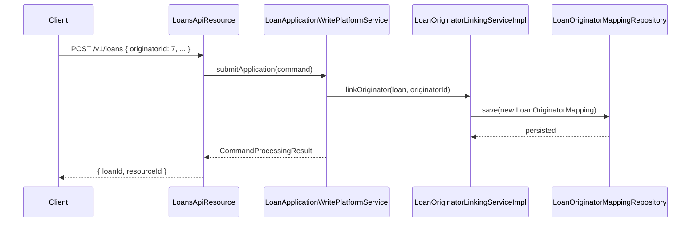

The `fineract-loan-origination` Gradle module provides an optional extension that tracks the external originator — the intermediary, channel partner, or sales agent — responsible for sourcing a loan. This metadata is important for revenue-sharing calculations, compliance reporting, and event-driven downstream integrations. The module is conditionally activated and adds no overhead when disabled, making it a clean extension point rather than a mandatory dependency.

## Activation

The entire module is guarded by a Spring Boot conditional property:

```properties
fineract.module.loan-origination.enabled=true
```

When set to `true` (the default), all `@ConditionalOnProperty`-annotated beans are registered. When `false`, the core `fineract-loan` module uses `LoanOriginatorLinkingServiceNoOp` — a no-operation implementation of `LoanOriginatorLinkingService` — so the loan creation flow is completely unaffected.

## Domain Model

### LoanOriginator

`LoanOriginator` (table `m_loan_originator`, package `org.apache.fineract.portfolio.loanorigination.domain`) is the central entity:

```java
@Entity
@Table(name = "m_loan_originator")
public class LoanOriginator extends AbstractAuditableWithUTCDateTimeCustom<Long> {

    private ExternalId externalId;        // unique external identifier
    private String name;                  // human-readable name
    private LoanOriginatorStatus status;  // ACTIVE / INACTIVE
    private CodeValue originatorType;     // code value from m_code "LoanOriginatorType"
    private CodeValue channelType;        // code value from m_code "LoanOriginatorChannelType"
}
```

`LoanOriginatorStatus` is an enum with values `ACTIVE` and `INACTIVE`. Both `originatorType` and `channelType` are backed by Fineract's configurable code-value system, meaning administrators can define their own originator and channel taxonomies without code changes.

### LoanOriginatorMapping

`LoanOriginatorMapping` (package `org.apache.fineract.portfolio.loanorigination.domain`) is the join entity that links a `LoanOriginator` to a specific loan account. The `LoanOriginatorMappingRepository` provides query methods for resolving the originator for a given loan ID.

## REST API

`LoanOriginatorApiResource` (package `org.apache.fineract.portfolio.loanorigination.api`) exposes CRUD operations at `/v1/loan-originators`:

<Tabs>
  <Tab title="Create">
    ```
    POST /v1/loan-originators
    ```
    Creates a new originator. Requires `CREATE_LOAN_ORIGINATOR` permission. Returns `CommandProcessingResult` with the new originator's ID.
  </Tab>
  <Tab title="Read">
    ```
    GET  /v1/loan-originators           — list all
    GET  /v1/loan-originators/{id}      — retrieve by internal ID
    GET  /v1/loan-originators/external-id/{externalId}  — retrieve by external ID
    GET  /v1/loan-originators/template  — template data for UI forms
    ```
    All read operations require `READ_LOAN_ORIGINATOR` permission. The `LoanOriginatorTemplateData` response pre-populates originator-type and channel-type dropdown options from the code-value system.
  </Tab>
  <Tab title="Update">
    ```
    PUT /v1/loan-originators/{id}
    PUT /v1/loan-originators/external-id/{externalId}
    ```
    Updates name, status, originator type, and channel type. Requires `UPDATE_LOAN_ORIGINATOR` permission.
  </Tab>
  <Tab title="Delete">
    ```
    DELETE /v1/loan-originators/{id}
    DELETE /v1/loan-originators/external-id/{externalId}
    ```
    Deletes an originator. Fails if the originator is mapped to any loan. Requires `DELETE_LOAN_ORIGINATOR` permission.
  </Tab>
</Tabs>

`LoanOriginatorsApiResource` (note the plural) provides an additional listing endpoint with filtering support, used by reporting screens.

### Command Pattern

Create, update, and delete operations follow Fineract's standard command pattern via `PortfolioCommandSourceWritePlatformService`. `CommandWrapperBuilder` constructs a `CommandWrapper` for each operation:

```java
// create
new CommandWrapperBuilder().createLoanOriginator().withJson(body).build();

// update by ID
new CommandWrapperBuilder().updateLoanOriginator(originatorId).withJson(body).build();

// delete
new CommandWrapperBuilder().deleteLoanOriginator(originatorId).build();
```

This routes through the standard command pipeline: validation → handler → `LoanOriginatorWritePlatformService` → persistence → audit entry.

## Service Layer

<CardGroup cols={2}>
  <Card title="LoanOriginatorReadPlatformService" icon="magnifying-glass">
    `LoanOriginatorReadPlatformServiceImpl` provides:
    - `retrieveAll()` — full list of originators
    - `retrieveById(Long)` — single lookup
    - `retrieveByExternalId(String)` — external-ID lookup
    - `resolveIdByExternalId(String)` — ID resolution for update/delete by external ID
    - `retrieveTemplate()` — returns `LoanOriginatorTemplateData`
  </Card>
  <Card title="LoanOriginatorWritePlatformService" icon="pen">
    `LoanOriginatorWritePlatformServiceImpl` handles:
    - Create — validates uniqueness, constructs `LoanOriginator.create(…)`, persists via `LoanOriginatorRepository`
    - Update — loads entity, calls `originator.update(…)`
    - Delete — checks for active mappings before removal
  </Card>
  <Card title="LoanOriginatorLinkingServiceImpl" icon="link">
    Implements `LoanOriginatorLinkingService` from `fineract-loan`. Called during loan creation to associate the originator ID provided in the loan application JSON with the newly created `Loan` entity via `LoanOriginatorMapping`.
  </Card>
  <Card title="LoanOriginatorHelper" icon="tools">
    Utility service for shared logic such as resolving a `LoanOriginator` from an external-ID string and validating that an originator is in `ACTIVE` status before association.
  </Card>
</CardGroup>

## Event Enrichers

The origination module's most powerful feature is its collection of business event enrichers. These enrich Avro-serialised business events with originator metadata before events are published to Kafka or other message bus integrations.

All enrichers implement a common interface and are registered as Spring beans in the event notification pipeline:

| Enricher | Event Enriched |
|---|---|
| `LoanAccountDataV1OriginatorEnricher` | `LoanAccountDataV1` — adds originator fields to loan account events |
| `LoanAccountDelinquencyRangeDataV1OriginatorEnricher` | `LoanAccountDelinquencyRangeDataV1` — adds originator to delinquency events |
| `LoanChargeDataV1OriginatorEnricher` | `LoanChargeDataV1` — adds originator to charge events |
| `LoanRepaymentDueDataV1OriginatorEnricher` | `LoanRepaymentDueDataV1` — adds originator to repayment-due events |
| `LoanTransactionAdjustmentDataV1OriginatorEnricher` | `LoanTransactionAdjustmentDataV1` — adds originator to transaction adjustment events |
| `LoanTransactionDataV1OriginatorEnricher` | `LoanTransactionDataV1` — adds originator to transaction events |

`LoanOriginatorAvroMapper` (package `org.apache.fineract.portfolio.loanorigination.enricher`) converts `LoanOriginator` JPA entities into their Avro schema counterparts, encapsulating all type conversions in one place.

## How Origination Differs from Standard Loan Application

The standard loan application flow in `fineract-loan` knows nothing about originators — `LoanOriginatorLinkingServiceNoOp` is the default implementation and does nothing. The `fineract-loan-origination` module replaces that no-op with `LoanOriginatorLinkingServiceImpl`, which:

1. Reads an `originatorId` or `originatorExternalId` field from the loan application request body.
2. Resolves the `LoanOriginator` entity.
3. Creates a `LoanOriginatorMapping` linking the new loan to the originator.
4. Enriches subsequent business events with originator metadata.



<Note>
  The originator association is created at loan **submission** time. If the loan is later rejected or withdrawn, the mapping remains for audit purposes but has no operational effect.
</Note>

## Serialization and Validation

`LoanOriginatorApiConstants` (package `org.apache.fineract.portfolio.loanorigination.api`) defines the JSON field name constants used by the request serializer/validator. The `serialization` package contains the `DataValidatorBuilder`-based command validator that enforces required fields, field lengths, and status values before any persistence occurs.
