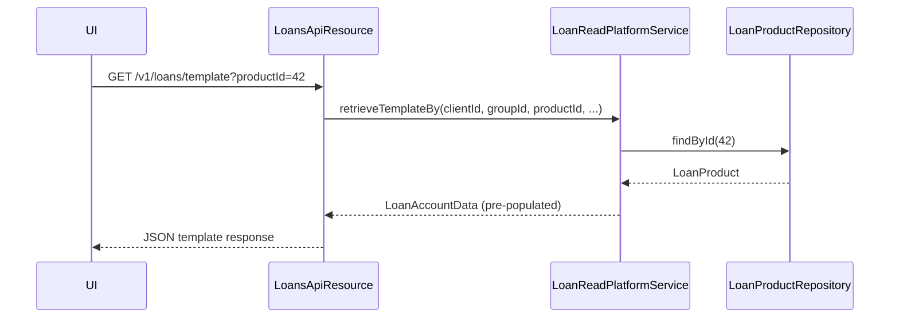

A loan product in Apache Fineract is the configuration template that governs every loan account created from it. Operators define products once and borrowers receive loans that inherit all product constraints. The `LoanProduct` JPA entity (table `m_product_loan`, package `org.apache.fineract.portfolio.loanproduct.domain`) is one of the most field-rich entities in the codebase, embedding several related detail objects and owning collections of rules, charges, rates, and more.

## LoanProduct Entity

`LoanProduct extends AbstractPersistableCustom<Long>` and is annotated with `@Entity @Table(name = "m_product_loan")`. Its unique constraints enforce that `name`, `short_name`, and `external_id` are each unique across all products.

### Core Embedded Objects

| Embedded Type | Purpose |
|---|---|
| `LoanProductRelatedDetail` | The bulk of product configuration: currency, principal ranges, term, repayment frequency, interest method, amortization method, schedule type, grace periods, in-arrears tolerance |
| `LoanProductMinMaxConstraints` | Min/max bounds for principal, loan term, and number of repayments |
| `LoanProductTrancheDetails` | Multi-disbursement (tranche) configuration |

### Key Direct Columns

| Column / Field | Type | Meaning |
|---|---|---|
| `transactionProcessingStrategyCode` | `String` | Identifies which payment allocation/transaction processor to use |
| `accountingRule` | `AccountingRuleType` | `NONE`, `CASH_BASED`, `ACCRUAL_PERIODIC`, `ACCRUAL_UPFRONT` |
| `overdueDaysForNPA` | `Integer` | Days past due before the loan is flagged as NPA |
| `minimumDaysBetweenDisbursalAndFirstRepayment` | `Integer` | Enforces a minimum gap between disbursement and first repayment |
| `holdGuaranteeFunds` | `boolean` | Whether guarantor funds should be held in reserve |
| `includeInBorrowerCycle` | `boolean` | Track borrower's loan cycle count |
| `useBorrowerCycle` | `boolean` | Apply borrower-cycle-specific product variations |
| `startDate` / `closeDate` | `LocalDate` | Product availability window |
| `externalId` | `ExternalId` | Externally assigned identifier |

### Payment and Credit Allocation Rules

Progressive loans require explicit allocation rules stored on the product:

- **`LoanProductPaymentAllocationRule`** (collection `paymentAllocationRules`) — ordered list mapping `PaymentAllocationTransactionType` → `List<PaymentAllocationType>` with a `FutureInstallmentAllocationRule`.
- **`LoanProductCreditAllocationRule`** (collection `creditAllocationRules`) — maps `CreditAllocationTransactionType` → `List<AllocationType>` for credit transactions such as chargebacks.

<Note>
  These collections are currently defined on `LoanProduct` itself but are annotated with a TODO (`FINERACT-1932`) to move them to the `fineract-progressive-loan` module once the entity association is decoupled.
</Note>

## Interest Method

`InterestMethod` (package `org.apache.fineract.portfolio.loanproduct.domain`) controls how interest is computed:

<CardGroup cols={2}>
  <Card title="DECLINING_BALANCE (0)" icon="chart-line-down">
    Interest is calculated on the outstanding principal balance each period. As principal is repaid the interest charge in subsequent installments decreases. Used by both cumulative (`CumulativeDecliningBalanceInterestLoanScheduleGenerator`) and progressive (`ProgressiveLoanScheduleGenerator`) modes.
  </Card>
  <Card title="FLAT (1)" icon="minus">
    Interest is calculated on the original disbursement amount for every period regardless of repayments. Implemented by `CumulativeFlatInterestLoanScheduleGenerator`. Not compatible with `LoanScheduleType.PROGRESSIVE`.
  </Card>
</CardGroup>

## Amortization Method

`AmortizationMethod` (same package) determines how principal is distributed across installments:

| Value | Code | Description |
|---|---|---|
| `EQUAL_PRINCIPAL` | 0 | Fixed principal per installment; interest component decreases over time |
| `EQUAL_INSTALLMENTS` | 1 | Fixed total EMI; principal component increases as interest decreases |

<Tip>
  For `LoanScheduleType.PROGRESSIVE`, Fineract always derives equal-EMI behavior through the `EMICalculator`, making the amortization method selection less relevant for that schedule type.
</Tip>

## Schedule Type

`LoanScheduleType` (package `org.apache.fineract.portfolio.loanaccount.loanschedule.domain`) selects between two fundamental schedule architectures:

| Value | Description |
|---|---|
| `CUMULATIVE` | Classic Fineract schedule. Each installment stands alone; recalculation rewrites the future installments only. |
| `PROGRESSIVE` | Modern schedule used with `AdvancedPaymentScheduleTransactionProcessor`. Full schedule re-computation on every transaction. |

Alongside `LoanScheduleType`, the `LoanScheduleProcessingType` enum controls whether the processor operates in `HORIZONTAL` (installment-by-installment) or `VERTICAL` (charge-type-by-charge-type) mode.

## Interest Recalculation

When `productInterestRecalculationDetails` is not null, the product uses dynamic interest recalculation. `LoanProductInterestRecalculationDetails` (same domain package) controls:

- **`InterestRecalculationCompoundingMethod`** — whether and how compound interest is applied (`NONE`, `FEE`, `INTEREST`, `FEE_AND_INTEREST`).
- **`InterestRecalculationPeriodMethod`** — period basis for recalculation (`SAME_AS_REPAYMENT_PERIOD`, `DAILY`, `MONTHLY`).
- **`RecalculationFrequencyType`** — how often interest is recalculated.
- **`LoanRescheduleStrategyMethod`** — how installments are restructured when interest is recalculated (`REDUCE_EMI_AMOUNT`, `REDUCE_NUMBER_OF_INSTALLMENTS`, `RESCHEDULE_NEXT_REPAYMENTS`).
- **`LoanPreCloseInterestCalculationStrategy`** — method for pre-closure interest (`TILL_PRE_CLOSURE_DATE`, `TILL_REST_FREQUENCY_DATE`).

## Grace Periods

Grace period configuration lives inside `LoanProductRelatedDetail` and is represented by several fields on the product:

| Field | Description |
|---|---|
| `graceOnPrincipalPayment` | Number of installments before principal repayment begins |
| `graceOnInterestPayment` | Number of installments before interest is charged |
| `graceOnInterestCharged` | Number of installments for which interest is waived entirely |
| `graceOnArrearsAgeing` | Installments past due that are excluded from arrears aging |

## Borrower-Cycle Variations

When `useBorrowerCycle` is enabled, the product holds a set of `LoanProductBorrowerCycleVariations` records that override principal/term/repayments for borrowers in their second, third, or later loan cycles. The `LoanProductParamType` enum identifies which parameter the variation applies to.

## Guarantee Details

`LoanProductGuaranteeDetails` is a `@OneToOne` embedded child that configures:

- `mandatoryGuarantee` — whether a guarantor is required
- `minimumGuaranteeFromOwnFunds` / `minimumGuaranteeFromGuarantor` — percentage floors

## Floating Rates

`LoanProductFloatingRates` links a product to a `FloatingRate` reference and tracks `defaultDifferentialLendingRate`, `isFloatingInterestRateCalculationAllowed`, and upper/lower bound differentials.

## Configurable Attributes

`LoanProductConfigurableAttributes` stores boolean flags that allow officers to override product defaults at the individual loan level (e.g., `amortizationType`, `interestType`, `repaymentEvery`, `graceOnPrincipalAndInterestPayment`, `inArrearsTolerance`, `transactionProcessingStrategyCode`).

## Service Layer

<CardGroup cols={2}>
  <Card title="LoanProductWritePlatformService" icon="pen">
    Interface in `org.apache.fineract.portfolio.loanproduct.service`. Responsible for CRUD on loan products. Implementations validate product constraints, persist the `LoanProduct` entity, and fire business events.
  </Card>
  <Card title="LoanProductRepository" icon="database">
    Spring Data JPA repository in `org.apache.fineract.portfolio.loanproduct.domain`. Used everywhere a product lookup is needed, including during `LoanAssembler` when a new loan account is being constructed.
  </Card>
  <Card title="LoanProductReadPlatformService" icon="magnifying-glass">
    Read-side service in `org.apache.fineract.portfolio.loanproduct.service`. Handles listing, template rendering, and dropdown population (`LoanDropdownReadPlatformService`).
  </Card>
  <Card title="LoanProductReadBasicDetailsService" icon="circle-info">
    Lightweight read service used in performance-sensitive paths where only a subset of product fields are needed.
  </Card>
</CardGroup>

## Delinquency Bucket Linkage

`LoanProduct` has an optional `@ManyToOne` association to `DelinquencyBucket` (`org.apache.fineract.portfolio.delinquency.domain`). When a delinquency bucket is assigned, loans created from the product are automatically enrolled in delinquency classification during COB processing. The `DelinquencyBucketMappings` entity maps ranges (days overdue) to delinquency labels.

## Linked Savings Account

`LoanProduct` can reference a linked savings product via a `@ManyToOne` to `SavingsProduct`. When configured, a borrower's disbursement is routed through a linked savings account, enabling account-transfer disbursements and reducing the ledger footprint.

## How Products Configure Loan Templates

When a loan officer creates a new loan, `LoansApiResource` calls `LoanReadPlatformService.retrieveTemplateBy(…)`. This method uses the product's configuration to pre-populate the loan template — currency, principal, term, repayment frequency, interest rate, charges, and repayment strategy — saving the officer from entering redundant information.

