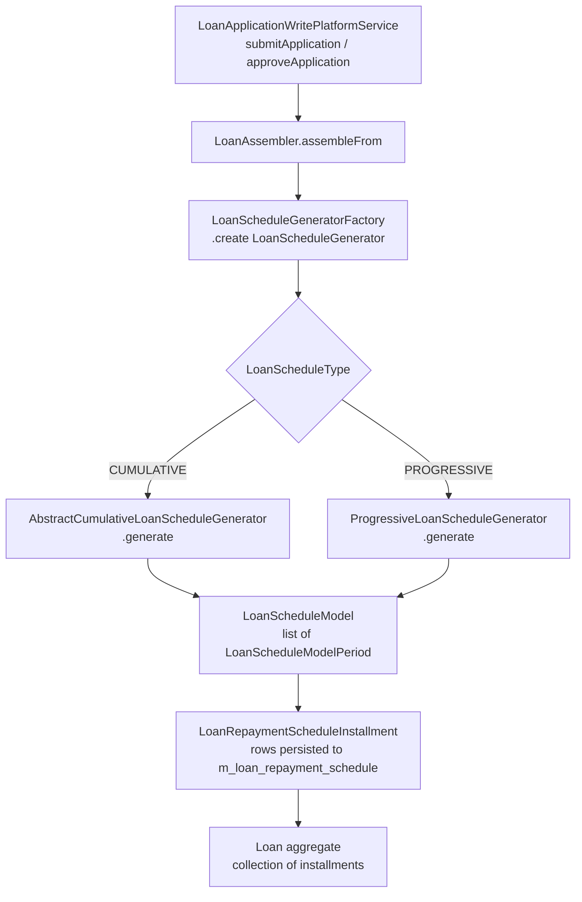

The loan repayment schedule is the heart of a loan account — it defines when principal, interest, and fee amounts are due, tracks what has been paid or waived, and anchors all accrual and collection logic. Fineract generates schedules through a pluggable `LoanScheduleGenerator` interface with implementations for both cumulative and progressive products. This page covers the schedule model, how installments are built, and how they evolve over a loan's lifetime.

## Schedule Type

Every loan derives its schedule type from the associated `LoanProduct` via `LoanScheduleType` (package `org.apache.fineract.portfolio.loanaccount.loanschedule.domain`):

| `LoanScheduleType` | Generator Used | Recalculation Scope |
|---|---|---|
| `CUMULATIVE` | `CumulativeDecliningBalanceInterestLoanScheduleGenerator` or `CumulativeFlatInterestLoanScheduleGenerator` | Future installments only |
| `PROGRESSIVE` | `ProgressiveLoanScheduleGenerator` | Full schedule from disbursement |

Alongside `LoanScheduleType`, the `LoanScheduleProcessingType` enum (same package) controls the payment allocation axis:

| Value | Meaning |
|---|---|
| `HORIZONTAL` | Allocate payments installment-by-installment (oldest first) |
| `VERTICAL` | Allocate payments component-by-component across all installments |

## LoanScheduleGenerator Interface

`LoanScheduleGenerator` (package `org.apache.fineract.portfolio.loanaccount.loanschedule.domain`) is the SPI for all schedule generators:

```java
public interface LoanScheduleGenerator {

    LoanScheduleModel generate(MathContext mc,
                               LoanApplicationTerms loanApplicationTerms,
                               Set<LoanCharge> loanCharges,
                               HolidayDetailDTO holidayDetailDTO);

    LoanScheduleDTO rescheduleNextInstallments(MathContext mc,
            LoanApplicationTerms loanApplicationTerms,
            Loan loan,
            HolidayDetailDTO holidayDetailDTO,
            LoanRepaymentScheduleTransactionProcessor processor,
            LocalDate rescheduleFrom);

    LoanScheduleDTO rescheduleNextInstallments(MathContext mc,
            LoanApplicationTerms loanApplicationTerms,
            Loan loan,
            HolidayDetailDTO holidayDetailDTO,
            LoanRepaymentScheduleTransactionProcessor processor,
            LocalDate rescheduleFrom,
            LocalDate rescheduleTill);

    OutstandingAmountsDTO calculatePrepaymentAmount(MonetaryCurrency currency,
            LocalDate onDate,
            LoanApplicationTerms loanApplicationTerms,
            MathContext mc,
            Loan loan,
            HolidayDetailDTO holidayDetailDTO,
            LoanRepaymentScheduleTransactionProcessor processor);

    Money getPeriodInterestTillDate(LoanRepaymentScheduleInstallment installment,
                                    LocalDate targetDate);
}
```

### Generator Implementations

<CardGroup cols={2}>
  <Card title="AbstractCumulativeLoanScheduleGenerator" icon="layer-group">
    Abstract base in `org.apache.fineract.portfolio.loanaccount.loanschedule.domain`. Implements date generation, charge distribution, and the core installment iteration loop shared by both cumulative subclasses.
  </Card>
  <Card title="CumulativeDecliningBalanceInterestLoanScheduleGenerator" icon="chart-line-down">
    Extends `AbstractCumulativeLoanScheduleGenerator`. Computes declining-balance interest using `FinanicalFunctions` for equal-installment products.
  </Card>
  <Card title="CumulativeFlatInterestLoanScheduleGenerator" icon="minus">
    Extends `AbstractCumulativeLoanScheduleGenerator`. Computes flat interest on the original principal amount regardless of repayments made.
  </Card>
  <Card title="ProgressiveLoanScheduleGenerator" icon="chart-line">
    Standalone implementation in `fineract-progressive-loan`. Uses `EMICalculator` to derive the equated monthly installment and `ScheduledDateGenerator` for due dates. Stores results in `ProgressiveLoanInterestScheduleModel`.
  </Card>
</CardGroup>

`LoanScheduleGeneratorFactory` (same package) is the Spring-managed factory that returns the correct generator based on `LoanScheduleType` and `InterestMethod`.

## LoanApplicationTerms

`LoanApplicationTerms` (package `org.apache.fineract.portfolio.loanaccount.loanschedule.domain`) is the rich parameter object passed to every generator. It assembles all product and loan parameters needed for schedule computation:

- Principal amount, currency, disbursement dates
- Interest rate (nominal, effective), `InterestMethod`, `InterestCalculationPeriodMethod`
- `AmortizationMethod`, repayment frequency and count
- Grace periods (principal, interest payment, interest charged)
- Compounding and recalculation settings
- Holiday detail (non-working days, meeting calendars)
- In-arrears tolerance

The static factory method `LoanApplicationTerms.assembleFrom(LoanRepaymentScheduleModelData, MathContext)` is used by `ProgressiveLoanScheduleGenerator`, while cumulative generators typically have their own assembly path through `LoanAssembler`.

## Generation Flow



### Schedule Model Objects

| Class | Purpose |
|---|---|
| `LoanScheduleModel` | Container for the full model; holds periods list plus totals |
| `LoanScheduleModelPeriod` | Interface for a single period (disbursement or repayment) |
| `LoanScheduleModelRepaymentPeriod` | Concrete repayment period with principal/interest/fee amounts |
| `LoanScheduleModelDisbursementPeriod` | Represents a disbursement period (tranche) |

## LoanRepaymentScheduleInstallment

`LoanRepaymentScheduleInstallment` (package `org.apache.fineract.portfolio.loanaccount.domain`, table `m_loan_repayment_schedule`) is the persisted installment entity. Each row in the schedule maps to one instance:

<Accordion title="Key fields">
  | Field | Column | Description |
  |---|---|---|
  | `installmentNumber` | `installment` | 1-based position in schedule |
  | `fromDate` | `fromdate` | Period start date |
  | `dueDate` | `duedate` | Installment due date |
  | `principal` | `principal_amount` | Scheduled principal for this period |
  | `principalCompleted` | `principal_completed_derived` | Principal already repaid |
  | `principalWrittenOff` | `principal_writtenoff_derived` | Principal written off |
  | `interestCharged` | `interest_amount` | Scheduled interest |
  | `interestPaid` | `interest_completed_derived` | Interest repaid |
  | `interestWaived` | `interest_waived_derived` | Interest waived |
  | `interestAccrued` | `accrual_interest_derived` | Interest accrued to date |
  | `feeChargesCharged` | `fee_charges_amount` | Total fees scheduled |
  | `feeChargesPaid` | `fee_charges_completed_derived` | Fees paid |
  | `feeChargesWaived` | `fee_charges_waived_derived` | Fees waived |
  | `feeAccrued` | `accrual_fee_charges_derived` | Fees accrued |
  | `penaltyCharges` | `penalty_charges_amount` | Penalty charges scheduled |
  | `penaltyChargesPaid` | `penalty_charges_completed_derived` | Penalties paid |
  | `penaltyChargesWaived` | `penalty_charges_waived_derived` | Penalties waived |
  | `rescheduleInterestPortion` | `reschedule_interest_portion` | Interest carried forward from rescheduling |
</Accordion>

### Installment Calculation: Principal, Interest, Fees

For a declining-balance equal-installment cumulative loan, each installment's components are computed as:

```
EMI = P × r × (1 + r)^n / ((1 + r)^n − 1)
interest_i = outstanding_principal_(i-1) × r
principal_i = EMI − interest_i
outstanding_principal_i = outstanding_principal_(i-1) − principal_i
```

`FinanicalFunctions` (same domain package) provides the `pmt(…)` implementation of this formula. The `DefaultPaymentPeriodsInOneYearCalculator` (implementing `PaymentPeriodsInOneYearCalculator`) normalises the periodic rate based on `DaysInYearType` (`ACTUAL`, `360`, `365`, `364`, `252`).

Fees and penalty charges attached via `LoanCharge` records are distributed across the schedule by `AbstractCumulativeLoanScheduleGenerator` during the `generate(…)` call. Installment-level charges stored as `LoanInstallmentCharge` are linked directly to their installment row.

## Date Generation

`DefaultScheduledDateGenerator` (implementing `ScheduledDateGenerator`) computes the sequence of repayment due dates. It respects:

- **Repayment frequency** (`PeriodFrequencyType.DAYS`, `WEEKS`, `MONTHS`, `YEARS`)
- **Non-working days** — from `HolidayDetailDTO`; the generator can push due dates forward or backward
- **Meeting calendars** — for group loans tied to a meeting schedule
- **`RepaymentStartDateType`** (`DISBURSEMENT_DATE` or `SUBMITTED_ON_DATE`) — controls where the first installment date is anchored

## Rescheduling

The `rescheduleloan` package (`org.apache.fineract.portfolio.loanaccount.rescheduleloan`) provides the full API and service layer for loan rescheduling requests. Key classes:

| Class | Role |
|---|---|
| `LoanScheduleGenerator.rescheduleNextInstallments(…)` | Recomputes installments from `rescheduleFrom` |
| `LoanTermVariations` | Persisted term variation records (date, amount, type) |
| `LoanTermVariationType` | Enum of variation types: `EMI_AMOUNT`, `INTEREST_RATE`, `DUE_DATE`, etc. |
| `LoanRepaymentScheduleHistory` | Archive row written before rescheduling; enables undo |
| `LoanRepaymentScheduleHistoryRepository` | JPA repository for schedule history |
| `RescheduleLoansApiConstants` | String constants for JSON field names |

<Steps>
  <Step title="Submit reschedule request">
    `POST /v1/rescheduleloans` — creates a pending reschedule with the requested term variations.
  </Step>
  <Step title="Approve or reject">
    `POST /v1/rescheduleloans/{id}?command=approve` — triggers `LoanScheduleGenerator.rescheduleNextInstallments(…)`, archives current schedule to `LoanRepaymentScheduleHistory`, and replaces installments.
  </Step>
  <Step title="Undo (if needed)">
    The archived `LoanRepaymentScheduleHistory` rows allow reverting to the prior schedule.
  </Step>
</Steps>

## Interest Recalculation

When `LoanProductInterestRecalculationDetails` is configured on the product, the `RecalculateInterestPoster` service (package `org.apache.fineract.portfolio.loanaccount.service`) triggers a full interest recalculation job on applicable loans. `LoanWritePlatformService.recalculateInterest(Loan)` recomputes the schedule using the current business date as the recalculation anchor and persists updated installments.

The `RecalculatedSchedule` and `RecalculationDetail` value objects (same schedule domain package) carry intermediate recalculation results between service calls without triggering redundant persistence.

<Note>
  For progressive loans, recalculation happens automatically on every transaction — no separate recalculation step is needed. The `ProgressiveLoanScheduleGenerator` and `AdvancedPaymentScheduleTransactionProcessor` always operate on the live `ProgressiveLoanInterestScheduleModel`.
</Note>

## Schedule History

`LoanRepaymentScheduleHistory` (table `m_loan_repayment_schedule_history`) stores a snapshot of each installment before rescheduling. The `LoanRepaymentScheduleHistoryRepository` provides lookup by loan ID and version, enabling the undo-reschedule workflow.
