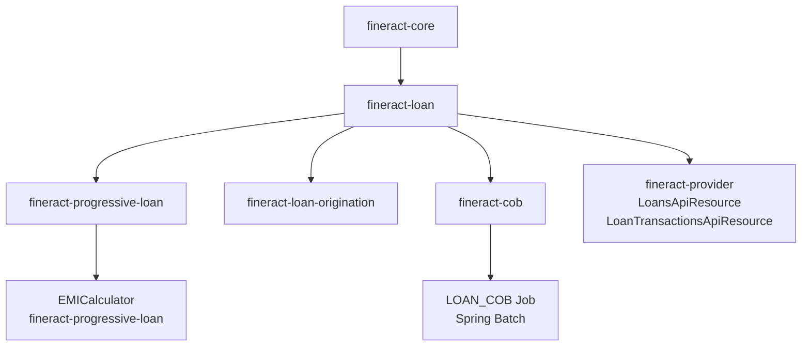

The Apache Fineract loan subsystem is the largest and most feature-rich area of the platform, spanning four dedicated Gradle modules and dozens of supporting packages inside `fineract-provider`. At its core sits the `Loan` aggregate root, which owns every piece of state associated with a borrower's credit facility — from initial submission through closure, write-off, or transfer. Understanding how the modules fit together is the necessary first step before drilling into any individual concern.

## Module Map

<CardGroup cols={2}>
  <Card title="fineract-loan" icon="building-columns" href="/loan/loan-lifecycle">
    The foundational module. Contains the `Loan` aggregate, `LoanProduct`, `LoanTransaction`, `LoanRepaymentScheduleInstallment`, the state machine (`DefaultLoanLifecycleStateMachine`), cumulative schedule generators, transaction processors, delinquency domain, and rescheduling support.
  </Card>
  <Card title="fineract-progressive-loan" icon="chart-line" href="/loan/progressive-loan">
    The progressive (equal-EMI) lending module. Provides `ProgressiveLoanScheduleGenerator`, `AdvancedPaymentScheduleTransactionProcessor`, `ProgressiveLoanModel`, and supporting EMI calculator integration. Depends on `fineract-loan` but keeps progressive logic cleanly separated.
  </Card>
  <Card title="fineract-loan-origination" icon="file-signature" href="/loan/loan-origination">
    An optional extension module (enabled via `fineract.module.loan-origination.enabled=true`). Manages `LoanOriginator` entities and attaches originator metadata to loans and business events via event enrichers.
  </Card>
  <Card title="fineract-cob (LOAN_COB)" icon="clock" href="/loan/cob-close-of-business">
    The Close-of-Business batch framework, implemented in `fineract-cob` with loan-specific steps in `fineract-loan`. Drives nightly accruals, arrears aging, delinquency classification, capitalized income amortization, and the account-lock mechanism.
  </Card>
</CardGroup>

## Key Domain Classes

The table below summarises the most important classes referenced throughout the loan documentation pages.

| Class | Module / Package | Role |
|---|---|---|
| `Loan` | `fineract-loan/.../loanaccount/domain` | DDD aggregate root for a single loan account |
| `LoanProduct` | `fineract-loan/.../loanproduct/domain` | Product template; drives schedule type, interest method, amortization |
| `LoanTransaction` | `fineract-loan/.../loanaccount/domain` | Immutable ledger entry (disbursement, repayment, accrual, …) |
| `LoanRepaymentScheduleInstallment` | `fineract-loan/.../loanaccount/domain` | A single row in `m_loan_repayment_schedule` |
| `LoanLifecycleStateMachine` | `fineract-loan/.../loanaccount/domain` | Interface for status transitions |
| `DefaultLoanLifecycleStateMachine` | `fineract-loan/.../loanaccount/domain` | Spring `@Component` implementation of the state machine |
| `LoanApplicationWritePlatformService` | `fineract-loan/.../loanaccount/service` | Submit, approve, reject, withdraw loan applications |
| `LoanWritePlatformService` | `fineract-loan/.../loanaccount/service` | Disburse, repay, waive, write-off, reschedule, close |
| `LoanScheduleGenerator` | `fineract-loan/.../loanschedule/domain` | Interface implemented by cumulative and progressive generators |
| `ProgressiveLoanScheduleGenerator` | `fineract-progressive-loan/.../loanschedule/domain` | Progressive EMI schedule generator using `EMICalculator` |
| `AdvancedPaymentScheduleTransactionProcessor` | `fineract-progressive-loan/.../transactionprocessor/impl` | Transaction processor for progressive loans |
| `LoanCOBBusinessStep` | `fineract-loan/.../cob/loan` | Marker interface for loan-specific COB steps |
| `AbstractItemProcessor` | `fineract-cob/.../processor` | Spring Batch `ItemProcessor` base that dispatches to `COBBusinessStep` chain |
| `AccountLockService` | `fineract-cob/.../service` | Manages hard locks on loan accounts during COB |

## Module Dependency Diagram

## Sub-Page Navigation

<CardGroup cols={2}>
  <Card title="Loan Lifecycle" icon="arrow-right-arrow-left" href="/loan/loan-lifecycle">
    Status states, the `LoanEvent` / `LoanStatus` enum pairs, and how `DefaultLoanLifecycleStateMachine` transitions the loan through them.
  </Card>
  <Card title="Loan Products" icon="tag" href="/loan/loan-products">
    `LoanProduct` entity, `InterestMethod`, `AmortizationMethod`, `LoanScheduleType`, interest recalculation, payment allocation rules.
  </Card>
  <Card title="Progressive Loans" icon="chart-line" href="/loan/progressive-loan">
    `ProgressiveLoanScheduleGenerator`, `AdvancedPaymentScheduleTransactionProcessor`, `LoanScheduleType.PROGRESSIVE`, EMI mathematics.
  </Card>
  <Card title="Loan Schedule" icon="calendar" href="/loan/loan-schedule">
    How installments are generated, `LoanApplicationTerms`, cumulative vs. progressive generators, rescheduling, interest recalculation.
  </Card>
  <Card title="Loan Origination" icon="file-pen" href="/loan/loan-origination">
    The optional `fineract-loan-origination` module, `LoanOriginator`, `LoanOriginatorApiResource`, event enrichers.
  </Card>
  <Card title="Close of Business (COB)" icon="moon" href="/loan/cob-close-of-business">
    The `LOAN_COB` Spring Batch job, `LoanCOBBusinessStep`, `ApplyCommonLockTasklet`, accruals, delinquency, and arrears aging.
  </Card>
</CardGroup>

<Note>
  The `fineract-provider` module exposes the REST API layer. `LoansApiResource` (under `org.apache.fineract.portfolio.loanaccount.api`) and `LoanTransactionsApiResource` delegate to `LoanApplicationWritePlatformService` and `LoanWritePlatformService` respectively.
</Note>
