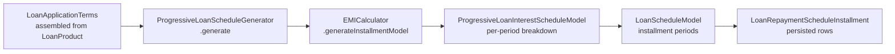

The `fineract-progressive-loan` Gradle module delivers a modern, EMI-based lending model that is distinct from the older cumulative schedule approach. Where cumulative loans generate a static installment table at origination and only partially recalculate on rescheduling, progressive loans recompute the entire interest schedule on every transaction using a dedicated `EMICalculator`. The result is a more accurate interest model where early repayments, partial payments, and overpayments are all reflected in correct future installment amounts.

## What "Progressive" Means

In Fineract's terminology, a *progressive* loan has `LoanScheduleType.PROGRESSIVE` set on its product. The `LoanScheduleType` enum lives in `org.apache.fineract.portfolio.loanaccount.loanschedule.domain`:

```java
// fineract-loan module
public enum LoanScheduleType {
    CUMULATIVE("Cumulative"),
    PROGRESSIVE("Progressive");
    // ...
}
```

Key behavioral differences from cumulative loans:

| Aspect | Cumulative | Progressive |
|---|---|---|
| Schedule generator | `CumulativeDecliningBalanceInterestLoanScheduleGenerator` / `CumulativeFlatInterestLoanScheduleGenerator` | `ProgressiveLoanScheduleGenerator` |
| Transaction processor | Strategy-based (e.g., `MifosStandardLoanRepaymentScheduleTransactionProcessor`) | `AdvancedPaymentScheduleTransactionProcessor` |
| On-transaction recalculation | Partial (future installments only) | Full schedule recomputed from disbursement |
| Interest model | Declining balance or flat | Always declining balance with EMI calculator |
| Payment allocation | Fixed strategy code | Configurable `LoanProductPaymentAllocationRule` |
| Credit allocation | Not supported | Configurable `LoanProductCreditAllocationRule` |

## ProgressiveLoanScheduleGenerator

`ProgressiveLoanScheduleGenerator` (package `org.apache.fineract.portfolio.loanaccount.loanschedule.domain` inside `fineract-progressive-loan`) implements `LoanScheduleGenerator` and is the central class for building installment plans.

```java
@Component
public class ProgressiveLoanScheduleGenerator implements LoanScheduleGenerator {

    private final ScheduledDateGenerator scheduledDateGenerator;
    private final EMICalculator emiCalculator;
    private final InterestScheduleModelRepositoryWrapper interestScheduleModelRepositoryWrapper;
    // ...

    public LoanSchedulePlan generate(final MathContext mc, final LoanRepaymentScheduleModelData modelData) {
        LoanApplicationTerms loanApplicationTerms = LoanApplicationTerms.assembleFrom(modelData, mc);
        return LoanSchedulePlan.from(generate(mc, loanApplicationTerms, null, null));
    }

    @Override
    public LoanScheduleModel generate(final MathContext mc,
            final LoanApplicationTerms loanApplicationTerms,
            final Set<LoanCharge> loanCharges,
            final HolidayDetailDTO holidayDetailDTO) {
        // determines total charges at disbursement, then delegates to EMICalculator
    }
}
```

The generator collaborates with:

- **`EMICalculator`** — computes the equated monthly installment amount using financial functions.
- **`ScheduledDateGenerator`** — (`DefaultScheduledDateGenerator`) computes repayment dates respecting holidays, business day conventions, and meeting calendars.
- **`InterestScheduleModelRepositoryWrapper`** — persists and retrieves the `ProgressiveLoanInterestScheduleModel` used for continuous recalculation.

### LoanSchedulePlan

`LoanSchedulePlan.from(LoanScheduleModel)` is a convenience converter that transforms the model periods returned by `generate(…)` into a flat plan structure consumed by the REST API and the `LoanAssembler`.

## AdvancedPaymentScheduleTransactionProcessor

`AdvancedPaymentScheduleTransactionProcessor` (package `org.apache.fineract.portfolio.loanaccount.domain.transactionprocessor.impl` inside `fineract-progressive-loan`) is the payment processor wired to all progressive loan products. Unlike cumulative processors that apply a fixed priority order, this processor:

1. Reads the `LoanProductPaymentAllocationRule` configured on the product.
2. For each payment event, iterates over the allocation rule's ordered `PaymentAllocationType` list.
3. Applies payments to the matching component (past-due penalty, past-due fee, past-due interest, past-due principal, current period, future periods) according to the rule.
4. Triggers a full schedule recalculation via `ProgressiveLoanScheduleGenerator` so that future installment amounts remain correct.

### ProgressiveTransactionCtx

`ProgressiveTransactionCtx` (same package) is a value object that holds the mutable state passed between allocation steps during a single transaction's processing. It carries the current `ProgressiveLoanInterestScheduleModel`, the installment list, and the charge set so that the processor can operate in a single consistent pass.

### ChangeOperation

`ChangeOperation` (same package) is a sealed-style record capturing what changed during a transaction: which installments were modified, what amounts were allocated, and whether a schedule recalculation is needed. It feeds `ReplayedTransactionBusinessEventService` so business events reflect exact allocation details.

## ProgressiveLoanModel

`ProgressiveLoanModel` (package `org.apache.fineract.portfolio.loanaccount.domain` in `fineract-progressive-loan`) is a domain value object that represents the complete financial model of a progressive loan at a point in time. It holds the `ProgressiveLoanInterestScheduleModel` alongside computed balance breakdowns used by the summary provider:

- `LoanCapitalizedIncomeBalance` — tracks capitalized income amounts
- `LoanBuyDownFeeBalance` — tracks buy-down fee amounts

## EMICalculator Integration

The `EMICalculator` (package `org.apache.fineract.portfolio.loanproduct.calc`) is defined in the `fineract-progressive-loan` module and performs the core mathematics of equal-installment amortization. Given:

- **`P`** — outstanding principal
- **`r`** — periodic interest rate (annual rate ÷ periods per year)
- **`n`** — remaining number of periods

it derives the EMI using the standard annuity formula and returns the result through `ProgressiveLoanInterestScheduleModel`.



## Rescheduling Progressive Loans

The `rescheduleloan` package inside `fineract-progressive-loan` contains overrides for progressive loan rescheduling. The `LoanScheduleGenerator.rescheduleNextInstallments(…)` method on `ProgressiveLoanScheduleGenerator` recomputes the schedule from a given `rescheduleFrom` date, optionally bounded by a `rescheduleTill` date. Rescheduling creates new `LoanTermVariations` entries (`LoanTermVariations` / `LoanTermVariationType` in the base module) which the generator respects on subsequent recalculations.

## Handler Classes

<Tabs>
  <Tab title="Command Handlers">
    The `handler` package in `fineract-progressive-loan` contains Spring command handler beans for progressive-specific operations. These extend from the base `fineract-loan` handlers but override schedule-generation and transaction-processing delegates to use `ProgressiveLoanScheduleGenerator` and `AdvancedPaymentScheduleTransactionProcessor`.
  </Tab>
  <Tab title="REST API">
    The `api` package in `fineract-progressive-loan` may expose additional endpoints specific to progressive loan management. The core CRUD operations flow through the standard `LoansApiResource` in `fineract-provider`, which detects `LoanScheduleType.PROGRESSIVE` and delegates accordingly.
  </Tab>
  <Tab title="Data Mappers">
    The `mapper` package provides MapStruct mappers that convert between `ProgressiveLoanModel` and API response DTOs in the data package.
  </Tab>
</Tabs>

## How to Enable Progressive Loans

Progressive loans are enabled at the product level:

<Steps>
  <Step title="Create a product with PROGRESSIVE schedule type">
    Post `POST /v1/loanproducts` with `loanScheduleType: "PROGRESSIVE"` and `transactionProcessingStrategyCode` set to the advanced payment processor's strategy code.
  </Step>
  <Step title="Configure payment allocation rules">
    Include `paymentAllocationRules` in the product payload. Each rule maps a `transactionType` to an ordered array of `PaymentAllocationType` values and specifies a `futureInstallmentAllocationRule`.
  </Step>
  <Step title="Optionally configure credit allocation rules">
    Include `creditAllocationRules` for chargeback and credit transaction handling.
  </Step>
  <Step title="Create loans from the product">
    Loans created from the product automatically use `ProgressiveLoanScheduleGenerator` and `AdvancedPaymentScheduleTransactionProcessor`.
  </Step>
</Steps>

<Warning>
  Progressive loans are incompatible with `InterestMethod.FLAT`. Attempting to configure a flat-interest progressive product will raise a `LoanProductGeneralRuleException`.
</Warning>

## Key Package Locations

| Class | Full Package |
|---|---|
| `ProgressiveLoanScheduleGenerator` | `org.apache.fineract.portfolio.loanaccount.loanschedule.domain` (in `fineract-progressive-loan`) |
| `AdvancedPaymentScheduleTransactionProcessor` | `org.apache.fineract.portfolio.loanaccount.domain.transactionprocessor.impl` |
| `ProgressiveTransactionCtx` | `org.apache.fineract.portfolio.loanaccount.domain.transactionprocessor.impl` |
| `ProgressiveLoanModel` | `org.apache.fineract.portfolio.loanaccount.domain` (in `fineract-progressive-loan`) |
| `LoanCapitalizedIncomeBalance` | `org.apache.fineract.portfolio.loanaccount.domain` (in `fineract-progressive-loan`) |
| `LoanBuyDownFeeBalance` | `org.apache.fineract.portfolio.loanaccount.domain` (in `fineract-progressive-loan`) |
| `EMICalculator` | `org.apache.fineract.portfolio.loanproduct.calc` (in `fineract-progressive-loan`) |
| `LoanScheduleType` | `org.apache.fineract.portfolio.loanaccount.loanschedule.domain` (in `fineract-loan`) |
