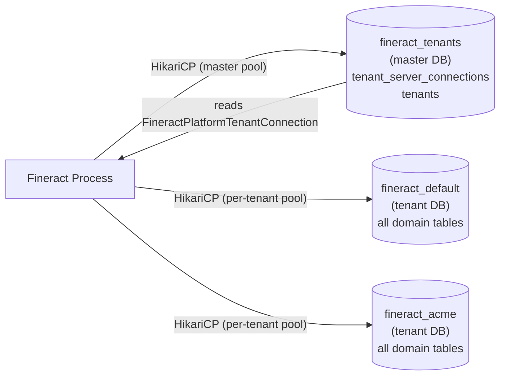
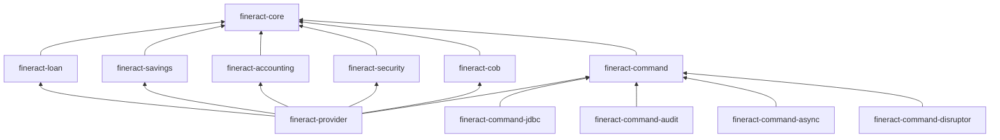

Apache Fineract is structured as a layered, multi-module Spring Boot application. The layers are deliberately separated so that domain logic (loans, savings, accounting) does not depend on web-tier concerns, and all modules share a common infrastructure foundation provided by `fineract-core`. This page maps the complete component structure and explains the responsibilities of each layer.

## High-Level Component Diagram

```mermaid
graph TD
    subgraph "Web / API Tier"
        PROV["fineract-provider\nServerApplication · JerseyConfig\nFineractWebApplicationConfiguration"]
    end

    subgraph "Command / CQRS Tier"
        CMD["fineract-command\nCommandDispatcher · CommandHandler\nCommandHandlerManager · CommandStore\nCommandHookBefore/After/Error"]
        CMDA["fineract-command-async\nAsyncCommandDispatcher"]
        CMDD["fineract-command-disruptor\nDisruptorCommandDispatcher"]
        CMDJ["fineract-command-jdbc\nJdbcCommandStore · CommandEntity"]
        AUDIT["fineract-command-audit\nAuditCommandHookAfter/Before/Error"]
        LEGACY["fineract-core / commands\nPortfolioCommandSourceWritePlatformService\nSynchronousCommandProcessingService\nCommandWrapper · CommandSource"]
    end

    subgraph "Domain Modules"
        LOAN["fineract-loan\nfineract-progressive-loan\nfineract-working-capital-loan\nfineract-loan-origination"]
        SAV["fineract-savings"]
        ACC["fineract-accounting"]
        CHG["fineract-charge · fineract-tax · fineract-rates"]
        INV["fineract-investor · fineract-branch\nfineract-document · fineract-mix · fineract-report"]
    end

    subgraph "Infrastructure / Support"
        COB["fineract-cob\nClose-of-Business Spring Batch Jobs"]
        SEC["fineract-security\nBasicAuth · OAuth2 · 2FA"]
        VAL["fineract-validation\nDataValidatorBuilder"]
        BATCH["fineract-core / batch\nBatchApiResource · BatchApiService\nResolutionHelper · CommandStrategy"]
        EVENTS["fineract-core / events\nFineractEvent · JMS · Kafka"]
        JOBS["Spring Batch (partitioned)\nRemoteJobMessageHandler (JMS / Kafka)"]
    end

    subgraph "Core Foundation"
        CORE["fineract-core\nFineractProperties · ThreadLocalContextUtil\nFineractPlatformTenant · ExternalId\nAbstractPersistableCustom\nJsonCommand · CommandProcessingResult"]
    end

    subgraph "Data Tier"
        TENDB[("fineract_tenants DB\nTenant registry")]
        TNTDB[("fineract_default DB\nPer-tenant schema")]
        LIQ["Liquibase migrations\n(per-tenant, on startup)"]
    end

    PROV --> CMD
    PROV --> LEGACY
    PROV --> BATCH
    CMD --> CMDA
    CMD --> CMDD
    CMD --> CMDJ
    CMD --> AUDIT
    LEGACY --> CORE
    CMD --> CORE
    LOAN --> CORE
    SAV --> CORE
    ACC --> CORE
    CHG --> CORE
    INV --> CORE
    COB --> CORE
    SEC --> CORE
    VAL --> CORE
    BATCH --> CORE
    EVENTS --> CORE
    JOBS --> CORE
    CORE --> TENDB
    CORE --> TNTDB
    LIQ --> TNTDB
```

## Layer Descriptions

### Web / API Tier — `fineract-provider`

The `fineract-provider` module is the assembly and bootstrap module. It contains no business logic. Its responsibilities are:

- **`ServerApplication`** — the Spring Boot entry point (`main()` method). Imports `FineractWebApplicationConfiguration` and `FineractLiquibaseOnlyApplicationConfiguration` via a nested `@Import` configuration class and extends `SpringBootServletInitializer` for optional WAR deployment.
- **`FineractWebApplicationConfiguration`** — root `@Configuration` class that enables `@ComponentScan("org.apache.fineract.**")`, `@IntegrationComponentScan`, `@EnableWebSecurity`, `@EnableTransactionManagement`, and `@EnableConfigurationProperties` for `FineractProperties`. It also excludes several Spring Boot autoconfiguration classes (`DataSourceAutoConfiguration`, `HibernateJpaAutoConfiguration`, `GsonAutoConfiguration`, etc.) so Fineract can wire its own datasources manually.
- **Jersey** — all JAX-RS resources across domain modules are registered through Jersey. Jersey acts as a servlet inside the embedded Tomcat.

See [fineract-provider](../core/fineract-provider) for details.

### Command / CQRS Tier

Fineract has two overlapping command systems that evolved over time:

**Modern command system** (`fineract-command` family): A typed, generic CQRS infrastructure introduced more recently. `CommandDispatcher.dispatch(Command<REQ>)` returns a `Supplier<RES>`. Three dispatcher implementations exist: synchronous (default), `AsyncCommandDispatcher` (thread pool), and `DisruptorCommandDispatcher` (LMAX Disruptor ring buffer). `CommandStore` (with JDBC backing in `fineract-command-jdbc`) provides durable state. `CommandHookBefore/After/Error` interfaces enable cross-cutting concerns; `fineract-command-audit` provides a concrete hook implementation.

**Legacy command system** (`fineract-core/commands`): The original CQRS layer still used by all existing domain APIs. `PortfolioCommandSourceWritePlatformService.logCommandSource(CommandWrapper)` routes every write through `SynchronousCommandProcessingService.executeCommand()`, which persists a `CommandSource` record (audit trail) in the tenant database and delegates to the appropriate `NewCommandSourceHandler` implementation found via `CommandHandlerProvider`. The `@CommandType(entity=..., action=...)` annotation is how handlers self-register.

See [Command Pattern](../core/command-pattern) for the full flow.

### Domain Modules

Each domain module depends on `fineract-core` and wires its own JPA entities, Spring Data repositories, service implementations, and JAX-RS resources:

| Module | Domain |
|---|---|
| `fineract-loan` | Loan products, disbursement, repayment, charges, rescheduling |
| `fineract-progressive-loan` | Advanced progressive repayment schedule engine |
| `fineract-working-capital-loan` | Working capital loan specialisation |
| `fineract-savings` | Savings accounts, fixed deposits, recurring deposits |
| `fineract-accounting` | Chart of accounts, journal entries, GL accounts |
| `fineract-charge` | Shared charge definitions used by loans and savings |
| `fineract-tax` | Tax component and tax group management |
| `fineract-rates` | Floating rate configuration |
| `fineract-investor` | External asset transfer / investor module |
| `fineract-branch` | Office and branch hierarchy |
| `fineract-document` | Document store (filesystem or S3) |
| `fineract-report` | Pentaho and SQL-based report execution |

### Infrastructure / Support

<Accordion title="Close-of-Business (fineract-cob)">
Spring Batch job configuration for daily end-of-business processing. Manages business-date progression, loan interest accrual, and status transitions. Supports partitioned execution across multiple worker nodes using JMS or Kafka for task distribution.
</Accordion>

<Accordion title="Security (fineract-security)">
Pluggable Spring Security configuration for HTTP Basic auth, OAuth2 Resource Server, and optional two-factor authentication. Integrates with `FineractProperties.FineractSecurityProperties` for feature flags.
</Accordion>

<Accordion title="Batch HTTP API (fineract-core/batch)">
The `BatchApiResource` at `POST /api/v1/batches` accepts an array of sub-requests in a single HTTP call. `ResolutionHelper` builds a dependency tree and resolves `$.param` JSONPath references between requests. `CommandStrategyProvider` maps each sub-request to a `CommandStrategy` implementation. See [Batch API](../core/batch-api).
</Accordion>

<Accordion title="Events (fineract-core/events)">
`FineractEvent` domain events can be published internally (Spring `ApplicationEvent`) or externally via JMS (ActiveMQ) or Kafka. External events are gated by `fineract.events.external.enabled`. The `EnableFineractEventsCondition` and `EnableFineractEventListenerCondition` condition classes control which beans activate.
</Accordion>

### Core Foundation — `fineract-core`

Every module in the project depends on `fineract-core`. It exports:

- **`FineractProperties`** — `@ConfigurationProperties(prefix = "fineract")` root class with deeply nested sub-properties for tenant, mode, security, events, jobs, Kafka, S3, caching, retry, etc.
- **`ThreadLocalContextUtil`** — per-request tenant resolution via `ThreadLocal<FineractPlatformTenant>`.
- **`FineractPlatformTenant` / `FineractPlatformTenantConnection`** — immutable tenant descriptor including JDBC coordinates.
- **`AbstractPersistableCustom`** — JPA `@MappedSuperclass` with `Long` identity and `IDENTITY` generation strategy used as the base for all entities.
- **`ExternalId`** — value object wrapping a string external identifier (UUID-assignable) used by APIs to decouple internal database IDs from external references.
- **`JsonCommand`** — wraps an incoming JSON payload and parsed `JsonElement` tree, plus entity/sub-entity IDs extracted from the URL. Used throughout handlers.
- **`CommandProcessingResult` / `CommandProcessingResultBuilder`** — the standard response returned from every write command handler.
- **`TenantDataSourceFactory`** — creates per-tenant `HikariDataSource` instances from `FineractPlatformTenantConnection` metadata.

See [fineract-core](../core/fineract-core) for the full module reference.

### Data Tier

The `fineract_tenants` master database holds the tenant registry (`tenants` table) and their JDBC connection metadata (`tenant_server_connections`). On startup each tenant's database is migrated independently using Liquibase. The `autoUpdateEnabled` flag on `FineractPlatformTenantConnection` controls whether migrations run for a given tenant.

See [Multi-Tenancy](../core/multi-tenancy) for the full runtime model.

## Module Dependency Hierarchy

`fineract-core` is the only module that has no intra-project dependencies; every other module depends on it either directly or transitively.
