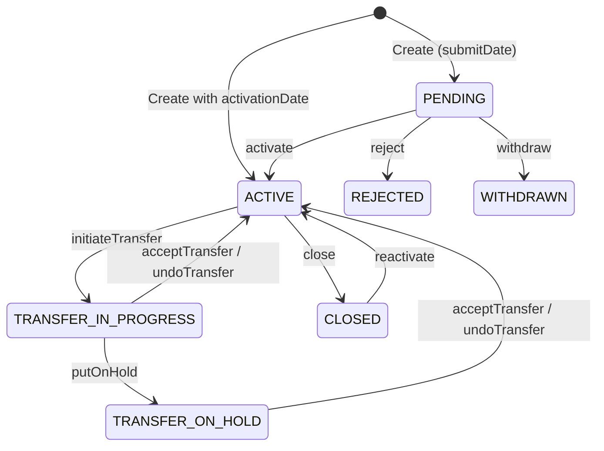

Clients are the central actors in Apache Fineract — they represent individuals and businesses that have applied or may apply to an MFI for loans, savings, or other financial products. The `Client` entity (defined in `fineract-core` at `org.apache.fineract.portfolio.client.domain.Client`, mapped to the `m_client` table) captures personal details, office membership, activation history, and account status. Clients can be created directly in an `ACTIVE` state or submitted as `PENDING` and then activated later.

## Client Entity Fields

The `Client` JPA entity exposes the following key columns on the `m_client` table:

| Field | Column | Description |
|---|---|---|
| `accountNumber` | `account_no` | Unique auto-generated account identifier (max 20 chars) |
| `firstname` | `firstname` | Given name (max 50 chars) |
| `middlename` | `middlename` | Middle name (max 50 chars) |
| `lastname` | `lastname` | Family name (max 50 chars) |
| `fullname` | `fullname` | Used for non-person (entity) clients (max 160 chars) |
| `displayName` | `display_name` | Computed display label shown in UI (max 160 chars) |
| `status` | `status_enum` | Integer code mapped to `ClientStatus` enum |
| `activationDate` | `activation_date` | Date the client was activated |
| `officeJoiningDate` | `office_joining_date` | Date the client joined the current office |
| `mobileNo` | `mobile_no` | Unique mobile number (max 50 chars) |
| `emailAddress` | `email_address` | Email address |
| `externalId` | `external_id` | Optional external reference ID |
| `imageId` | `image_id` | FK to stored client photo |
| `office` | `office_id` | The branch/office the client belongs to |
| `staff` | `staff_id` | Assigned loan officer |
| `subStatus` | `sub_status` | Optional CodeValue sub-status |

<Note>
`fullname` is used when `legalForm` is set to `ENTITY` (non-person clients such as businesses). For individuals, `firstname` + `lastname` are used and `displayName` is derived automatically.
</Note>

## ClientStatus Lifecycle

The `ClientStatus` enum in `org.apache.fineract.portfolio.client.domain.ClientStatus` (package `fineract-core`) defines eight integer-coded states:

```java
// fineract-core/.../portfolio/client/domain/ClientStatus.java
public enum ClientStatus {
    INVALID(0,   "clientStatusType.invalid"),
    PENDING(100, "clientStatusType.pending"),
    ACTIVE(300,  "clientStatusType.active"),
    TRANSFER_IN_PROGRESS(303, "clientStatusType.transfer.in.progress"),
    TRANSFER_ON_HOLD(304,     "clientStatusType.transfer.on.hold"),
    CLOSED(600,  "clientStatusType.closed"),
    REJECTED(700, "clientStatusType.rejected"),
    WITHDRAWN(800, "clientStatusType.withdraw");
}
```

The typical forward lifecycle flows through three primary states:



<CardGroup cols={2}>
  <Card title="PENDING (100)" icon="clock">
    Initial state when a client is submitted but not yet approved. No financial products can be opened while pending.
  </Card>
  <Card title="ACTIVE (300)" icon="circle-check">
    Fully onboarded client who can hold loans and savings products.
  </Card>
  <Card title="TRANSFER_IN_PROGRESS (303)" icon="arrow-right-arrow-left">
    An inter-office transfer has been initiated. The client is temporarily locked for most operations.
  </Card>
  <Card title="TRANSFER_ON_HOLD (304)" icon="pause">
    Transfer has been put on hold pending further action by the receiving office.
  </Card>
  <Card title="CLOSED (600)" icon="circle-xmark">
    Client has been closed. All active accounts must be settled before closure.
  </Card>
  <Card title="REJECTED (700)" icon="ban">
    The pending application was rejected. A reason code (CodeValue) is captured.
  </Card>
</CardGroup>

## REST API — ClientsApiResource

The primary REST resource is `ClientsApiResource` in `org.apache.fineract.portfolio.client.api`, mapped to **`/api/v1/clients`**.

<Tabs>
  <Tab title="Core CRUD">
    | Method | Path | Description |
    |--------|------|-------------|
    | `GET` | `/v1/clients` | Paginated list of clients (supports `officeId`, `externalId`, `displayName`, `underHierarchy` filters) |
    | `GET` | `/v1/clients/template` | Retrieves field defaults and allowed-value lists for the create form |
    | `POST` | `/v1/clients` | Creates a new client |
    | `GET` | `/v1/clients/{clientId}` | Retrieves a single client |
    | `PUT` | `/v1/clients/{clientId}` | Updates client details |
    | `DELETE` | `/v1/clients/{clientId}` | Deletes a client (only allowed when `PENDING`) |
  </Tab>
  <Tab title="Lifecycle Commands">
    Commands are sent as `POST` with `?command=<action>`:

    | Command | Path | Description |
    |---------|------|-------------|
    | `activate` | `/v1/clients/{id}?command=activate` | Transitions `PENDING → ACTIVE` |
    | `close` | `/v1/clients/{id}?command=close` | Transitions `ACTIVE → CLOSED` |
    | `reactivate` | `/v1/clients/{id}?command=reactivate` | Reopens a closed client |
    | `reject` | `/v1/clients/{id}?command=reject` | Transitions `PENDING → REJECTED` |
    | `withdraw` | `/v1/clients/{id}?command=withdraw` | Transitions `PENDING → WITHDRAWN` |
    | `undoRejection` | `/v1/clients/{id}?command=undoRejection` | Reverts rejected back to pending |
    | `undoWithdrawal` | `/v1/clients/{id}?command=undoWithdrawal` | Reverts withdrawn back to pending |
    | `assignStaff` | `/v1/clients/{id}?command=assignStaff` | Assigns a loan officer |
    | `unassignStaff` | `/v1/clients/{id}?command=unassignStaff` | Removes staff assignment |
    | `proposeTransfer` | `/v1/clients/{id}?command=proposeTransfer` | Initiates inter-office transfer |
    | `acceptTransfer` | `/v1/clients/{id}?command=acceptTransfer` | Accepts pending transfer |
    | `withdrawTransfer` | `/v1/clients/{id}?command=withdrawTransfer` | Cancels a transfer |
  </Tab>
  <Tab title="v2 Search">
    A newer search endpoint is available via `ClientSearchV2ApiResource`:

    ```
    POST /api/v2/clients/search
    ```

    Supports fuzzy matching across `displayName`, `accountNumber`, `externalId`, and `mobileNo`.
  </Tab>
</Tabs>

### Write Service

The `ClientWritePlatformService` interface (implemented by `ClientWritePlatformServiceJpaRepositoryImpl`) handles all mutating operations. Key methods include:

```java
// org.apache.fineract.portfolio.client.service.ClientWritePlatformService
CommandProcessingResult createClient(JsonCommand command);
CommandProcessingResult updateClient(Long clientId, JsonCommand command);
CommandProcessingResult activateClient(Long clientId, JsonCommand command);
CommandProcessingResult closeClient(Long clientId, JsonCommand command);
CommandProcessingResult rejectClient(Long clientId, JsonCommand command);
CommandProcessingResult withdrawClient(Long clientId, JsonCommand command);
CommandProcessingResult transferClientBetweenGroups(Long sourceGroupId, JsonCommand jsonCommand, Long destinationGroupId, ...);
```

All write operations go through the CQRS `CommandWrapperBuilder` pipeline, which logs an audit trail entry before dispatching to the appropriate handler.

## Sub-Resources

### Client Identifiers

`ClientIdentifiersApiResource` exposes `/v1/clients/{clientId}/identifiers` for storing external document references (passports, national IDs). Each `ClientIdentifier` holds:
- `documentType` — a `CodeValue` from the `Customer Identifier` code
- `documentKey` — the identifier value
- `description` — optional label

### Client Addresses

`ClientAddressApiResource` maps to `/v1/clients/{clientId}/addresses`. The `ClientAddress` domain entity links to the `Address` entity, which stores street, city, postal code, state, and country. Multiple address types (home, work, etc.) are supported via `addressType` CodeValue.

### Client Image

The `ClientImagesApiResource` exposes `/v1/clients/{clientId}/images` for uploading and retrieving the client's profile photo. Images are stored via the configured content repository (filesystem or S3). The `Client.imageId` field stores a FK reference to the persisted image resource.

### Client Charges

`ClientChargesApiResource` at `/v1/clients/{clientId}/charges` manages one-time fees applied directly to a client. The `ClientCharge` entity tracks the charge, due date, amount, and paid status.

### Client Transactions

`ClientTransactionsApiResource` at `/v1/clients/{clientId}/transactions` provides a read view of `ClientTransaction` records (deposits and charge payments against the client's account).

### Family Members

`ClientFamilyMembersApiResource` at `/v1/clients/{clientId}/familymembers` stores demographic data about a client's family/dependents.

## Client Timeline

The client timeline is embedded in the `GET /v1/clients/{clientId}` response and captures key audit dates:

```json
{
  "timeline": {
    "submittedOnDate": "2024-01-10",
    "submittedByUsername": "mifos",
    "activatedOnDate": "2024-01-15",
    "activatedByUsername": "mifos",
    "closedOnDate": null
  }
}
```

These timestamps are derived from `AbstractAuditableWithUTCDateTimeCustom` fields combined with explicit date columns on `m_client`.

## Legal Form

Clients can represent natural persons (`PERSON = 1`) or legal entities (`ENTITY = 2`) via the `LegalForm` enum in `org.apache.fineract.portfolio.client.domain.LegalForm`. When `legalForm = ENTITY`, the `fullname` field is used instead of `firstname`/`lastname`, and a `ClientNonPerson` record can be attached with additional fields such as `constitutionType`, `mainBusinessLine`, and `remarks`.

<Tip>
Use `GET /v1/clients/template` with `?commandParam=close` or `?commandParam=reject` to pre-populate the reason code dropdown from the relevant `CodeValue` list before showing a closure form to users.
</Tip>
