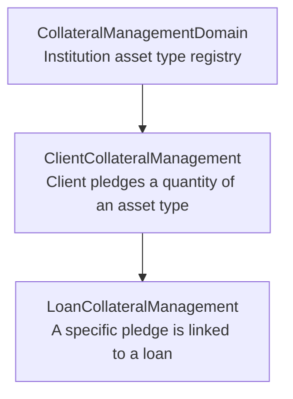
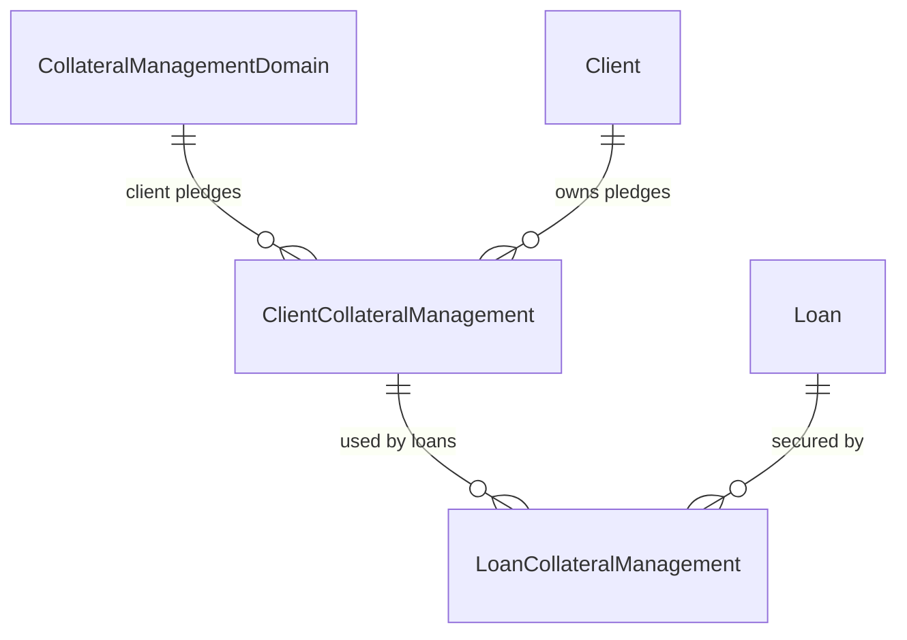

Apache Fineract provides two distinct but complementary collateral systems. The **legacy loan collateral** system attaches informal collateral records directly to individual loans using a simple type-value structure backed by a configurable code list. The newer **collateral management** system (`fineract-loan` module) introduces a proper asset registry where collateral items are first catalogued at the institution level, then pledged by clients, and finally linked to specific loan accounts. Both systems coexist and serve different use cases.

## Legacy Loan Collateral

### Overview

The legacy system lives in `org.apache.fineract.portfolio.collateral` (package `fineract-provider`) and attaches collateral directly to a loan. It is a lightweight record consisting of:

- **type** — a `CodeValue` from the `LoanCollateral` code set (configurable, e.g., "Gold Jewellery", "Land Title Deed")
- **value** — monetary value of the collateral item
- **description** — free-text description
- **currency** — inherited from the loan's currency

The `LoanCollateralRepository` in `org.apache.fineract.portfolio.collateral.domain` provides the JPA access layer.

### REST API — CollateralsApiResource

`CollateralsApiResource` in `org.apache.fineract.portfolio.collateral.api` is mounted at **`/api/v1/loans/{loanId}/collaterals`**:

<Tabs>
  <Tab title="Endpoints">
    | Method | Path | Description |
    |--------|------|-------------|
    | `GET` | `/v1/loans/{loanId}/collaterals/template` | Returns allowed collateral types from the `LoanCollateral` code |
    | `GET` | `/v1/loans/{loanId}/collaterals` | Lists all collateral items for the specified loan |
    | `POST` | `/v1/loans/{loanId}/collaterals` | Adds a new collateral item to the loan |
    | `GET` | `/v1/loans/{loanId}/collaterals/{collateralId}` | Retrieves a specific collateral item |
    | `PUT` | `/v1/loans/{loanId}/collaterals/{collateralId}` | Updates a collateral item |
    | `DELETE` | `/v1/loans/{loanId}/collaterals/{collateralId}` | Deletes a collateral item |
  </Tab>
  <Tab title="Request / Response">
    **Create collateral (POST)**:
    ```json
    {
      "collateralTypeId": 12,
      "value": "50000",
      "description": "Gold necklace, 22 carats",
      "locale": "en"
    }
    ```

    **Response data parameters**: `id`, `type`, `value`, `description`, `allowedCollateralTypes`, `currency`
  </Tab>
</Tabs>

### Service Layer

The `CollateralReadPlatformService` and `CollateralWritePlatformServiceJpaRepositoryImpl` in `org.apache.fineract.portfolio.collateral.service` provide the read and write operations respectively. The write service validates that collateral cannot be modified once the loan is disbursed (`CollateralCannotBeUpdatedException`).

The `CollateralAssembler` class in the same package translates JSON command input into `LoanCollateral` domain objects during loan creation.

<Warning>
Collateral items on this legacy system can only be added or modified while the loan is in a **SUBMITTED** or **APPROVED** state. Attempting modifications after disbursement raises `CollateralCannotBeUpdatedException`.
</Warning>

## Collateral Management System

### Overview

The newer collateral management system is located in `org.apache.fineract.portfolio.collateralmanagement` (package `fineract-loan`) and introduces a three-level hierarchy:



### CollateralManagementDomain

`CollateralManagementDomain` in `org.apache.fineract.portfolio.collateralmanagement.domain` (table `m_collateral_management`) is the institution-level asset type catalogue:

```java
// fineract-loan/.../portfolio/collateralmanagement/domain/CollateralManagementDomain.java
@Entity
@Table(name = "m_collateral_management")
public class CollateralManagementDomain extends AbstractPersistableCustom<Long> {
    private String name;          // asset type name (max 20 chars)
    private String quality;       // quality grade (max 40 chars)
    private BigDecimal basePrice; // base market price per unit
    private String unitType;      // unit of measure (max 10 chars, e.g. "grams", "sqft")
    private BigDecimal pctToBase; // loan-to-value percentage
    private ApplicationCurrency currency; // valuation currency
    // ...
}
```

<Note>
`pctToBase` defines what percentage of the base price the institution will accept as collateral value — for example, 80% means a gold item priced at ₹10,000 is valued at ₹8,000 as collateral.
</Note>

### ClientCollateralManagement

`ClientCollateralManagement` in `org.apache.fineract.portfolio.collateralmanagement.domain` (table `m_client_collateral_management`) represents an individual client pledging a quantity of a registered asset type:

```java
// fineract-loan/.../portfolio/collateralmanagement/domain/ClientCollateralManagement.java
@Entity
@Table(name = "m_client_collateral_management")
public class ClientCollateralManagement extends AbstractPersistableCustom<Long> {
    private BigDecimal quantity;  // how many units the client pledges
    private Client client;        // FK to m_client
    private CollateralManagementDomain collateral; // FK to m_collateral_management
    private Set<LoanCollateralManagement> loanCollateralManagementSet; // linked loan usages
}
```

### Linking Collateral to Loans

`LoanCollateralManagement` (in the `fineract-loan` module, package `org.apache.fineract.portfolio.loanaccount.domain`) creates the association between a `ClientCollateralManagement` pledge and a specific loan:



### REST Endpoints

The `CollateralManagementJsonInputParams` class in `org.apache.fineract.portfolio.collateralmanagement.api` defines the JSON field names for requests. REST resources for collateral management follow this URL pattern:

| Path | Description |
|------|-------------|
| `GET /v1/collateral-management` | List all institution-level collateral types |
| `POST /v1/collateral-management` | Create a new collateral type |
| `PUT /v1/collateral-management/{id}` | Update collateral type |
| `DELETE /v1/collateral-management/{id}` | Delete collateral type |
| `GET /v1/clients/{clientId}/collaterals` | List collaterals pledged by a client |
| `POST /v1/clients/{clientId}/collaterals` | Create client collateral pledge |
| `PUT /v1/clients/{clientId}/collaterals/{collateralId}` | Update pledge quantity |
| `DELETE /v1/clients/{clientId}/collaterals/{collateralId}` | Remove pledge |

## Choosing the Right System

<Accordion title="When to use Legacy Loan Collateral">
Use the legacy `LoanCollateral` system when:
- You need simple, free-form collateral description without an asset registry
- Collateral tracking is informal and per-loan only
- The collateral value is manually entered without institution-managed asset types
- You are integrating with older Fineract-based configurations

The type list is managed via the **LoanCollateral** code in the code management system (`GET /api/v1/codes?name=LoanCollateral`).
</Accordion>

<Accordion title="When to use Collateral Management">
Use the `CollateralManagement` system when:
- You need a structured asset registry with base prices and LTV ratios
- Multiple loans may share the same client's pledged collateral pool
- You want to track the total encumbered vs available quantity per client
- You need currency-aware collateral valuations

The `CollateralManagementDomain` acts as a product catalogue — create asset types first, then clients can pledge quantities of those types.
</Accordion>

## Collateral Validation

Both systems enforce constraints during loan operations:

- **Legacy**: `CollateralCommandFromApiJsonDeserializer` validates required fields; `CollateralWritePlatformServiceJpaRepositoryImpl` blocks edits on disbursed loans.
- **Management**: `ClientCollateralManagement` quantity changes are validated against outstanding `LoanCollateralManagement` usages — you cannot reduce a pledge below the amount currently allocated to active loans.

<Tip>
To view the allowed legacy collateral types for a new loan, call `GET /api/v1/loans/{loanId}/collaterals/template`. This returns `allowedCollateralTypes` populated from the `CodeValueReadPlatformService` using the `LoanCollateral` code.
</Tip>
