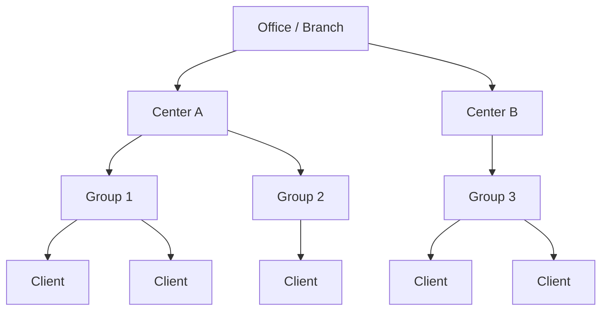
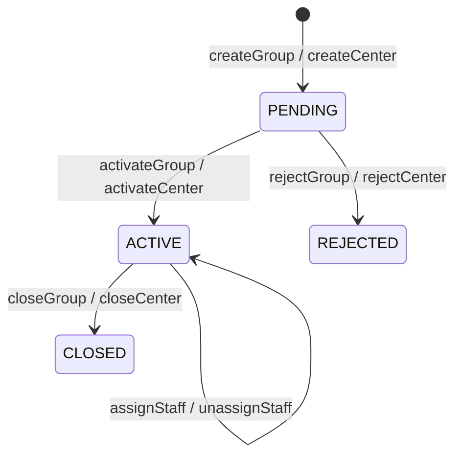
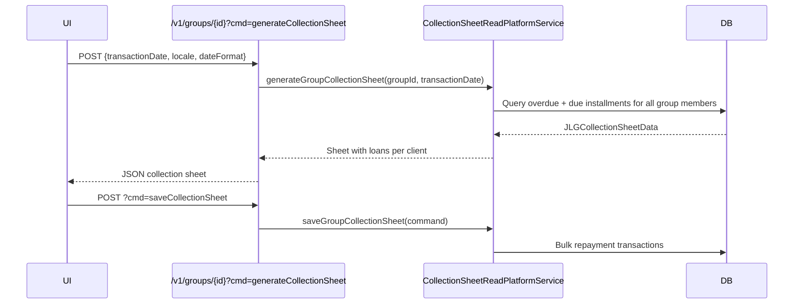

Fineract supports several popular group-lending methodologies — Joint Liability Groups, Grameen Model (Center-Group), Self-Help Groups, and Village Banks — by providing two hierarchical organisational units: **Centers** and **Groups**. Centers are the outermost container (typically associated with a loan officer's weekly meeting), while Groups are individual lending circles nested inside a Center. Clients can belong to Groups directly. The same `Group` entity backs both levels, differentiated by the `GroupTypes` enum.

## GroupTypes Enum

`GroupTypes` in `org.apache.fineract.portfolio.group.domain.GroupTypes` defines the two entity subtypes stored in a single table:

```java
// fineract-provider/.../portfolio/group/domain/GroupTypes.java
public enum GroupTypes {
    INVALID(0L, "lendingStrategy.invalid", "invalid"),
    CENTER(1L,  "groupTypes.center",       "center"),
    GROUP(2L,   "groupTypes.group",        "group");
}
```

Both are persisted to the same `m_group` table. The `level_id` FK to `m_group_level` distinguishes Center-level records (level 1) from Group-level records (level 2).

## Hierarchy



- A **Center** (`GroupTypes.CENTER`) belongs to an Office and may contain one or more Groups.
- A **Group** (`GroupTypes.GROUP`) belongs to a Center (optionally) and contains Clients.
- **Clients** join a Group via the `m_group_client` association table (the `@ManyToMany` relationship on `Client.groups`).

<Note>
Groups do not require a parent Center. Standalone groups (without a Center parent) are fully supported for simpler group-lending models.
</Note>

## Group Lifecycle

Groups and Centers share an analogous status lifecycle managed by `GroupingTypesDataValidator` and triggered through command handlers:



<CardGroup cols={2}>
  <Card title="PENDING" icon="clock">
    Newly created group awaiting activation. No financial products can be issued.
  </Card>
  <Card title="ACTIVE" icon="circle-check">
    Fully operational group. Loans and savings can be opened; collection sheets are available.
  </Card>
  <Card title="CLOSED" icon="circle-xmark">
    Group has been closed. All active loan accounts must be settled first.
  </Card>
  <Card title="REJECTED" icon="ban">
    The group application was rejected during the pending phase.
  </Card>
</CardGroup>

Activation and closure are handled by dedicated command handlers:

| Handler | Operation |
|---------|-----------|
| `ActivateCenterCommandHandler` | Center `PENDING → ACTIVE` |
| `ActivateGroupCommandHandler` | Group `PENDING → ACTIVE` |
| `CloseCenterCommandHandler` | Center `ACTIVE → CLOSED` |
| `CloseGroupCommandHandler` | Group `ACTIVE → CLOSED` |
| `AssociateGroupsToCenterCommandHandler` | Links Groups to a Center |
| `AssociateClientsToGroupCommandHandler` | Adds Clients to a Group |
| `DisassociateClientsFromGroupCommandHandler` | Removes Clients from a Group |

## REST API

### GroupsApiResource

`GroupsApiResource` in `org.apache.fineract.portfolio.group.api` is mounted at **`/api/v1/groups`**:

<Tabs>
  <Tab title="CRUD">
    | Method | Path | Description |
    |--------|------|-------------|
    | `GET` | `/v1/groups` | Paginated group list. Supports filters: `officeId`, `staffId`, `externalId`, `name`, `underHierarchy` |
    | `GET` | `/v1/groups/template` | Template data for the create form |
    | `POST` | `/v1/groups` | Create a new group |
    | `GET` | `/v1/groups/{groupId}` | Retrieve a group with accounts summary, calendar, and member list |
    | `PUT` | `/v1/groups/{groupId}` | Update group name, staff, or meeting schedule |
    | `DELETE` | `/v1/groups/{groupId}` | Delete a PENDING group |
  </Tab>
  <Tab title="Commands">
    Posted as `POST /v1/groups/{groupId}?command=<action>`:

    | Command | Description |
    |---------|-------------|
    | `activate` | Activates a pending group |
    | `close` | Closes an active group |
    | `reject` | Rejects a pending group |
    | `associateClients` | Bulk-add clients to the group |
    | `disassociateClients` | Bulk-remove clients from the group |
    | `assignStaff` | Assigns a loan officer |
    | `unassignStaff` | Removes staff assignment |
    | `assignRole` | Sets a named role (e.g., president) for a group member |
    | `unassignRole` | Removes a role from a member |
    | `transferClients` | Moves clients from one group to another |
    | `generateCollectionSheet` | Returns a collection sheet for the current meeting date |
    | `saveCollectionSheet` | Bulk-saves repayment transactions from a collection sheet |
  </Tab>
  <Tab title="Sub-Resources">
    | Path | Description |
    |------|-------------|
    | `GET /v1/groups/{id}/accounts` | Account summary (loans + savings) for all group members |
    | `GET /v1/groups/{id}/roles` | Named roles for group members |
    | `POST /v1/groups/{id}/roles` | Assign a role to a group member |
    | `GET /v1/groups/{id}/glimaccounts` | GLIM (Group Liability Individual Management) loan containers |
    | `GET /v1/groups/{id}/gsimaccounts` | GSIM savings containers |
  </Tab>
</Tabs>

### CentersApiResource

`CentersApiResource` in `org.apache.fineract.portfolio.group.api` is mounted at **`/api/v1/centers`**:

| Method | Path | Description |
|--------|------|-------------|
| `GET` | `/v1/centers` | Paginated centers list |
| `POST` | `/v1/centers` | Create a new center |
| `GET` | `/v1/centers/{centerId}` | Retrieve center with member groups |
| `PUT` | `/v1/centers/{centerId}` | Update center |
| `POST` | `/v1/centers/{centerId}?command=activate` | Activate center |
| `POST` | `/v1/centers/{centerId}?command=close` | Close center |
| `POST` | `/v1/centers/{centerId}?command=associateGroups` | Associate groups to a center |
| `POST` | `/v1/centers/{centerId}?command=generateCollectionSheet` | Generate collection sheet |
| `POST` | `/v1/centers/{centerId}?command=saveCollectionSheet` | Save bulk repayments |
| `GET` | `/v1/centers/{centerId}/accounts` | Aggregated account view |
| `GET` | `/v1/centers/template` | Template data including staff center data |

## Collection Sheets

The collection sheet is a bulk data-entry mechanism that lists all loans with repayments due at a group or center meeting. Fineract generates the sheet from `CollectionSheetReadPlatformService` (package `org.apache.fineract.portfolio.collectionsheet.service`) which aggregates `JLGCollectionSheetData`.



The dedicated `SaveGroupCollectionSheetCommandHandler` and `SaveCenterCollectionSheetCommandHandler` process the save command.

## Meeting and Calendar Scheduling

Groups and Centers maintain a recurring meeting schedule via the Calendar sub-system:

- Each group/center can have one active `Calendar` (accessed via `CalendarReadPlatformService` in `org.apache.fineract.portfolio.calendar.service`).
- `CalendarEntityType.GROUPS` and `CalendarEntityType.CENTERS` categorize the association.
- The calendar stores an iCal-compatible recurrence rule (e.g., `RRULE:FREQ=WEEKLY;BYDAY=MO`).
- Meeting dates are derived using `CalendarUtils.getRecurringDates()`.
- Individual `Meeting` records capture attendance and actual repayment events per occurrence.

`GroupsApiResource` exposes calendar data via the `associations=calendarData` query parameter on the group detail endpoint, returning the next meeting date and recurrence string.

## Group Roles

Named roles (president, secretary, treasurer, etc.) can be assigned to group members via `GroupRolesWritePlatformService`. The `m_group_role` table stores the mapping between a group, a member client, and a `CodeValue` from the `GroupRole` code set.

```
POST /v1/groups/{groupId}/roles
{ "clientId": 5, "role": 3 }   // role is a CodeValue ID
```

## Read Services

<CardGroup cols={2}>
  <Card title="GroupReadPlatformService" icon="magnifying-glass">
    `GroupReadPlatformServiceImpl` — queries `m_group` for group listings, member counts, and account summaries.
  </Card>
  <Card title="CenterReadPlatformService" icon="magnifying-glass">
    `CenterReadPlatformServiceImpl` — fetches centers with nested group and staff data; powers the `StaffCenterData` projection.
  </Card>
  <Card title="GroupRolesReadPlatformService" icon="user-gear">
    `GroupRolesReadPlatformServiceImpl` — returns `GroupRoleData` projections for role assignment UIs.
  </Card>
  <Card title="GroupLevelReadPlatformService" icon="layer-group">
    `GroupLevelReadPlatformServiceImpl` — retrieves `GroupLevelData` including parent/child level constraints and naming.
  </Card>
</CardGroup>

<Tip>
Use `GET /v1/groups?officeId=1&staffId=3&associations=groupMembers,collectionMeetingCalendar` to retrieve all groups assigned to a loan officer along with their meeting schedules in a single request.
</Tip>
