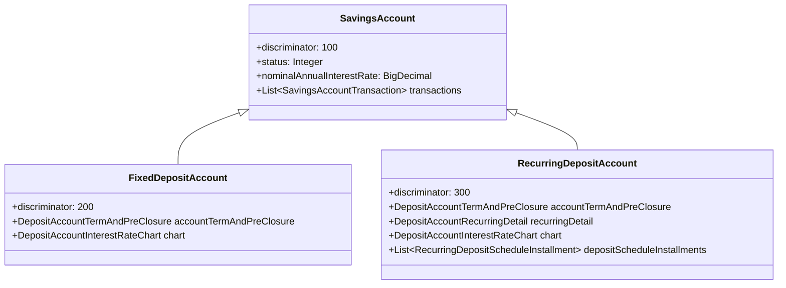
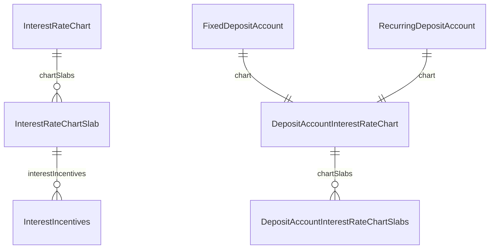

Apache Fineract models term deposits as specialised extensions of the `SavingsAccount` aggregate root. Both `FixedDepositAccount` and `RecurringDepositAccount` use JPA's single-table inheritance (`m_savings_account` table), inheriting the full transaction ledger, charge framework, and journal-entry integration from the parent class while adding deposit-specific behaviour through associated entities.

## Inheritance at a Glance



Both classes reside in `org.apache.fineract.portfolio.savings.domain` inside **fineract-provider**.

## Fixed Deposit Account

`FixedDepositAccount` (discriminator value `200`) models a one-time lump-sum deposit held for a defined term.

```java
// org.apache.fineract.portfolio.savings.domain.FixedDepositAccount
@Entity
@DiscriminatorValue("200")
public class FixedDepositAccount extends SavingsAccount {

    @OneToOne(mappedBy = "account", cascade = CascadeType.ALL)
    private DepositAccountTermAndPreClosure accountTermAndPreClosure;

    @OneToOne(fetch = FetchType.LAZY, cascade = CascadeType.ALL, mappedBy = "account")
    protected DepositAccountInterestRateChart chart;
}
```

The `DepositAccountTermAndPreClosure` entity (table: `m_deposit_account_term_and_preclosure`) holds:

| Field | Column | Description |
|---|---|---|
| `depositAmount` | `deposit_amount` | Principal deposited |
| `maturityAmount` | `maturity_amount` | Projected maturity value including interest |
| `maturityDate` | `maturity_date` | Date on which the account matures |
| `depositPeriod` | `deposit_period` | Numeric length of the term |
| `depositPeriodFrequency` | `deposit_period_frequency_enum` | `SavingsPeriodFrequencyType` (DAYS/WEEKS/MONTHS/YEARS) |
| `onAccountClosureType` | `on_account_closure_enum` | `DepositAccountOnClosureType` |
| `transferInterestToLinkedAccount` | `transfer_interest_to_linked_account` | Route interest to a savings account |
| `preClosureDetail` | (embedded) | `DepositPreClosureDetail` |
| `depositTermDetail` | (embedded) | `DepositTermDetail` (min/max term constraints) |

## Recurring Deposit Account

`RecurringDepositAccount` (discriminator value `300`) requires the client to make periodic deposits according to a schedule, building up to a maturity amount.

```java
// org.apache.fineract.portfolio.savings.domain.RecurringDepositAccount
@Entity
@DiscriminatorValue("300")
public class RecurringDepositAccount extends SavingsAccount {

    @OneToOne(mappedBy = "account", cascade = CascadeType.ALL)
    private DepositAccountTermAndPreClosure accountTermAndPreClosure;

    @OneToOne(mappedBy = "account", cascade = CascadeType.ALL)
    private DepositAccountRecurringDetail recurringDetail;

    @OneToOne(fetch = FetchType.LAZY, cascade = CascadeType.ALL, mappedBy = "account")
    private DepositAccountInterestRateChart chart;

    @OrderBy(value = "installmentNumber, id")
    @OneToMany(cascade = CascadeType.ALL, mappedBy = "account",
               orphanRemoval = true, fetch = FetchType.LAZY)
    private List<RecurringDepositScheduleInstallment> depositScheduleInstallments;
}
```

The `DepositAccountRecurringDetail` and `DepositRecurringDetail` embeddables track:
- **Mandatory deposit** (`isMandatoryDeposit`) — whether each installment is required
- **Allow withdrawal** (`allowWithdrawal`) — whether partial withdrawals are permitted
- **Adjust advance payments** (`adjustAdvanceTowardsFuturePayments`)
- **Expected first deposit on date** (`expectedFirstDepositOnDate`)

## Comparing Fixed vs Recurring Deposits

<Tabs>
  <Tab title="Fixed Deposit">
    - **One deposit** at account opening
    - `depositAmount` is set upfront
    - `maturityDate = activationDate + depositPeriod`
    - Interest accrues on the entire principal for the whole term
    - Early closure triggers `DepositPreClosureDetail.preClosurePenalInterest` applied either to the `WHOLE_TERM` or only `TILL_PREMATURE_WITHDRAWAL`
    - REST resource: `FixedDepositAccountsApiResource` at `/api/v1/fixeddepositaccounts`
  </Tab>
  <Tab title="Recurring Deposit">
    - **Periodic deposits** per `RecurringDepositScheduleInstallment`
    - Each installment has a `dueDate`, `depositAmount`, and `completedDeposit` flag
    - Balance builds gradually; maturity is computed on cumulative deposits + compounded interest
    - Calendar integration (`Calendar` domain object) drives the installment schedule
    - Early closure uses same `DepositPreClosureDetail` mechanism as fixed deposit
    - REST resource: `RecurringDepositAccountsApiResource` at `/api/v1/recurringdepositaccounts`
  </Tab>
</Tabs>

## Maturity Calculation

Both account types compute maturity inside the account domain class. Key steps:

<Steps>
  <Step title="Retrieve deposit period and start date">
    `depositPeriod` and `depositPeriodFrequency` from `DepositAccountTermAndPreClosure` determine the term length. The start date is the account activation date.
  </Step>
  <Step title="Calculate maturityDate">
    `maturityDate = activationDate.plus(depositPeriod, depositPeriodFrequency)`. This is persisted to `maturity_date` column.
  </Step>
  <Step title="Apply interest chart slabs">
    `DepositAccountInterestRateChart.calculateInterestRate(...)` selects the matching `DepositAccountInterestRateChartSlabs` entry based on the deposit term and optionally the deposit amount (when `isPrimaryGroupingByAmount = true`).
  </Step>
  <Step title="Compute maturityAmount">
    Compound interest is applied over the deposit term using the rate from the selected slab. The result is stored in `maturity_amount`.
  </Step>
  <Step title="Handle on-closure action">
    `DepositAccountOnClosureType` controls what happens when the account matures: `WITHDRAW_DEPOSIT` (pay out), `TRANSFER_TO_SAVINGS` (move to a linked savings account), or `REINVEST_PRINCIPAL_AND_INTEREST` / `REINVEST_PRINCIPAL_ONLY`.
  </Step>
</Steps>

## Pre-Closure Penalties

Early closure before `maturityDate` invokes pre-closure logic. The penalty configuration is in the `DepositPreClosureDetail` embeddable (stored in `m_deposit_account_term_and_preclosure`):

```java
// org.apache.fineract.portfolio.savings.domain.DepositPreClosureDetail
@Embeddable
public class DepositPreClosureDetail {

    @Column(name = "pre_closure_penal_applicable")
    private boolean preClosurePenalApplicable;

    @Column(name = "pre_closure_penal_interest", scale = 6, precision = 19)
    private BigDecimal preClosurePenalInterest;   // e.g. 1.5 (percent reduction)

    @Column(name = "pre_closure_penal_interest_on_enum")
    private Integer preClosurePenalInterestOnType; // PreClosurePenalInterestOnType
}
```

`PreClosurePenalInterestOnType` (in `org.apache.fineract.portfolio.savings`, fineract-core) has two options:

| Constant | Value | Meaning |
|---|---|---|
| `WHOLE_TERM` | 1 | Penalty applies to the interest earned over the entire deposit period |
| `TILL_PREMATURE_WITHDRAWAL` | 2 | Penalty applies only up to the actual closure date |

<Warning>
  If `preClosurePenalApplicable = false`, the account closes at the standard rate with no penalty regardless of the closure date.
</Warning>

## Interest Rate Charts

Both fixed and recurring deposit accounts use `DepositAccountInterestRateChart` (table: `m_savings_account_interest_rate_chart`) to store a per-account copy of the product's interest rate chart. The chart is assembled from the product's `InterestRateChart` at account creation time.

### InterestRateChart (Product Level)

```java
// org.apache.fineract.portfolio.interestratechart.domain.InterestRateChart
@Entity
@Table(name = "m_interest_rate_chart")
public class InterestRateChart extends AbstractPersistableCustom<Long> {

    @Embedded
    private InterestRateChartFields chartFields; // name, description, validFrom, validTo

    @OneToMany(mappedBy = "interestRateChart",
               cascade = CascadeType.ALL, orphanRemoval = true, fetch = FetchType.EAGER)
    private Set<InterestRateChartSlab> chartSlabs;
}
```

### InterestRateChartSlab

Each slab (table: `m_interest_rate_slab`) defines a rate for a specific deposit duration or amount bracket:

```java
// org.apache.fineract.portfolio.interestratechart.domain.InterestRateChartSlab
@Entity
@Table(name = "m_interest_rate_slab")
public class InterestRateChartSlab extends AbstractPersistableCustom<Long> {

    @Embedded
    private InterestRateChartSlabFields slabFields;
    // fromPeriod, toPeriod, periodType (DAYS/WEEKS/MONTHS/YEARS)
    // annualInterestRate, amountRangeFrom, amountRangeTo

    @OneToMany(mappedBy = "interestRateChartSlab",
               cascade = CascadeType.ALL, orphanRemoval = true, fetch = FetchType.EAGER)
    private Set<InterestIncentives> interestIncentives;
}
```

### Interest Incentives

`InterestIncentives` (table linked through `InterestIncentivesFields`) allow additional rate adjustments based on client attributes (e.g., gender, age group). The `AttributeIncentiveCalculationFactory` selects the correct `AttributeIncentiveCalculation` strategy.



## REST API Reference

<Tabs>
  <Tab title="Fixed Deposit Accounts">
    Base path: `/api/v1/fixeddepositaccounts` — `FixedDepositAccountsApiResource`.

    | Method | Path | Command | Description |
    |---|---|---|---|
    | `POST` | `/fixeddepositaccounts` | — | Submit new application |
    | `GET` | `/fixeddepositaccounts/{accountId}` | — | Retrieve account |
    | `PUT` | `/fixeddepositaccounts/{accountId}` | — | Update account |
    | `POST` | `/fixeddepositaccounts/{accountId}` | `approve` | Approve |
    | `POST` | `/fixeddepositaccounts/{accountId}` | `activate` | Activate |
    | `POST` | `/fixeddepositaccounts/{accountId}` | `close` | Mature/close |
    | `POST` | `/fixeddepositaccounts/{accountId}` | `prematureClose` | Pre-mature closure |
    | `POST` | `/fixeddepositaccounts/{accountId}` | `calculatePrematureAmount` | Estimate pre-closure payout |
    | `POST` | `/fixeddepositaccounts/{accountId}` | `calculateInterest` | Trigger interest calculation |
    | `POST` | `/fixeddepositaccounts/{accountId}` | `postInterest` | Post interest |

    Transactions are managed via `FixedDepositAccountTransactionsApiResource` at `/api/v1/fixeddepositaccounts/{accountId}/transactions`.
  </Tab>
  <Tab title="Recurring Deposit Accounts">
    Base path: `/api/v1/recurringdepositaccounts` — `RecurringDepositAccountsApiResource`.

    | Method | Path | Command | Description |
    |---|---|---|---|
    | `POST` | `/recurringdepositaccounts` | — | Submit new application |
    | `GET` | `/recurringdepositaccounts/{accountId}` | — | Retrieve account |
    | `PUT` | `/recurringdepositaccounts/{accountId}` | — | Update account |
    | `POST` | `/recurringdepositaccounts/{accountId}` | `approve` | Approve |
    | `POST` | `/recurringdepositaccounts/{accountId}` | `activate` | Activate |
    | `POST` | `/recurringdepositaccounts/{accountId}` | `close` | Close at maturity |
    | `POST` | `/recurringdepositaccounts/{accountId}` | `prematureClose` | Pre-mature closure |
    | `POST` | `/recurringdepositaccounts/{accountId}` | `calculatePrematureAmount` | Estimate pre-closure payout |

    Transactions are managed via `RecurringDepositAccountTransactionsApiResource` at `/api/v1/recurringdepositaccounts/{accountId}/transactions`.
  </Tab>
</Tabs>

<Tip>
  Both account types share a common `DepositAccountDomainService` (fineract-provider) that overrides `SavingsAccountDomainService` methods with deposit-specific validation, maturity checks, and pre-closure calculations.
</Tip>
