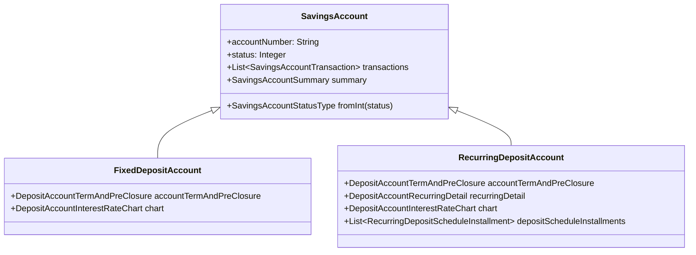

Apache Fineract organises all deposit-taking functionality under a single savings subsystem that spans two Maven modules: **fineract-savings** (domain model, service interfaces, and supporting libraries) and **fineract-provider** (REST API resources, command handlers, and concrete service implementations). Together they support four distinct account types that share a common inheritance hierarchy rooted in `SavingsAccount`.

## Account Types

<CardGroup cols={2}>
  <Card title="Savings Accounts" icon="piggy-bank" href="/savings/savings-accounts">
    Regular savings accounts with configurable interest rates, overdraft support, charge schedules, and a full transaction ledger. Backed by the `SavingsAccount` aggregate root in `org.apache.fineract.portfolio.savings.domain`.
  </Card>
  <Card title="Term Deposits" icon="vault" href="/savings/fixed-and-recurring-deposits">
    Fixed deposit accounts (`FixedDepositAccount`) and recurring deposit accounts (`RecurringDepositAccount`) extend `SavingsAccount` with maturity dates, deposit schedules, and pre-closure penalty logic.
  </Card>
  <Card title="Share Accounts" icon="chart-line" href="/savings/share-accounts">
    Equity-style share accounts modelled in `org.apache.fineract.portfolio.shareaccounts`. Clients purchase and redeem shares of a `ShareProduct`; dividends are distributed via a scheduled batch job.
  </Card>
  <Card title="Accounting Integration" icon="calculator" href="/accounting/overview">
    Every savings transaction automatically generates double-entry journal entries via `SavingsAccountDomainService.postJournalEntries(...)`. Product-to-GL-account mappings determine which ledger accounts are debited and credited.
  </Card>
</CardGroup>

## Module Structure

```
fineract-savings/
└── src/main/java/org/apache/fineract/portfolio/
    ├── savings/
    │   ├── domain/              # SavingsAccount, SavingsAccountTransaction,
    │   │                        # DepositAccountTermAndPreClosure, FixedDepositProduct,
    │   │                        # RecurringDepositProduct, DepositAccountInterestRateChart
    │   ├── service/             # SavingsAccountWritePlatformService,
    │   │                        # SavingsAccountDomainService, SavingsAccountReadPlatformService
    │   ├── data/                # DTOs & validators
    │   └── api/                 # SavingsApiSetConstants, DepositsApiConstants
    └── interestratechart/
        ├── domain/              # InterestRateChart, InterestRateChartSlab, InterestIncentives
        └── data/                # InterestRateChartData, InterestRateChartSlabData

fineract-provider/
└── src/main/java/org/apache/fineract/portfolio/
    ├── savings/
    │   ├── api/                 # SavingsAccountsApiResource, FixedDepositAccountsApiResource,
    │   │                        # RecurringDepositAccountsApiResource
    │   └── domain/              # FixedDepositAccount, RecurringDepositAccount,
    │                            # DepositAccountDomainService, DepositAccountAssembler
    ├── shareaccounts/
    │   ├── domain/              # ShareAccount, ShareAccountTransaction, ShareAccountStatusType
    │   ├── service/             # ShareAccountCommandsServiceImpl
    │   └── jobs/                # PostDividentsForSharesTasklet
    └── shareproducts/
        └── domain/              # ShareProduct, ShareProductMarketPrice
```

## Key Aggregate Roots

| Class | Table | Discriminator |
|---|---|---|
| `SavingsAccount` | `m_savings_account` | `deposit_type_enum = 100` |
| `FixedDepositAccount` | `m_savings_account` | `deposit_type_enum = 200` |
| `RecurringDepositAccount` | `m_savings_account` | `deposit_type_enum = 300` |
| `SavingsAccountTransaction` | `m_savings_account_transaction` | — |
| `ShareAccount` | `m_share_account` | — |
| `ShareProduct` | `m_share_product` | — |

All three deposit account types share a single `SINGLE_TABLE` inheritance strategy in the `m_savings_account` table, with the `deposit_type_enum` column acting as the JPA discriminator.

## Inheritance Hierarchy



## REST Endpoints at a Glance

| Resource | Base Path | Description |
|---|---|---|
| `SavingsAccountsApiResource` | `/api/v1/savingsaccounts` | CRUD + lifecycle commands for regular savings accounts |
| `FixedDepositAccountsApiResource` | `/api/v1/fixeddepositaccounts` | CRUD + commands for fixed deposit accounts |
| `RecurringDepositAccountsApiResource` | `/api/v1/recurringdepositaccounts` | CRUD + commands for recurring deposit accounts |
| `AccountsApiResource` | `/api/v1/accounts/{type}` | Generic share-account resource (type = `shares`) |
| `ShareDividendApiResource` | `/api/v1/shareproducts/{productId}/dividends` | Dividend management |

<Note>
All savings API resources reside in `org.apache.fineract.portfolio.savings.api` (fineract-provider) and follow the same pattern: `@Path`, `@GET`, `@POST`, `@PUT`, `@DELETE` JAX-RS annotations, with commands dispatched through the `CommandProcessingService`.
</Note>
