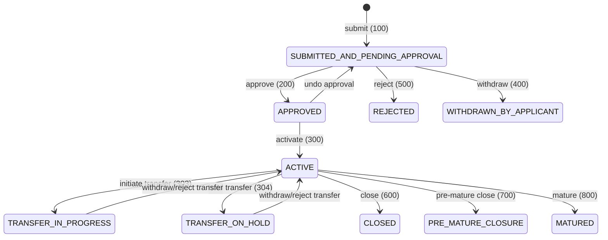

The `SavingsAccount` class in `org.apache.fineract.portfolio.savings.domain` is the central aggregate root for all deposit-taking operations in Apache Fineract. It uses JPA single-table inheritance (`SINGLE_TABLE` strategy on the `m_savings_account` table with discriminator column `deposit_type_enum`) so that fixed deposit and recurring deposit accounts can extend it without duplicating the transaction ledger or charge infrastructure.

## Status State Machine

A savings account moves through a well-defined lifecycle managed by `SavingsAccountStatusType` (in `org.apache.fineract.portfolio.savings.domain`, fineract-core module). Each status is stored as an integer in the `status_enum` column.



The full enum (value in parentheses):

| Constant | Value | Meaning |
|---|---|---|
| `SUBMITTED_AND_PENDING_APPROVAL` | 100 | Application submitted, awaiting approval |
| `APPROVED` | 200 | Approved but not yet activated |
| `ACTIVE` | 300 | Account is fully operational |
| `TRANSFER_IN_PROGRESS` | 303 | Account transfer initiated |
| `TRANSFER_ON_HOLD` | 304 | Account transfer on hold |
| `WITHDRAWN_BY_APPLICANT` | 400 | Applicant withdrew their application |
| `REJECTED` | 500 | Application rejected |
| `CLOSED` | 600 | Account closed normally |
| `PRE_MATURE_CLOSURE` | 700 | Closed before maturity (deposit accounts) |
| `MATURED` | 800 | Reached maturity date |

### Sub-status

Beyond the primary status, `SavingsAccount` tracks a `sub_status_enum` column corresponding to `SavingsAccountSubStatusEnum` (in `org.apache.fineract.portfolio.savings.domain`, fineract-core):

| Constant | Value | Meaning |
|---|---|---|
| `NONE` | 0 | Normal active state |
| `INACTIVE` | 100 | Account has had no transactions for the configured inactivity period |
| `DORMANT` | 200 | Account has been inactive beyond the dormancy threshold |
| `ESCHEAT` | 300 | Account funds escheated to the government |
| `BLOCK` | 400 | Full account block (no debits or credits) |
| `BLOCK_CREDIT` | 500 | Credits blocked only |
| `BLOCK_DEBIT` | 600 | Debits blocked only |

An account that becomes dormant due to inactivity has its sub-status updated; posting a transaction resets it back to `NONE`.

## SavingsAccount Domain Entity

`SavingsAccount` extends `AbstractAuditableWithUTCDateTimeCustom<Long>` and implements `IDepositAccountType`. Key fields:

```java
// org.apache.fineract.portfolio.savings.domain.SavingsAccount
@Entity
@Table(name = "m_savings_account")
@Inheritance(strategy = InheritanceType.SINGLE_TABLE)
@DiscriminatorColumn(name = "deposit_type_enum", discriminatorType = DiscriminatorType.INTEGER)
@DiscriminatorValue("100")
public class SavingsAccount extends AbstractAuditableWithUTCDateTimeCustom<Long>
        implements IDepositAccountType {

    @Column(name = "account_no", length = 20, unique = true, nullable = false)
    protected String accountNumber;

    @Column(name = "external_id", nullable = true)
    protected ExternalId externalId;

    @ManyToOne
    @JoinColumn(name = "product_id", nullable = false)
    protected SavingsProduct product;

    @Column(name = "status_enum", nullable = false)
    protected Integer status;

    @Column(name = "sub_status_enum", nullable = false)
    protected Integer sub_status = 0;

    @Column(name = "nominal_annual_interest_rate", ...)
    protected BigDecimal nominalAnnualInterestRate;

    @OneToMany(cascade = CascadeType.ALL, mappedBy = "savingsAccount")
    @OrderBy(value = "dateOf, createdDate, id")
    private List<SavingsAccountTransaction> transactions;

    @Embedded
    private SavingsAccountSummary summary;
}
```

## Transaction Types

Every monetary movement is captured as a `SavingsAccountTransaction` persisted to `m_savings_account_transaction`. The type is encoded by the `SavingsAccountTransactionType` enum in `org.apache.fineract.portfolio.savings.SavingsAccountTransactionType` (fineract-core):

| Enum Constant | ID | Entry Type | Description |
|---|---|---|---|
| `DEPOSIT` | 1 | CREDIT | Cash or transfer deposited |
| `WITHDRAWAL` | 2 | DEBIT | Funds withdrawn |
| `INTEREST_POSTING` | 3 | CREDIT | Calculated interest credited |
| `WITHDRAWAL_FEE` | 4 | DEBIT | Fee on withdrawal |
| `ANNUAL_FEE` | 5 | DEBIT | Annual maintenance fee |
| `WAIVE_CHARGES` | 6 | — | Charge waived (no balance change) |
| `PAY_CHARGE` | 7 | DEBIT | Charge paid |
| `DIVIDEND_PAYOUT` | 8 | CREDIT | Dividend credited from share account |
| `ACCRUAL` | 10 | — | Interest accrual (no immediate balance change) |
| `INITIATE_TRANSFER` | 12 | — | Account transfer initiated |
| `APPROVE_TRANSFER` | 13 | — | Account transfer approved |
| `WITHDRAW_TRANSFER` | 14 | — | Account transfer withdrawn |
| `REJECT_TRANSFER` | 15 | — | Account transfer rejected |
| `WRITTEN_OFF` | 16 | — | Account written off |
| `OVERDRAFT_INTEREST` | 17 | DEBIT | Interest charged on overdraft balance |
| `WITHHOLD_TAX` | 18 | DEBIT | Withholding tax deducted |
| `ESCHEAT` | 19 | DEBIT | Account escheat (no balance change) |
| `AMOUNT_HOLD` | 20 | DEBIT | Lien placed (no balance change) |
| `AMOUNT_RELEASE` | 21 | CREDIT | Lien released (no balance change) |

<Note>
`isDebit()` and `isCredit()` on `SavingsAccountTransactionType` exclude hold/release/escheat transactions because those don't alter the running balance — only the available balance.
</Note>

### SavingsAccountTransaction Entity

```java
// org.apache.fineract.portfolio.savings.domain.SavingsAccountTransaction
@Entity
@Table(name = "m_savings_account_transaction")
public final class SavingsAccountTransaction extends AbstractAuditableWithUTCDateTimeCustom<Long> {

    @Column(name = "transaction_type_enum", nullable = false)
    private Integer typeOf;               // SavingsAccountTransactionType.getValue()

    @Column(name = "transaction_date", nullable = false)
    private LocalDate dateOf;

    @Column(name = "amount", scale = 6, precision = 19, nullable = false)
    private BigDecimal amount;

    @Column(name = "is_reversed", nullable = false)
    private boolean reversed;

    @Column(name = "running_balance_derived", scale = 6, precision = 19)
    private BigDecimal runningBalance;

    @Column(name = "overdraft_amount_derived", scale = 6, precision = 19)
    private BigDecimal overdraftAmount;

    @Column(name = "is_manual", length = 1)
    private boolean isManualTransaction;
}
```

## Key Service Interfaces

<Tabs>
  <Tab title="SavingsAccountWritePlatformService">
    Declared in `org.apache.fineract.portfolio.savings.service.SavingsAccountWritePlatformService` (fineract-savings). Orchestrates the full lifecycle of a savings account:

    ```java
    public interface SavingsAccountWritePlatformService {
        CommandProcessingResult activate(Long savingsId, JsonCommand command);
        CommandProcessingResult deposit(Long savingsId, JsonCommand command);
        CommandProcessingResult withdrawal(Long savingsId, JsonCommand command);
        CommandProcessingResult calculateInterest(Long savingsId);
        CommandProcessingResult close(Long savingsId, JsonCommand command);
        CommandProcessingResult addSavingsAccountCharge(JsonCommand command);
        CommandProcessingResult waiveCharge(Long savingsAccountId, Long chargeId);
        CommandProcessingResult payCharge(Long savingsAccountId, Long chargeId, JsonCommand command);
        CommandProcessingResult assignFieldOfficer(Long savingsAccountId, JsonCommand command);
        // ... reversal, transfer, annual fee, etc.
    }
    ```
  </Tab>
  <Tab title="SavingsAccountDomainService">
    Declared in `org.apache.fineract.portfolio.savings.service.SavingsAccountDomainService` (fineract-savings). Handles lower-level operations that bridge domain logic with persistence and accounting:

    ```java
    public interface SavingsAccountDomainService {
        SavingsAccountTransaction handleDeposit(
            SavingsAccount account, DateTimeFormatter fmt,
            LocalDate transactionDate, BigDecimal transactionAmount,
            PaymentDetail paymentDetail, boolean isAccountTransfer,
            boolean isRegularTransaction, boolean backdatedTxnsAllowedTill);

        SavingsAccountTransaction handleWithdrawal(
            SavingsAccount account, DateTimeFormatter fmt,
            LocalDate transactionDate, BigDecimal transactionAmount,
            PaymentDetail paymentDetail,
            SavingsTransactionBooleanValues transactionBooleanValues,
            boolean backdatedTxnsAllowedTill);

        void postJournalEntries(
            SavingsAccount savingsAccount,
            Set<Long> existingTransactionIds,
            Set<Long> existingReversedTransactionIds,
            boolean backdatedTxnsAllowedTill);

        SavingsAccountTransaction handleDividendPayout(...);
        SavingsAccountTransaction handleReversal(...);
        SavingsAccountTransaction handleHold(
            SavingsAccount account, BigDecimal amount,
            LocalDate transactionDate, Boolean lienAllowed);
    }
    ```
  </Tab>
</Tabs>

## Core Operations

<Steps>
  <Step title="Submit Application">
    `POST /api/v1/savingsaccounts` — creates a `SavingsAccount` with status `SUBMITTED_AND_PENDING_APPROVAL (100)`. The `SavingsAccount.createNewApplicationForSubmittal(...)` static factory is called by the assembler.
  </Step>
  <Step title="Approve">
    `POST /api/v1/savingsaccounts/{accountId}?command=approve` — transitions to `APPROVED (200)`. The approval date is validated not to be before the submission date.
  </Step>
  <Step title="Activate">
    `POST /api/v1/savingsaccounts/{accountId}?command=activate` — transitions to `ACTIVE (300)`. Any charges due on activation are applied; minimum required opening balance is validated.
  </Step>
  <Step title="Deposit & Withdrawal">
    `POST /api/v1/savingsaccounts/{accountId}/transactions?command=deposit` or `withdrawal`. `SavingsAccountDomainService.handleDeposit(...)` / `handleWithdrawal(...)` creates the `SavingsAccountTransaction`, updates the running balance, then calls `postJournalEntries(...)`.
  </Step>
  <Step title="Interest Calculation & Posting">
    Interest is calculated by `SavingsAccountWritePlatformService.calculateInterest(...)`, which invokes `SavingsAccount.calculateInterestUsing(...)`. The result is a `PostingPeriod` list that drives an `INTEREST_POSTING` transaction.
  </Step>
  <Step title="Close">
    `POST /api/v1/savingsaccounts/{accountId}?command=close` — any outstanding charges are collected, remaining balance is transferred, and status becomes `CLOSED (600)`.
  </Step>
</Steps>

## Interest Calculation

Interest computation lives inside `SavingsAccount` and the `interest` sub-package (`org.apache.fineract.portfolio.savings.domain.interest`). The key concepts are:

<Accordion title="Compounding Period">
  Controlled by `SavingsCompoundingInterestPeriodType` — options include DAILY, WEEKLY, BIWEEKLY, MONTHLY, QUARTERLY, SEMI_ANNUAL, ANNUAL.
</Accordion>

<Accordion title="Posting Period">
  Controlled by `SavingsPostingInterestPeriodType` — the frequency at which accrued interest is credited to the account as an `INTEREST_POSTING` transaction.
</Accordion>

<Accordion title="Calculation Type">
  `SavingsInterestCalculationType` — DAILY_BALANCE (average daily balance) or AVERAGE_DAILY_BALANCE.
</Accordion>

<Accordion title="Days in Year">
  `SavingsInterestCalculationDaysInYearType` — DAYS_360 or DAYS_365.
</Accordion>

<Accordion title="Overdraft Interest">
  When `allowOverdraft = true`, a separate `nominalAnnualInterestRateOverdraft` applies to negative balances. `minOverdraftForInterestCalculation` sets the threshold below which overdraft interest is not charged.
</Accordion>

## REST API Reference

Base path: `/api/v1/savingsaccounts` — served by `SavingsAccountsApiResource` in `org.apache.fineract.portfolio.savings.api` (fineract-provider).

| Method | Path | Command | Description |
|---|---|---|---|
| `GET` | `/savingsaccounts` | — | List all savings accounts (paginated) |
| `GET` | `/savingsaccounts/template` | — | Retrieve template data |
| `POST` | `/savingsaccounts` | — | Submit new application |
| `GET` | `/savingsaccounts/{accountId}` | — | Retrieve single account |
| `GET` | `/savingsaccounts/external-id/{externalId}` | — | Retrieve by external ID |
| `PUT` | `/savingsaccounts/{accountId}` | — | Update account details |
| `DELETE` | `/savingsaccounts/{accountId}` | — | Delete pending application |
| `POST` | `/savingsaccounts/{accountId}` | `approve` | Approve the account |
| `POST` | `/savingsaccounts/{accountId}` | `undoapproval` | Undo approval |
| `POST` | `/savingsaccounts/{accountId}` | `activate` | Activate the account |
| `POST` | `/savingsaccounts/{accountId}` | `deposit` | Post a deposit |
| `POST` | `/savingsaccounts/{accountId}` | `withdrawal` | Post a withdrawal |
| `POST` | `/savingsaccounts/{accountId}` | `calculateInterest` | Trigger interest calculation |
| `POST` | `/savingsaccounts/{accountId}` | `postInterest` | Post calculated interest |
| `POST` | `/savingsaccounts/{accountId}` | `close` | Close the account |
| `POST` | `/savingsaccounts/{accountId}` | `assignSavingsOfficer` | Assign field officer |

<Tip>
  Transactions are managed via the dedicated `SavingsAccountTransactionsApiResource` at `/api/v1/savingsaccounts/{savingsId}/transactions`. Charges are managed via `SavingsAccountChargesApiResource` at `/api/v1/savingsaccounts/{savingsId}/charges`.
</Tip>

## Charges

`SavingsAccountCharge` (in `org.apache.fineract.portfolio.savings.domain`) links a `Charge` definition from `org.apache.fineract.portfolio.charge.domain.Charge` to a savings account. Charge types include:

- **SAVINGS_ACTIVATION_FEE** — charged at activation
- **WITHDRAWAL_FEE** — charged per withdrawal
- **ANNUAL_FEE** — charged annually
- **MONTHLY_FEE** — charged monthly
- **SPECIFIED_DUE_DATE** — charged on a specific date

When a charge falls due, `SavingsAccountWritePlatformService.applyChargeDue(...)` is called, creating a `PAY_CHARGE` transaction that reduces the balance.

<Warning>
  Charges marked `penaltyCharge = true` on the `Charge` entity count as penalty income in accounting and map to the `INCOME_FROM_PENALTIES` GL account rather than `INCOME_FROM_FEES`.
</Warning>
