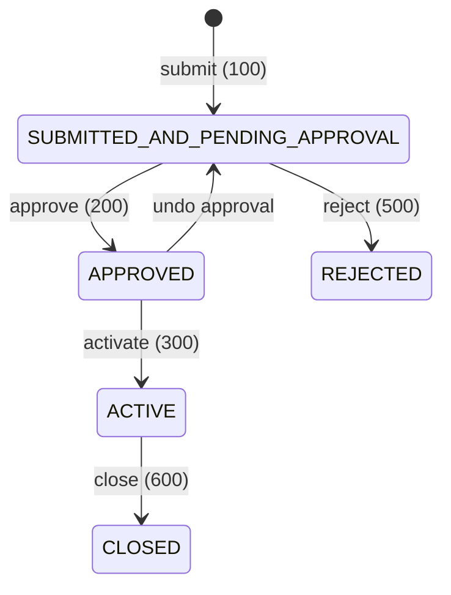
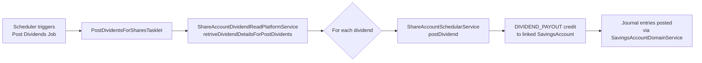

Apache Fineract supports equity-style share accounts that allow clients to purchase, hold, and redeem shares in a financial institution's share product. The share account module is separate from the savings subsystem and lives in `org.apache.fineract.portfolio.shareaccounts` (fineract-provider). Share products are defined in `org.apache.fineract.portfolio.shareproducts`.

## Module Layout

```
fineract-provider/src/main/java/org/apache/fineract/portfolio/
├── shareaccounts/
│   ├── domain/
│   │   ├── ShareAccount.java               # Aggregate root
│   │   ├── ShareAccountTransaction.java    # Purchase/redemption records
│   │   ├── ShareAccountStatusType.java     # Status enum
│   │   ├── ShareAccountCharge.java
│   │   ├── ShareAccountDividendDetails.java
│   │   └── PurchasedSharesStatusType.java
│   ├── service/
│   │   ├── ShareAccountCommandsServiceImpl.java
│   │   ├── ShareAccountSchedularService.java
│   │   └── ShareAccountDividendReadPlatformService.java
│   └── jobs/postdividentsforshares/
│       ├── PostDividentsForSharesConfig.java
│       └── PostDividentsForSharesTasklet.java
└── shareproducts/
    ├── domain/
    │   ├── ShareProduct.java
    │   ├── ShareProductMarketPrice.java
    │   └── ShareProductDividendPayOutDetails.java
    └── api/
        └── ShareDividendApiResource.java
```

## ShareProduct Entity

`ShareProduct` (table: `m_share_product`) defines the rules for an issuable share class:

```java
// org.apache.fineract.portfolio.shareproducts.domain.ShareProduct
@Entity
@Table(name = "m_share_product")
public class ShareProduct extends AbstractAuditableCustom {

    @Column(name = "name", nullable = false, unique = true)
    private String name;

    @Column(name = "short_name", nullable = false, unique = true)
    private String shortName;

    @Column(name = "total_shares", nullable = false)
    private Long totalShares;           // Total shares the product can issue

    @Column(name = "issued_shares", nullable = false)
    private Long totalSharesIssued;     // Currently issued to clients

    @Column(name = "unit_price", nullable = false)
    private BigDecimal unitPrice;       // Nominal unit price per share

    @Column(name = "capital_amount", nullable = false)
    private BigDecimal shareCapital;    // total_shares × unit_price

    @Column(name = "minimum_client_shares")
    private Long minimumShares;

    @Column(name = "nominal_client_shares", nullable = false)
    private Long nominalShares;

    @Column(name = "maximum_client_shares")
    private Long maximumShares;

    @Embedded
    private MonetaryCurrency currency;

    @OrderBy(value = "fromDate,id")
    @OneToMany(cascade = CascadeType.ALL, mappedBy = "product",
               orphanRemoval = true, fetch = FetchType.EAGER)
    Set<ShareProductMarketPrice> marketPrice;  // Price history

    @ManyToMany(fetch = FetchType.EAGER)
    Set<Charge> charges;                       // Applicable charges
}
```

`ShareProductMarketPrice` records the history of the market price with `fromDate` and `shareValue` fields, enabling time-aware pricing during purchases.

## ShareAccount Entity

`ShareAccount` (table: `m_share_account`) represents a client's holding in a share product:

```java
// org.apache.fineract.portfolio.shareaccounts.domain.ShareAccount
@Entity
@Table(name = "m_share_account")
public class ShareAccount extends AbstractPersistableCustom<Long> {

    @ManyToOne
    @JoinColumn(name = "client_id")
    private Client client;

    @ManyToOne
    @JoinColumn(name = "product_id")
    private ShareProduct shareProduct;

    @Column(name = "status_enum", nullable = false)
    protected Integer status;           // ShareAccountStatusType

    @Column(name = "account_no", length = 20, unique = true, nullable = false)
    private String accountNumber;

    @Column(name = "total_approved_shares")
    private Long totalSharesApproved;

    @Column(name = "total_pending_shares")
    private Long totalSharesPending;

    @Embedded
    private MonetaryCurrency currency;

    @ManyToOne
    @JoinColumn(name = "savings_account_id")
    private SavingsAccount savingsAccount;  // Linked savings account for settlements

    @OneToMany(cascade = CascadeType.ALL, mappedBy = "shareAccount",
               orphanRemoval = true, fetch = FetchType.EAGER)
    private Set<ShareAccountTransaction> shareAccountTransactions;

    @OneToMany(cascade = CascadeType.ALL, mappedBy = "shareAccount",
               orphanRemoval = true, fetch = FetchType.EAGER)
    private Set<ShareAccountCharge> charges;

    @Column(name = "lockin_period_frequency")
    private Integer lockinPeriodFrequency;

    @Enumerated(EnumType.ORDINAL)
    @Column(name = "lockin_period_frequency_enum")
    private PeriodFrequencyType lockinPeriodFrequencyType;

    @Column(name = "minimum_active_period_frequency")
    private Integer minimumActivePeriodFrequency;
}
```

<Note>
  The `savingsAccount` association links a share account to a client's regular savings account. Purchase payments and redemption proceeds flow through this linked savings account as `DIVIDEND_PAYOUT` or direct debit/credit transactions.
</Note>

## Account Status Lifecycle

`ShareAccountStatusType` in `org.apache.fineract.portfolio.shareaccounts.domain`:



| Constant | Value | Description |
|---|---|---|
| `SUBMITTED_AND_PENDING_APPROVAL` | 100 | Application submitted |
| `APPROVED` | 200 | Approved, pending activation |
| `ACTIVE` | 300 | Fully active — shares can be purchased/redeemed |
| `REJECTED` | 500 | Application rejected |
| `CLOSED` | 600 | Account closed |

## ShareAccountTransaction

Each share purchase or redemption is recorded as a `ShareAccountTransaction`:

| Field | Column | Description |
|---|---|---|
| `shareAccount` | FK to `m_share_account` | Owning account |
| `numberOfShares` | `number_of_shares` | Quantity in this transaction |
| `purchasedPrice` | `unit_price` | Price per share at transaction time |
| `status` | `status_enum` | `PurchasedSharesStatusType` |
| `transactionDate` | `transaction_date` | Settlement date |
| `chargeAmount` | `charge_amount` | Fees applied to this transaction |

`PurchasedSharesStatusType` tracks whether a purchase is `APPLIED` (pending), `APPROVED`, or `REJECTED`.

## Purchase & Redemption Lifecycle

<Steps>
  <Step title="Apply for Shares">
    `POST /api/v1/accounts/shares/{accountId}?command=applyadditionalshares` — creates `ShareAccountTransaction` entries with status `APPLIED`. The total pending shares are incremented on the `ShareAccount`.
  </Step>
  <Step title="Approve Additional Shares">
    `POST /api/v1/accounts/shares/{accountId}?command=approveadditionalshares` — transitions each selected `ShareAccountTransaction` to `APPROVED`. `totalSharesApproved` is increased and `totalSharesPending` decreased on the `ShareAccount`. The `ShareProduct.totalSharesIssued` is also incremented.
  </Step>
  <Step title="Reject Additional Shares">
    `POST /api/v1/accounts/shares/{accountId}?command=rejectadditionalshares` — marks selected transactions as `REJECTED` and reduces `totalSharesPending`.
  </Step>
  <Step title="Redeem Shares">
    `POST /api/v1/accounts/shares/{accountId}?command=redeemshares` — handled by `RedeemSharesCommandHandler`. Creates a redemption `ShareAccountTransaction`. If a lock-in period or minimum active period constraint exists, the redemption is validated before proceeding. The linked savings account is credited with the redemption value.
  </Step>
  <Step title="Close Account">
    `POST /api/v1/accounts/shares/{accountId}?command=close` — closes the share account. Any remaining approved shares are redeemed and proceeds credited to the linked savings account.
  </Step>
</Steps>

## Dividend Distribution

Dividends are managed at the `ShareProduct` level and distributed to all active `ShareAccount` holders proportionally.

### Declaring a Dividend

`POST /api/v1/shareproducts/{productId}/dividends` — served by `ShareDividendApiResource`. Creates a `ShareProductDividendPayOutDetails` record (table: `m_share_product_dividend_pay_out_details`) with:

- `dividendAmount` — total dividend pool
- `dividendPeriodStartDate` / `dividendPeriodEndDate`
- `status` — `ShareProductDividendStatusType`: `INITIATED`, `APPROVED`, `REJECTED`

### Posting Dividends (Batch Job)

`PostDividentsForSharesTasklet` in `org.apache.fineract.portfolio.shareaccounts.jobs.postdividentsforshares` executes as a Spring Batch job:

```java
// org.apache.fineract.portfolio.shareaccounts.jobs.postdividentsforshares.PostDividentsForSharesTasklet
@Slf4j
@RequiredArgsConstructor
public class PostDividentsForSharesTasklet implements Tasklet {

    private final ShareAccountDividendReadPlatformService shareAccountDividendReadPlatformService;
    private final ShareAccountSchedularService shareAccountSchedularService;

    @Override
    public RepeatStatus execute(StepContribution contribution, ChunkContext chunkContext) {
        List<Map<String, Object>> dividendDetails =
            shareAccountDividendReadPlatformService.retriveDividendDetailsForPostDividents();
        for (Map<String, Object> dividendMap : dividendDetails) {
            Long id = ...; Long savingsId = ...;
            shareAccountSchedularService.postDividend(id, savingsId);
        }
        return RepeatStatus.FINISHED;
    }
}
```

The batch job:
1. Retrieves all approved dividend payouts not yet posted
2. For each share account holder, computes their proportional dividend
3. Calls `ShareAccountSchedularService.postDividend(...)` which posts a `DIVIDEND_PAYOUT` (`SavingsAccountTransactionType.DIVIDEND_PAYOUT = 8`) credit to the linked savings account



## Accounting Integration

Share accounts integrate with the GL through `ShareProductToGLAccountMappingHelper` in `org.apache.fineract.accounting.producttoaccountmapping.service`. The relevant mapping keys from `CashAccountsForShares` (in `AccountingConstants`):

| Enum Constant | Value | GL Account Type | Purpose |
|---|---|---|---|
| `SHARES_REFERENCE` | 1 | Asset | Cash/bank account receiving share payments |
| `SHARES_SUSPENSE` | 2 | Liability | Suspense account for pending share applications |
| `INCOME_FROM_FEES` | 3 | Income | Fee income from share transactions |
| `SHARES_EQUITY` | 4 | Equity | Capital/equity account for issued shares |

When shares are approved, the journal entry moves funds from `SHARES_SUSPENSE` → `SHARES_EQUITY` and records `INCOME_FROM_FEES`. When dividends are posted, a `DIVIDEND_PAYOUT` debit hits `PAYABLE_DIVIDENDS` (a `FinancialActivity` GL mapping) and a credit posts to the member's savings account.

## REST API Reference

Share accounts are served by the generic `AccountsApiResource` at `/api/v1/accounts/{type}` with `type = shares`.

| Method | Path | Command | Description |
|---|---|---|---|
| `GET` | `/accounts/shares/template` | — | Template for new share account |
| `GET` | `/accounts/shares` | — | List all share accounts (paginated) |
| `POST` | `/accounts/shares` | — | Create share account application |
| `GET` | `/accounts/shares/{accountId}` | — | Retrieve share account |
| `PUT` | `/accounts/shares/{accountId}` | — | Update share account |
| `POST` | `/accounts/shares/{accountId}` | `approve` | Approve account |
| `POST` | `/accounts/shares/{accountId}` | `reject` | Reject account |
| `POST` | `/accounts/shares/{accountId}` | `undoapproval` | Undo approval |
| `POST` | `/accounts/shares/{accountId}` | `activate` | Activate account |
| `POST` | `/accounts/shares/{accountId}` | `applyadditionalshares` | Apply for more shares |
| `POST` | `/accounts/shares/{accountId}` | `approveadditionalshares` | Approve pending shares |
| `POST` | `/accounts/shares/{accountId}` | `rejectadditionalshares` | Reject pending shares |
| `POST` | `/accounts/shares/{accountId}` | `redeemshares` | Redeem shares |
| `POST` | `/accounts/shares/{accountId}` | `close` | Close share account |

<Tip>
  Dividend management is available at `/api/v1/shareproducts/{productId}/dividends` via `ShareDividendApiResource`. This endpoint supports creating, approving, and deleting dividend payout declarations before the batch job posts them.
</Tip>
