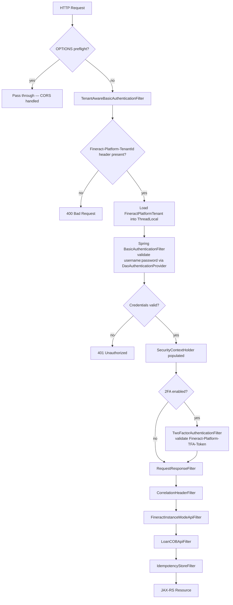
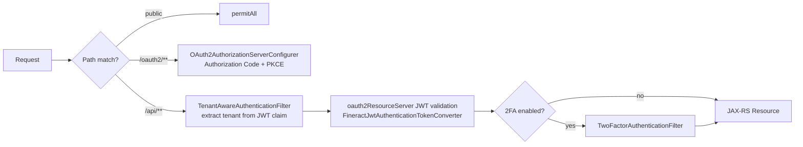

Apache Fineract builds its entire security posture on top of Spring Security, exposing three mutually-exclusive authentication modes — HTTP Basic Auth, OAuth2 Authorization Code with PKCE, and layered Two-Factor Authentication — all governed by a handful of `fineract.security.*` properties in `application.properties`. Every inbound request travels through a carefully ordered servlet filter chain before it reaches a JAX-RS resource, ensuring tenant resolution, credential verification, 2FA enforcement, and audit logging happen in a deterministic sequence regardless of which auth mode is active.

## Authentication Modes at a Glance

<CardGroup cols={3}>
  <Card title="Basic Auth" icon="key" href="/security/basic-auth-and-oauth2">
    Username/password encoded as Base64 in the `Authorization` header. Enabled by default via `fineract.security.basicauth.enabled=true`. Tenant identified by the `Fineract-Platform-TenantId` header.
  </Card>
  <Card title="OAuth2" icon="lock" href="/security/basic-auth-and-oauth2">
    Authorization Code + PKCE flow backed by Spring Authorization Server. Configured via `fineract.security.oauth2.enabled=true` and the `frontend-client` registration in `application.properties`.
  </Card>
  <Card title="Two-Factor Auth" icon="shield-halved" href="/security/two-factor-auth">
    OTP delivered via email or SMS, exchanged for a `TFAccessToken`. Layered on top of Basic Auth when `fineract.security.2fa.enabled=true`.
  </Card>
</CardGroup>

## Security Properties Reference

The complete set of `fineract.security.*` properties lives in
`fineract-provider/src/main/resources/application.properties` (lines 24–42).

```properties
# ── Authentication mode (exactly one of basicauth / oauth2 should be enabled) ──
fineract.security.basicauth.enabled=${FINERACT_SECURITY_BASICAUTH_ENABLED:true}
fineract.security.oauth2.enabled=${FINERACT_SECURITY_OAUTH_ENABLED:false}

# ── Two-Factor Auth ─────────────────────────────────────────────────────────────
fineract.security.2fa.enabled=${FINERACT_SECURITY_2FA_ENABLED:false}

# ── HTTP Strict Transport Security ─────────────────────────────────────────────
fineract.security.hsts.enabled=${FINERACT_SECURITY_HSTS_ENABLED:false}

# ── CORS ────────────────────────────────────────────────────────────────────────
fineract.security.cors.enabled=${FINERACT_SECURITY_CORS_ENABLED:true}
fineract.security.cors.allowed-origin-patterns=${FINERACT_SECURITY_CORS_ALLOWED_ORIGIN_PATTERNS:*}
fineract.security.cors.allowed-methods=${FINERACT_SECURITY_CORS_ALLOWED_METHODS:*}
fineract.security.cors.allowed-headers=${FINERACT_SECURITY_CORS_ALLOWED_HEADERS:*}
fineract.security.cors.exposed-headers=${FINERACT_SECURITY_CORS_EXPOSED_HEADERS:*}
fineract.security.cors.allow-credentials=${FINERACT_SECURITY_CORS_ALLOW_CREDENTIALS:true}

# ── OAuth2 client registrations ─────────────────────────────────────────────────
fineract.security.oauth2.client.registrations.frontend-client.client-id=${FINERACT_SECURITY_OAUTH2_CLIENTS_FRONTEND_ID:frontend-client}
fineract.security.oauth2.client.registrations.frontend-client.scopes=${FINERACT_SECURITY_OAUTH2_CLIENTS_FRONTEND_SCOPES:read,write}
fineract.security.oauth2.client.registrations.frontend-client.authorization-grant-types=${FINERACT_SECURITY_OAUTH2_CLIENTS_FRONTEND_GRANTS:authorization_code,refresh_token}
fineract.security.oauth2.client.registrations.frontend-client.redirect-uris=${FINERACT_SECURITY_OAUTH2_CLIENTS_FRONTEND_REDIRECT:http://localhost:3000/callback}
fineract.security.oauth2.client.registrations.frontend-client.require-authorization-consent=${FINERACT_SECURITY_OAUTH2_CLIENTS_FRONTEND_CONSENT:false}
```

<Note>
  Only one of `fineract.security.basicauth.enabled` and `fineract.security.oauth2.enabled` should be `true` at runtime. Each flag activates a different `@Configuration` class (`SecurityConfig` vs `AuthorizationServerConfig`) via `@ConditionalOnProperty`.
</Note>

## The Security Filter Chain

### Basic Auth mode — `SecurityConfig`

`SecurityConfig` (`org.apache.fineract.infrastructure.core.config.SecurityConfig`) is activated when `fineract.security.basicauth.enabled=true`. It registers one `SecurityFilterChain` that matches `/api/**`:



### OAuth2 mode — `AuthorizationServerConfig`

`AuthorizationServerConfig` (`org.apache.fineract.infrastructure.security.config.AuthorizationServerConfig`) is activated when `fineract.security.oauth2.enabled=true`. It registers **three** ordered `SecurityFilterChain` beans:

| Order | Matcher | Purpose |
|-------|---------|---------|
| 1 | `/swagger-ui/**`, `/fineract.json`, `/actuator/**`, `/legacy-docs/**` | Public endpoints — `permitAll`, no JWT |
| 2 | OAuth2 server endpoints (`/oauth2/**`) | Authorization Server — issues tokens |
| 3 | All other requests | Resource Server — validates Bearer JWT |



## CORS Configuration

CORS is managed by a `CorsConfigurationSource` bean defined in both `SecurityConfig` and `AuthorizationServerConfig`. When `fineract.security.cors.enabled=true`, `HttpSecurity.cors(Customizer.withDefaults())` is applied to the relevant filter chains. The `CorsConfiguration` is populated directly from `FineractProperties.CorsProperties`:

```java
// From SecurityConfig.corsConfigurationSource()
CorsConfiguration config = new CorsConfiguration();
FineractProperties.CorsProperties corsConfiguration = fineractProperties.getSecurity().getCors();
config.setAllowedOriginPatterns(corsConfiguration.getAllowedOriginPatterns());
config.setAllowedMethods(corsConfiguration.getAllowedMethods());
config.setAllowedHeaders(corsConfiguration.getAllowedHeaders());
config.setExposedHeaders(corsConfiguration.getExposedHeaders());
config.setAllowCredentials(corsConfiguration.isAllowCredentials());
```

<Warning>
  The default `allowed-origin-patterns=*` is permissive. Tighten this to your frontend origins in production deployments.
</Warning>

## HSTS — HTTP Strict Transport Security

When `fineract.security.hsts.enabled=true`, `SecurityConfig` configures Spring Security to require HTTPS and sets the `Strict-Transport-Security` header with a `max-age` of 31,536,000 seconds (one year), including subdomains:

```java
// From SecurityConfig.filterChain()
if (fineractProperties.getSecurity().getHsts().isEnabled()) {
    http.requiresChannel(channel -> channel.anyRequest().requiresSecure())
        .headers(headers -> headers.httpStrictTransportSecurity(
            hsts -> hsts.includeSubDomains(true).maxAgeInSeconds(31536000)));
}
```

TLS itself is configured separately through `server.ssl.*` properties:

```properties
server.ssl.enabled=${FINERACT_SERVER_SSL_ENABLED:true}
server.ssl.protocol=TLS
server.ssl.key-store=${FINERACT_SERVER_SSL_KEY_STORE:classpath:keystore.jks}
server.ssl.key-store-password=${FINERACT_SERVER_SSL_KEY_STORE_PASSWORD:openmf}
```

## Session Management

Fineract is designed as a stateless API. In Basic Auth mode, `SecurityConfig` sets `SessionCreationPolicy.STATELESS`, meaning no `HttpSession` is ever created for API requests. The OAuth2 Authorization Server filter chain uses `SessionCreationPolicy.IF_REQUIRED` only for the `/login` form flow used to authenticate the resource owner during the authorization code exchange.

## Key Classes

<Accordion title="SecurityConfig — Basic Auth filter chain">
  **Package:** `org.apache.fineract.infrastructure.core.config`  
  **File:** `fineract-provider/src/main/java/org/apache/fineract/infrastructure/core/config/SecurityConfig.java`  
  Activated by `@ConditionalOnProperty("fineract.security.basicauth.enabled")`. Registers `TenantAwareBasicAuthenticationFilter`, `DaoAuthenticationProvider` (via `TemporaryPasswordAwareAuthenticationProvider`), the `CORS` source, and optionally `TwoFactorAuthenticationFilter` and HSTS.
</Accordion>

<Accordion title="AuthorizationServerConfig — OAuth2 filter chains">
  **Package:** `org.apache.fineract.infrastructure.security.config`  
  **File:** `fineract-provider/src/main/java/org/apache/fineract/infrastructure/security/config/AuthorizationServerConfig.java`  
  Activated by `@ConditionalOnProperty("fineract.security.oauth2.enabled")`. Registers three ordered `SecurityFilterChain` beans, builds the `RegisteredClientRepository` from `fineract.security.oauth2.client.registrations.*`, and customizes JWT tokens with tenant, role, and scope claims.
</Accordion>

<Accordion title="TenantAwareBasicAuthenticationFilter">
  **Package:** `org.apache.fineract.infrastructure.security.filter`  
  **File:** `fineract-security/src/main/java/org/apache/fineract/infrastructure/security/filter/TenantAwareBasicAuthenticationFilter.java`  
  Extends Spring's `BasicAuthenticationFilter`. Reads the `Fineract-Platform-TenantId` header (or `tenantIdentifier` query parameter), loads the corresponding `FineractPlatformTenant` via `AuthTenantDetailsService`, and stores it in `ThreadLocalContextUtil`. Returns HTTP 400 if the tenant identifier is missing.
</Accordion>

<Accordion title="TwoFactorAuthenticationFilter">
  **Package:** `org.apache.fineract.infrastructure.security.filter`  
  **File:** `fineract-security/src/main/java/org/apache/fineract/infrastructure/security/filter/TwoFactorAuthenticationFilter.java`  
  Activated when `fineract.security.2fa.enabled=true`. Reads the `Fineract-Platform-TFA-Token` header and validates it against `TFAccessToken` records via `TwoFactorService`. Grants the `TWOFACTOR_AUTHENTICATED` Spring Security authority on success. Users with the `BYPASS_TWOFACTOR` permission always receive this authority automatically.
</Accordion>

## Related Pages

<CardGroup cols={2}>
  <Card title="Basic Auth & OAuth2" icon="circle-user" href="/security/basic-auth-and-oauth2">
    Detailed configuration guide for both authentication methods, including header formats, environment variables, and the OAuth2 PKCE flow.
  </Card>
  <Card title="Two-Factor Auth" icon="mobile" href="/security/two-factor-auth">
    OTP delivery methods, token lifecycle, API endpoints, and how 2FA layers onto Basic Auth.
  </Card>
  <Card title="Roles & Permissions" icon="users-gear" href="/security/roles-and-permissions">
    The `AppUser`, `Role`, and `Permission` domain model, permission naming conventions, and the user administration REST API.
  </Card>
</CardGroup>
