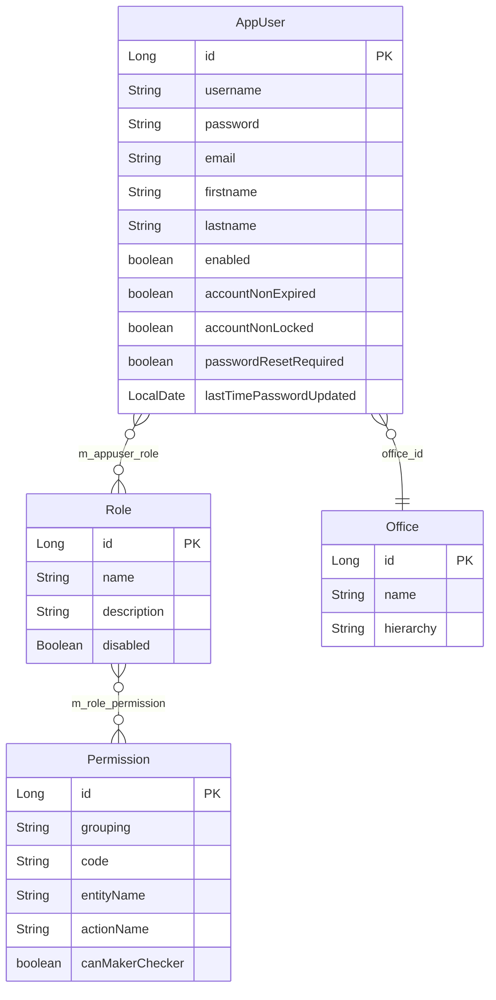

Apache Fineract implements a fine-grained role-based access control (RBAC) model in which every authenticated user is associated with one or more roles, each role carries a set of permissions, and every service-layer operation validates the current user's permissions before executing. The domain model is straightforward: `AppUser` → many `Role` objects → many `Permission` objects. Permission codes follow a strict `ACTION_ENTITYNAME` naming convention (e.g., `READ_LOAN`, `CREATE_CLIENT`, `DELETE_ROLE`) with a handful of wildcard super-permissions for administrative users.

## Domain Model



### `AppUser`

**Package:** `org.apache.fineract.useradministration.domain`  
**File:** `fineract-core/src/main/java/org/apache/fineract/useradministration/domain/AppUser.java`  
**Table:** `m_appuser`

`AppUser` extends Spring Security's `User` and implements `PlatformUser`. The critical security-relevant fields are:

```java
@Entity
@Table(name = "m_appuser",
    uniqueConstraints = @UniqueConstraint(columnNames = {"username"}, name = "username_org"))
public class AppUser extends AbstractPersistableCustom<Long> implements PlatformUser {

    @Column(name = "username", nullable = false, length = 100)
    private String username;

    @Column(name = "password", nullable = false)
    private String password;  // bcrypt-hashed via DelegatingPasswordEncoder

    @Column(name = "enabled", nullable = false)
    private boolean enabled;

    @Column(name = "nonexpired", nullable = false)
    private boolean accountNonExpired;

    @Column(name = "nonlocked", nullable = false)
    private boolean accountNonLocked;

    @Column(name = "password_reset_required", nullable = false)
    private boolean passwordResetRequired;

    @ManyToMany(fetch = FetchType.EAGER)
    @JoinTable(name = "m_appuser_role",
        joinColumns = @JoinColumn(name = "appuser_id"),
        inverseJoinColumns = @JoinColumn(name = "role_id"))
    private Set<Role> roles;

    @ManyToOne
    @JoinColumn(name = "office_id", nullable = false)
    private Office office;  // hierarchical office scoping
}
```

The `roles` collection is loaded `EAGER` so that Spring Security can immediately build the `GrantedAuthority` list when the user is loaded from the database.

### `Role`

**Package:** `org.apache.fineract.useradministration.domain`  
**File:** `fineract-core/src/main/java/org/apache/fineract/useradministration/domain/Role.java`  
**Table:** `m_role`

```java
@Entity
@Table(name = "m_role",
    uniqueConstraints = @UniqueConstraint(columnNames = {"name"}, name = "unq_name"))
public class Role extends AbstractPersistableCustom<Long> implements Serializable {

    @Column(name = "name", unique = true, nullable = false, length = 100)
    private String name;

    @Column(name = "description", nullable = false, length = 500)
    private String description;

    @Column(name = "is_disabled", nullable = false)
    private Boolean disabled;

    @ManyToMany(fetch = FetchType.EAGER)
    @JoinTable(name = "m_role_permission",
        joinColumns = @JoinColumn(name = "role_id"),
        inverseJoinColumns = @JoinColumn(name = "permission_id"))
    private Set<Permission> permissions = new HashSet<>();

    public boolean hasPermissionTo(final String permissionCode) {
        for (final Permission permission : this.permissions) {
            if (permission.hasCode(permissionCode)) {
                return true;
            }
        }
        return false;
    }
}
```

Roles can be enabled or disabled. Disabled roles have no effect on the user's authorities even if the user is still assigned to them.

### `Permission`

**Package:** `org.apache.fineract.useradministration.domain`  
**File:** `fineract-core/src/main/java/org/apache/fineract/useradministration/domain/Permission.java`  
**Table:** `m_permission`

```java
@Entity
@Table(name = "m_permission")
public class Permission extends AbstractPersistableCustom<Long> implements Serializable {

    @Column(name = "grouping", nullable = false, length = 45)
    private String grouping;  // e.g. "portfolio", "transaction_loan", "special"

    @Column(name = "code", nullable = false, length = 100)
    private String code;      // e.g. "READ_LOAN", "CREATE_CLIENT"

    @Column(name = "entity_name", nullable = true, length = 100)
    private String entityName;  // e.g. "LOAN", "CLIENT"

    @Column(name = "action_name", nullable = true, length = 100)
    private String actionName;  // e.g. "READ", "CREATE"

    @Column(name = "can_maker_checker", nullable = false)
    private boolean canMakerChecker;

    public Permission(final String grouping, final String entityName, final String actionName) {
        this.grouping = grouping;
        this.entityName = entityName;
        this.actionName = actionName;
        this.code = actionName + "_" + entityName;  // code is always ACTION_ENTITYNAME
    }
}
```

<Note>
  Permissions are **pre-installed** by Liquibase migrations and cannot be created or deleted via the API. The `/api/v1/permissions` endpoint allows listing them and toggling `canMakerChecker` only.
</Note>

## Permission Naming Convention

Every permission code follows the pattern `ACTION_ENTITYNAME`, where the constructor in `Permission.java` explicitly assembles it as `actionName + "_" + entityName`. Standard actions are:

| Action Prefix | Description |
|--------------|-------------|
| `READ_` | Retrieve / list operations (GET) |
| `CREATE_` | Create new resource (POST) |
| `UPDATE_` | Modify existing resource (PUT) |
| `DELETE_` | Remove resource (DELETE) |
| `APPROVE_` | Approve a transaction or application |
| `REJECT_` | Reject a transaction or application |
| `DISBURSE_` | Disburse a loan |
| `REPAYMENT_` | Record a repayment |

**Example permission codes:**

| Code | Entity | Action |
|------|--------|--------|
| `READ_LOAN` | `LOAN` | `READ` |
| `CREATE_LOAN` | `LOAN` | `CREATE` |
| `UPDATE_LOAN` | `LOAN` | `UPDATE` |
| `DELETE_CLIENT` | `CLIENT` | `DELETE` |
| `READ_CURRENCY` | `CURRENCY` | `READ` |
| `UPDATE_CURRENCY` | `CURRENCY` | `UPDATE` |
| `CREATE_CLIENTNOTE` | `CLIENTNOTE` | `CREATE` |
| `READ_DOCUMENT` | `DOCUMENT` | `READ` |

### Super-Permissions

Several wildcard permission codes bypass entity-level checks entirely. They are in the `special` grouping and pre-seeded by the Liquibase changelog `0002_initial_data.xml`:

| Code | Effect |
|------|--------|
| `ALL_FUNCTIONS` | Grants every read and write permission across the entire platform |
| `ALL_FUNCTIONS_READ` | Grants every read permission; write operations still require specific permissions |
| `ALL_FUNCTIONS_WRITE` | Grants every write permission; used in `SecurityConfig` route matchers |
| `CHECKER_SUPER_USER` | Can approve any maker-checker transaction |
| `REPORTING_SUPER_USER` | Can run any report, regardless of individual `READ_<ReportName>` permissions |
| `BYPASS_TWOFACTOR` | Skips 2FA token requirement in `TwoFactorAuthenticationFilter` |

## Bootstrapped Admin Role

The Liquibase migration `changeset id="27"` in `0002_initial_data.xml` seeds the **Super user** role (id=1) with the `ALL_FUNCTIONS` permission (id=1):

```xml
<!-- 0002_initial_data.xml — changeset 27 -->
<insert tableName="m_role">
    <column name="id" valueNumeric="1"/>
    <column name="name" value="Super user"/>
    <column name="description"
        value="This role provides all application permissions."/>
    <column name="is_disabled" valueBoolean="false"/>
</insert>

<!-- changeset 28 — binds ALL_FUNCTIONS to Super user -->
<insert tableName="m_role_permission">
    <column name="role_id" valueNumeric="1"/>
    <column name="permission_id" valueNumeric="1"/>
</insert>
```

The default `mifos` user (username: `mifos`) is bootstrapped by the same migration (changeset 26) and assigned the Super user role. This account should be disabled or have its password changed immediately in production environments.

## Permission Checking in the Service Layer

Permission enforcement happens in two complementary layers:

### 1. `PlatformSecurityContext` — Programmatic checks

`SpringSecurityPlatformSecurityContext` (`org.apache.fineract.infrastructure.security.service`) is the central security facade. Service classes inject it and call `authenticatedUser()` to retrieve the current `AppUser`, then invoke permission-check methods:

```java
// SpringSecurityPlatformSecurityContext.authenticatedUser()
@Override
public AppUser authenticatedUser() {
    AppUser currentUser = null;
    final SecurityContext context = SecurityContextHolder.getContext();
    if (context != null) {
        final Authentication auth = context.getAuthentication();
        if (auth != null) {
            Object principal = auth.getPrincipal();
            if (principal instanceof AppUser appUser) {
                currentUser = appUser;
            }
        }
    }
    if (currentUser == null) {
        throw new UnAuthenticatedUserException();
    }
    if (this.doesPasswordHasToBeRenewed(currentUser)) {
        throw new ResetPasswordException(currentUser.getId());
    }
    return currentUser;
}
```

`AppUser` itself carries the permission-checking methods used throughout the codebase:

```java
// AppUser — shorthand helpers used in API resources and services
public void validateHasReadPermission(final String resourceType) {
    validateHasPermission("READ", resourceType);
    // Accepts: ALL_FUNCTIONS, ALL_FUNCTIONS_READ, or READ_<RESOURCETYPE>
}

public void validateHasCreatePermission(final String resourceType) {
    validateHasPermission("CREATE", resourceType);
    // Accepts: ALL_FUNCTIONS, or CREATE_<RESOURCETYPE>
}

public void validateHasUpdatePermission(final String resourceType) {
    validateHasPermission("UPDATE", resourceType);
}

public void validateHasDeletePermission(final String resourceType) {
    validateHasPermission("DELETE", resourceType);
}

public boolean hasSpecificPermissionTo(final String permissionCode) {
    // Checks explicit permission code (no ALL_FUNCTIONS fallback)
    for (final Role role : this.roles) {
        if (role.hasPermissionTo(permissionCode)) return true;
    }
    return false;
}
```

**Typical usage in an API resource:**

```java
// UsersApiResource.retrieveAll()
this.context.authenticatedUser().validateHasReadPermission(RESOURCE_NAME_FOR_PERMISSIONS);
// RESOURCE_NAME_FOR_PERMISSIONS = "USER"
// → accepts: ALL_FUNCTIONS, ALL_FUNCTIONS_READ, or READ_USER
```

### 2. `SecurityConfig` — URL-level declarative checks

`SecurityConfig.filterChain()` declares per-endpoint authority requirements for known entity paths. This provides a defense-in-depth layer before the request even reaches a JAX-RS resource:

```java
// SecurityConfig — excerpt from filterChain()
auth
    .requestMatchers(API_MATCHER.matcher(HttpMethod.GET, "/api/*/currencies"))
        .hasAnyAuthority(ALL_FUNCTIONS, ALL_FUNCTIONS_READ, "READ_CURRENCY")
    .requestMatchers(API_MATCHER.matcher(HttpMethod.POST, "/api/*/currencies"))
        .hasAnyAuthority(ALL_FUNCTIONS, ALL_FUNCTIONS_WRITE, "UPDATE_CURRENCY")
    .requestMatchers(API_MATCHER.matcher(HttpMethod.GET, "/api/*/loans/*/notes"))
        .hasAnyAuthority(ALL_FUNCTIONS, ALL_FUNCTIONS_READ, "READ_LOANNOTE")
    .requestMatchers(API_MATCHER.matcher(HttpMethod.POST, "/api/*/loans/*/notes"))
        .hasAnyAuthority(ALL_FUNCTIONS, ALL_FUNCTIONS_WRITE, "CREATE_LOANNOTE");
```

```mermaid
flowchart TD
    A[HTTP Request] --> B[SecurityConfig URL matcher]
    B -- no matching authority --> C[403 Forbidden — Spring Security]
    B -- authority OK --> D[JAX-RS Resource method]
    D --> E[context.authenticatedUser().validateHasReadPermission]
    E -- no permission --> F[NoAuthorizationException → 403]
    E -- has permission --> G[Service / Repository]
```

## User Administration REST API

### Users — `/api/v1/users`

Implemented by `UsersApiResource` (`org.apache.fineract.useradministration.api.UsersApiResource`), path `@Path("/v1/users")`.

| Method | Path | Permission Required | Description |
|--------|------|---------------------|-------------|
| `GET` | `/api/v1/users` | `READ_USER` | List all users |
| `GET` | `/api/v1/users/{userId}` | `READ_USER` | Retrieve a single user |
| `POST` | `/api/v1/users` | `CREATE_USER` | Create a new user |
| `PUT` | `/api/v1/users/{userId}` | `UPDATE_USER` | Update user details |
| `DELETE` | `/api/v1/users/{userId}` | `DELETE_USER` | Delete a user |

**Create user request body:**
```json
{
  "username": "branch_officer",
  "firstname": "Jane",
  "lastname": "Smith",
  "email": "jane@example.org",
  "officeId": 1,
  "staffId": 5,
  "roles": [{"id": 2}],
  "password": "InitialPass1!",
  "repeatPassword": "InitialPass1!",
  "sendPasswordToEmail": false
}
```

### Roles — `/api/v1/roles`

Implemented by `RolesApiResource` (`org.apache.fineract.useradministration.api.RolesApiResource`), path `@Path("/v1/roles")`.

| Method | Path | Permission Required | Description |
|--------|------|---------------------|-------------|
| `GET` | `/api/v1/roles` | `READ_ROLE` | List all roles |
| `GET` | `/api/v1/roles/{roleId}` | `READ_ROLE` | Retrieve a role |
| `POST` | `/api/v1/roles` | `CREATE_ROLE` | Create a new role |
| `PUT` | `/api/v1/roles/{roleId}` | `UPDATE_ROLE` | Update role name/description |
| `DELETE` | `/api/v1/roles/{roleId}` | `DELETE_ROLE` | Delete a role |
| `GET` | `/api/v1/roles/{roleId}/permissions` | `READ_ROLE` | List permissions for a role |
| `PUT` | `/api/v1/roles/{roleId}/permissions` | `UPDATE_ROLE` | Assign permissions to a role |
| `POST` | `/api/v1/roles/{roleId}/disable` | `UPDATE_ROLE` | Disable a role |
| `POST` | `/api/v1/roles/{roleId}/enable` | `UPDATE_ROLE` | Enable a role |

**Assign permissions to a role:**
```json
PUT /api/v1/roles/3/permissions

{
  "permissions": {
    "READ_LOAN": true,
    "CREATE_LOAN": true,
    "UPDATE_LOAN": false,
    "DELETE_LOAN": false
  }
}
```

### Permissions — `/api/v1/permissions`

Implemented by `PermissionsApiResource` (`org.apache.fineract.useradministration.api.PermissionsApiResource`), path `@Path("/v1/permissions")`.

| Method | Path | Permission Required | Description |
|--------|------|---------------------|-------------|
| `GET` | `/api/v1/permissions` | `READ_PERMISSION` | List all permissions |
| `PUT` | `/api/v1/permissions` | `UPDATE_PERMISSION` | Toggle maker-checker on permissions |

The `PermissionsApiResource` Javadoc notes: *"There is no Apache Fineract functionality for creating or deleting permissions. Permissions come pre-installed."*

**List permissions (with maker-checker status):**
```bash
GET /api/v1/permissions?makerCheckerable=true&tenantIdentifier=default
Authorization: Basic <b64>
```

**Response excerpt:**
```json
[
  {
    "grouping": "portfolio",
    "code": "CREATE_LOAN",
    "entityName": "LOAN",
    "actionName": "CREATE",
    "selected": true,
    "isMakerChecker": false
  },
  {
    "grouping": "special",
    "code": "ALL_FUNCTIONS",
    "entityName": null,
    "actionName": null,
    "selected": true,
    "isMakerChecker": false
  }
]
```

## Office Hierarchy Scoping

Beyond permission codes, `AppUser` is also scoped to an `Office` within the organisational hierarchy. `SpringSecurityPlatformSecurityContext.validateAccessRights()` enforces that a user can only access resources belonging to their office or offices below it in the hierarchy:

```java
@Override
public void validateAccessRights(final String resourceOfficeHierarchy) {
    final AppUser user = authenticatedUser();
    final String userOfficeHierarchy = user.getOffice().getHierarchy();
    if (!resourceOfficeHierarchy.startsWith(userOfficeHierarchy)) {
        throw new NoAuthorizationException(
            "The user doesn't have enough permissions to access the resource.");
    }
}
```

Office hierarchies are stored as path strings (e.g., `.1.2.5.`) — a user at node `.1.2.` can access resources in `.1.2.5.` but not in `.1.3.`.

## Maker-Checker Workflow

Permissions with `canMakerChecker=true` support a four-eyes principle: one user (the "maker") initiates a transaction, and a second user (the "checker") must approve it before it is committed. The checker role requires either `CHECKER_SUPER_USER` or an action-specific `<ACTION>_CHECKER` permission. The `AppUser.validateHasCheckerPermissionTo()` method enforces this:

```java
public void validateHasCheckerPermissionTo(final String function) {
    final String checkerPermissionName =
        function.toUpperCase(Locale.ROOT) + "_CHECKER";
    if (hasNotPermissionTo("CHECKER_SUPER_USER")
            && hasNotPermissionTo(checkerPermissionName)) {
        throw new NoAuthorizationException(
            "User has no authority to be a checker for: " + function);
    }
}
```

<Tip>
  Enable maker-checker on a permission via `PUT /api/v1/permissions` with `{"permissions": {"CREATE_LOAN": true}}`. This flags `can_maker_checker=true` in the `m_permission` table.
</Tip>

## Related Pages

<CardGroup cols={2}>
  <Card title="Security Overview" icon="shield" href="/security/overview">
    Spring Security filter chain, CORS, HSTS, and the full set of `fineract.security.*` properties.
  </Card>
  <Card title="Two-Factor Auth" icon="mobile" href="/security/two-factor-auth">
    The `BYPASS_TWOFACTOR` permission, OTP delivery, and the `TFAccessToken` lifecycle.
  </Card>
</CardGroup>
